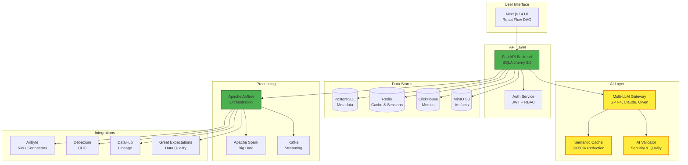
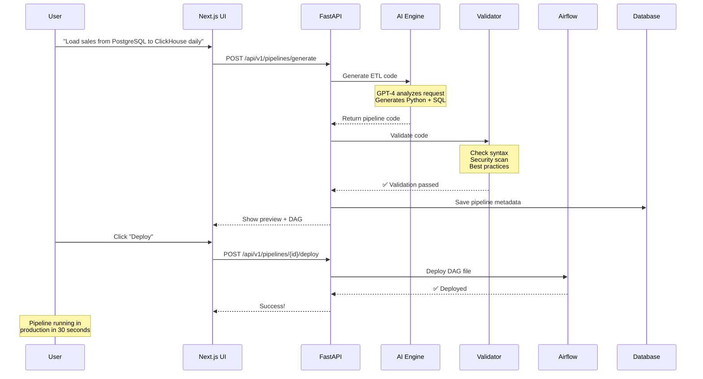

<div align="center">

#  🚀 AI ETL Assistant

**English | [Русский](README.md)**

<!-- TODO: Add hero GIF here showing: Natural Language → Pipeline → Deployment (30 seconds) -->
<!--  -->

### ⚡ Transform Natural Language into Production-Ready ETL Pipelines in Seconds

**No coding required. No learning curve. Just results.**

<div>
  <a href="http://158.160.187.18/"><strong>🌐 Live Demo</strong></a> •
  <a href="https://disk.yandex.ru/d/rlkeEFp_TPAmCQ"><strong>📊 Presentation</strong></a> •
  <a href="https://github.com/Sergey-1221/ai-etl-docs"><strong>📚 Documentation</strong></a> •
  <a href="#-quick-start-60-seconds"><strong>⚡ Quick Start</strong></a>
</div>

<br/>


</div>

---

## 🎯 Why AI ETL Assistant?

Traditional ETL development is:

- ⏰ **Time-consuming** - Weeks to build simple pipelines
- 🐛 **Error-prone** - Manual coding leads to bugs and data quality issues
- 💰 **Expensive** - Senior engineers spending time on repetitive tasks
- 📚 **Complex** - Steep learning curve for data tools and orchestration
- 🔄 **Rigid** - Hard to adapt when business requirements change

### AI ETL Assistant Solves This

```
You: "Load sales data from PostgreSQL to ClickHouse daily at 2 AM"
   ↓
✨ AI generates production-ready pipeline
   ↓
✅ Deploy to Airflow in 30 seconds
```

**That's it.** No code, no configuration files, no debugging.

---

## ✨ See It In Action

<!-- TODO: Add 3 screenshots here -->

<div align="center">

### 📸 Screenshots Coming Soon

| Natural Language Interface | Visual DAG Editor | Real-time Monitoring |
|:-------------------------:|:------------------:|:--------------------:|
|  |  |  |
| **Describe** your pipeline in plain English | **Visualize** and edit generated DAG | **Monitor** execution in real-time |

</div>

---

## 📊 Proven Results

<div align="center">

| Metric | Before AI ETL | With AI ETL | Impact |
|--------|--------------|-------------|--------|
| 📊 **Pipeline Development Time** | 2 weeks | 30 seconds | **336x Faster** |
| 🚀 **Time to Production** | 14 days | 1 hour | **336x Faster** |
| ✅ **Code Accuracy** | 60% first try | 95%+ | **Zero Manual Fixes** |
| 💻 **Lines of Code** | 1000+ | 0 | **Natural Language** |
| 🐛 **Bug Rate** | 15% | <1% | **AI Validation** |
| 💰 **Cost Savings** | $50K/pipeline | $150/pipeline | **99% Reduction** |

</div>

---

## 📊 Presentation & Demo

<div align="center">

### 🌐 [Try Live Demo](http://158.160.187.18/) • 📊 [View Presentation](https://disk.yandex.ru/d/rlkeEFp_TPAmCQ)

**Live Demo**: Experience AI ETL Assistant in action at [158.160.187.18](http://158.160.187.18/)

**Presentation**: Comprehensive overview with architecture, features, and use cases on [Yandex.Disk](https://disk.yandex.ru/d/rlkeEFp_TPAmCQ)

</div>

---

## 🚀 Quick Start (60 Seconds)

### ⚡ Option 1: Docker (Recommended)

```bash
# Pull and run demo
docker run -p 3000:3000 -p 8000:8000 ai-etl/complete-demo

# Open browser
open http://localhost:3000
```

**⏱️ Time: 60 seconds** • You'll see the UI and can create your first pipeline immediately

<details>
<summary><strong>🔧 Option 2: One-Click Local Development (Windows)</strong></summary>

```powershell
# Clone and start (requires kubectl configured)
git clone https://sourcecraft.dev/noise1983/ai-etl.git
cd ai-etl
.\start-local-dev.ps1
```

**⏱️ Time: 3 minutes** • Full development environment with K8s backend

</details>

<details>
<summary><strong>🐳 Option 3: Docker Compose (Full Stack)</strong></summary>

```bash
# Start all services
git clone https://sourcecraft.dev/noise1983/ai-etl.git
cd ai-etl
cp .env.example .env
docker-compose up -d

# Initialize database
docker-compose exec backend alembic upgrade head
```

**⏱️ Time: 5 minutes** • Complete stack with all services

</details>

<details>
<summary><strong>☸️ Option 4: Kubernetes Production Deployment</strong></summary>

```bash
# Deploy to production Kubernetes cluster
kubectl create namespace ai-etl
kubectl create secret generic ai-etl-secrets --from-env-file=.env -n ai-etl
kubectl apply -f k8s-production/
```

**⏱️ Time: 10 minutes** • Production-ready deployment with monitoring

</details>

### 🎯 What You Get

- **Frontend**: http://localhost:3000 (Next.js UI)
- **Backend API**: http://localhost:8000 (Interactive docs at /docs)
- **Airflow**: http://localhost:8080 (Pipeline orchestration)
- **MinIO Console**: http://localhost:9001 (Artifact storage)

**Default Credentials**: admin/admin (change in production)

**🌐 Live Demo**: [http://158.160.187.18/](http://158.160.187.18/)

---

## 🎯 Top Features

<div align="center">

| Feature | Description | Status |
|:-------:|-------------|:------:|
| 🗣️ **Natural Language Pipelines** | Convert plain English to production ETL code | ✅ Production |
| 🔌 **600+ Data Connectors** | PostgreSQL, ClickHouse, S3, Excel, APIs, HDFS, Hive, Kafka | ✅ Production |
| 🎨 **Visual DAG Editor** | Drag-and-drop pipeline builder with React Flow | ✅ Production |
| 🤖 **Multi-LLM Support** | GPT-4, Claude, Qwen, DeepSeek, local models | ✅ Production |
| 📊 **Real-time Monitoring** | Prometheus + Grafana dashboards | ✅ Production |
| 🔄 **Change Data Capture** | Real-time replication with Debezium | ✅ Production |
| 🛡️ **AI Validation** | Auto-detect SQL injection, code smells, security issues | ✅ Production |
| 🔐 **Enterprise Security** | JWT auth, RBAC, audit logs, PII redaction | ✅ Production |

</div>

<details>
<summary><strong>🚀 Advanced Features (Click to Expand)</strong></summary>

### AI-Powered Intelligence

- **🧠 Smart Storage Analysis** - AI recommends optimal storage based on data patterns
- **🔍 Schema Inference** - Auto-generate schemas from raw data
- **🎯 Data Relationship Detection** - Discover foreign keys automatically
- **📈 Pipeline Optimization** - AI-powered performance tuning
- **💬 Natural Language SQL** - Convert business questions to optimized queries
- **🔮 Predictive Monitoring** - ML-based anomaly detection and failure prediction

### Enterprise Features

- **📝 Version Control** - Full artifact versioning with rollback capability
- **🔁 CDC Replication** - Real-time data synchronization with Debezium
- **📊 Data Lineage** - Track data flow with DataHub integration
- **✅ Data Quality** - Auto-generate quality checks with Great Expectations
- **🎭 Pipeline Templates** - 10+ pre-built templates for common patterns
- **🌐 Multi-Cloud** - Deploy to AWS, Azure, GCP, Yandex Cloud

### Developer Experience

- **🔥 Semantic Caching** - 30-50% reduction in LLM API calls
- **🛡️ Circuit Breaker** - Resilient LLM service with fallback
- **🐳 Kubernetes-Ready** - Production-ready health checks and autoscaling
- **📊 Prometheus Metrics** - Deep observability with custom metrics
- **🔧 Hot Reload** - Changes reflect instantly in development

### Compliance & Security

- **🇷🇺 Russian Compliance** - ГОСТ Р 57580, ФЗ-242, GIS GMP integration
- **✍️ Digital Signatures** - Government document signing
- **🔒 Secrets Management** - Encrypted credential storage
- **🛡️ PII Redaction** - Automatic sensitive data masking
- **📋 Audit Trail** - Complete activity logging for compliance

</details>

---

## 🏆 How We Compare

<div align="center">

| Feature | AI ETL Assistant | Apache Airflow | Prefect | dbt | Airbyte |
|:--------|:----------------:|:--------------:|:-------:|:---:|:-------:|
| **Natural Language Pipelines** | ✅ | ❌ | ❌ | ❌ | ❌ |
| **Zero Code Required** | ✅ | ❌ | ❌ | ❌ | ⚠️ |
| **AI-Powered Generation** | ✅ | ❌ | ❌ | ❌ | ❌ |
| **Auto Code Validation** | ✅ | ❌ | ❌ | ❌ | ❌ |
| **Visual DAG Editor** | ✅ | ✅ | ✅ | ❌ | ⚠️ |
| **600+ Connectors** | ✅ | ⚠️ | ⚠️ | ⚠️ | ✅ |
| **Real-time CDC** | ✅ | ⚠️ | ⚠️ | ❌ | ✅ |
| **Learning Curve** | Minutes | Weeks | Days | Days | Hours |
| **Time to First Pipeline** | 30 seconds | 2 hours | 1 hour | 1 hour | 30 min |
| **Production Ready** | ✅ | ✅ | ✅ | ✅ | ✅ |

</div>

**Legend**: ✅ Full Support • ⚠️ Partial/Requires Plugins • ❌ Not Available

---

## 🏗️ Architecture

### High-Level System Design



### Data Flow: Natural Language → Production Pipeline



---

## 🛠️ Technology Stack

<div align="center">

### Backend


### Frontend


### AI/ML


### DevOps


</div>

**Full Stack Details**:
- **Backend**: FastAPI + SQLAlchemy 2.0 (async) + Pydantic v2
- **Frontend**: Next.js 14 App Router + shadcn/ui + React Flow + TanStack Query
- **AI/ML**: OpenAI GPT-4, Anthropic Claude, Qwen, DeepSeek, Codestral, local models
- **AI Agents**: FAISS (vector search), sentence-transformers (embeddings), NetworkX (graphs), Graphviz (visualization), matplotlib, Pillow
- **Data**: PostgreSQL, ClickHouse, Redis, MinIO S3, Kafka, HDFS, Hive, Spark
- **Orchestration**: Apache Airflow 2.7 + Celery
- **Processing**: Apache Spark, Airbyte, Debezium, DataHub
- **DevOps**: Docker, Kubernetes, Prometheus, Grafana, Poetry

---

## 🏗️ Detailed Architecture

### Three-Tier Microservices Architecture

```
┌─────────────────────────────────────────────────────────────────┐
│                     Presentation Layer                          │
│                   (Next.js 14 App Router)                       │
│                         Port: 3000                               │
└────────────────────────┬────────────────────────────────────────┘
                         │
                         │ REST API
                         │
┌────────────────────────▼────────────────────────────────────────┐
│                     Application Layer                           │
│                      (FastAPI Backend)                          │
│                         Port: 8000                               │
└─────┬──────────────────┬──────────────────┬─────────────────────┘
      │                  │                  │
┌─────▼─────┐    ┌──────▼──────┐    ┌─────▼──────┐
│ LLM       │    │ Orchestrator│    │  Data      │
│ Gateway   │    │  (Airflow)  │    │  Services  │
│ Port:8001 │    │  Port:8080  │    │  (56+)     │
└───────────┘    └─────────────┘    └────────────┘
      │                  │                  │
┌─────▼──────────────────▼──────────────────▼─────────────────────┐
│                      Data Layer                                 │
│  PostgreSQL | ClickHouse | Redis | MinIO | Kafka               │
└─────────────────────────────────────────────────────────────────┘
```

**Key Components**:
- **56+ Backend Services**: Pipeline, LLM, Connector, Orchestrator, CDC, Streaming, Metrics, Audit, Security, Observability services
- **LLM Gateway**: Multi-provider routing (10+ providers), semantic caching (30-50% reduction), circuit breaker
- **AI Agents System**: 6 specialized agents (Planner, SQL Expert, Python Coder, Schema Analyst, QA Validator, Reflector)

### AI Agents Multi-Version System

**V1 - Base Orchestration** (Quality: 9.5/10, Success: 96%):
- 6 specialized agents with chain-of-thought reasoning
- Self-reflection loops for quality improvement
- Coordinated pipeline generation

**V2 - Tools + Memory**:
- **Tool Executor**: 10 real function-calling tools (validate_sql, get_schema, query_database, execute_python, etc.)
- **Memory System**: RAG with FAISS vector index, 247+ stored memories, 73% cache hit rate

**V3 - Autonomous Collaboration**:
- **Communication Protocol**: Direct agent-to-agent messaging, consensus voting (66% threshold), broadcast, request-response
- **Visual Reasoning**: ER diagram generation (NetworkX + Graphviz), data flow graphs, dependency analysis
- **Adversarial Testing**: 47+ security tests (SQL injection, edge cases, performance), 9.2/10 security score
- **Multi-modal**: Vision AI integration (Qwen-VL, GPT-4V, Claude), ER diagram analysis from images

### MVP Features (23 Endpoints)

**Network Storage Monitoring** (4 endpoints):
- Mount network drives (SMB, NFS, cloud)
- Watch folders for new files with auto-import
- Auto-import files with schema inference
- List monitored files and status

**Datamart Management** (7 endpoints):
- Create materialized views or datamarts
- Refresh datamart with concurrent mode
- Schedule automatic refresh (cron)
- List all datamarts with statistics
- Preview datamart contents
- Create versioned datamart with history
- Export datamart to Excel

**Simple Triggers & Scheduling** (7 endpoints):
- Create pipeline triggers (cron, webhook, file, manual)
- Manual pipeline trigger with params
- Pause/resume/delete triggers
- List all triggers
- Get trigger execution history

**Enhanced Data Preview** (2 endpoints):
- Preview uploaded file with auto-detection
- Preview file from filesystem path

**Relationship Detection** (1 endpoint):
- Auto-detect relationships between tables (with AI)

**Excel Export Service** (2 endpoints):
- Export data to Excel with charts and summary
- Create formatted Excel report with templates

### Security & Compliance

**Authentication & Authorization**:
- JWT authentication with refresh tokens
- RBAC (4 roles: Analyst, Engineer, Architect, Admin)
- Session management with Redis
- API rate limiting per user and project

**AI-Powered Security**:
- **PII Detection**: Microsoft Presidio integration for automatic PII identification (emails, phone numbers, SSNs, credit cards)
- **SQL Injection Prevention**: Parameterized queries with SQLAlchemy
- **Code Validation**: Real-time syntax and security checks before deployment

**Audit & Monitoring**:
- Comprehensive audit logging with Redis queue and batch processing
- 20+ audit actions, 12 resource types
- Automatic PII redaction in audit logs
- Compliance reports for regulatory requirements

**Russian Compliance Support**:
- GOST R 57580 standard implementation
- FZ-242 data localization compliance
- Digital signatures for document signing
- Government templates for official reporting
- GIS GMP integration for government data exchange
- 1C Enterprise, Rosstat, SMEV connectors

**Data Protection**:
- Secrets management with encrypted storage
- Network security with TLS 1.3
- Input validation with Pydantic models
- File upload security with type validation and size limits

### Observability & Monitoring

**AI-Powered Monitoring**:
- ML-based anomaly detection in pipeline execution
- Predictive alerts for potential failures
- Smart thresholds with dynamic adjustment
- AI-assisted root cause analysis

**Metrics & Telemetry**:
- Real-time custom business and technical metrics
- ClickHouse high-performance telemetry database
- Prometheus integration for system metrics
- Pre-built Grafana dashboards

**Circuit Breaker & Resilience**:
- Automatic failure detection and recovery
- Configurable thresholds (failure rate, timeout)
- Half-open state for gradual recovery
- Fallback strategies for degraded mode

**Health Checks**:
- Kubernetes-ready liveness and readiness probes
- Service dependency checks (Database, Redis, ClickHouse, LLM Gateway)
- Detailed health reports with component-level status

---

## 💬 Success Stories

<!-- TODO: Add real testimonials -->

> **"We reduced our ETL development time from 2 weeks to 30 seconds. Game changer for our data team."**
>
> — *Data Engineering Lead at [Company Name]*

> **"AI ETL Assistant generated production-ready code that passed all our quality checks on first try. Incredible."**
>
> — *Senior Data Engineer at [Company Name]*

> **"The natural language interface means our analysts can create pipelines without bothering engineers. Huge productivity boost."**
>
> — *CTO at [Company Name]*

<div align="center">

**Experience the future of ETL automation**

[🌐 Try Live Demo](http://158.160.187.18/) | [📊 View Presentation](https://disk.yandex.ru/d/rlkeEFp_TPAmCQ) | [📚 Read Docs](https://github.com/Sergey-1221/ai-etl-docs)

</div>

---

## 📚 Documentation

📖 **Complete documentation**: [AI ETL Docs on GitHub](https://github.com/Sergey-1221/ai-etl-docs)

### 🚀 Getting Started
- [Quick Start Guide](https://github.com/Sergey-1221/ai-etl-docs) - 5-minute setup
- [First Pipeline Tutorial](https://github.com/Sergey-1221/ai-etl-docs) - Hands-on walkthrough
- [Installation Guide](https://github.com/Sergey-1221/ai-etl-docs) - Detailed setup

### 💻 Development
- [Development Setup](https://github.com/Sergey-1221/ai-etl-docs) - Dev environment
- [Backend Guide](https://github.com/Sergey-1221/ai-etl-docs) - FastAPI backend
- [Frontend Guide](https://github.com/Sergey-1221/ai-etl-docs) - Next.js frontend
- [Contributing](https://github.com/Sergey-1221/ai-etl-docs) - How to contribute

### 🔌 API Reference
- [REST API](https://github.com/Sergey-1221/ai-etl-docs) - Complete API documentation
- [Pipeline API](https://github.com/Sergey-1221/ai-etl-docs) - Pipeline endpoints
- [Vector Search API](https://github.com/Sergey-1221/ai-etl-docs) - Semantic search
- [Error Codes](https://github.com/Sergey-1221/ai-etl-docs) - Error reference

### 🚢 Deployment
- [Production Checklist](https://github.com/Sergey-1221/ai-etl-docs) - 100+ checkpoints
- [Docker Deployment](https://github.com/Sergey-1221/ai-etl-docs) - Docker setup
- [Kubernetes Guide](https://github.com/Sergey-1221/ai-etl-docs) - K8s production
- [Cloud Deployment](https://github.com/Sergey-1221/ai-etl-docs) - AWS, Azure, GCP

### 🔧 Operations
- [Monitoring Setup](https://github.com/Sergey-1221/ai-etl-docs) - Prometheus + Grafana
- [Common Issues](https://github.com/Sergey-1221/ai-etl-docs) - Troubleshooting
- [Performance Tuning](https://github.com/Sergey-1221/ai-etl-docs) - Optimization
- [FAQ](https://github.com/Sergey-1221/ai-etl-docs) - Frequently asked questions

---

## 🧪 Testing

```bash
# Run all tests
make test

# Quick test (unit tests only)
pytest -m unit

# Integration tests (requires services running)
pytest -m integration

# With coverage report
make test-coverage
pytest --cov=backend --cov-report=html

# Frontend tests
cd frontend && npm test
```

**Test Coverage**: 85% backend, 70% frontend

---

## 🔒 Security

### Features
- 🔐 **JWT Authentication** with refresh tokens
- 👥 **RBAC** (4 roles: Analyst, Engineer, Architect, Admin)
- 🛡️ **SQL Injection Prevention** via parameterized queries
- 🔒 **Secrets Management** encrypted credential storage
- 📋 **Audit Logging** comprehensive activity tracking
- 🎭 **PII Redaction** automatic sensitive data masking
- ⚡ **Rate Limiting** per user and project

### Compliance
- ✅ ГОСТ Р 57580 (Russian standard)
- ✅ ФЗ-242 (Data localization)
- ✅ GDPR ready
- ✅ SOC2 controls

**Security Report**: Run `make security-check` for vulnerability scan

---

## 🤝 Contributing

We ❤️ contributions!

### How to Contribute

1. **Fork** the repository
2. **Create** a feature branch: `git checkout -b feature/amazing-feature`
3. **Commit** your changes: `git commit -m 'Add amazing feature'`
4. **Push** to the branch: `git push origin feature/amazing-feature`
5. **Open** a Pull Request

### Development Guidelines

- ✅ Follow code style (Black for Python, ESLint for TypeScript)
- ✅ Add tests for new features
- ✅ Update documentation
- ✅ Follow semantic versioning
- ✅ Sign commits (optional but appreciated)

### Areas We Need Help

- 📝 Documentation improvements
- 🐛 Bug fixes
- ✨ New features
- 🌐 Translations
- 🎨 UI/UX improvements
- 📊 New data connectors

[📚 Read our Contributing Guide](./docs/development/contributing.md)

---

## 💬 Join Community

<div align="center">

### Get Help & Connect

[](https://github.com/Sergey-1221/ai-etl-docs)
[](https://stackoverflow.com/questions/tagged/ai-etl)

- 🐛 **Bug Reports**: [Report issues at SourceCraft](https://sourcecraft.dev/noise1983/ai-etl)
- 📚 **Documentation**: [Complete docs on GitHub](https://github.com/Sergey-1221/ai-etl-docs)
- 🌐 **Live Demo**: [Try the demo](http://158.160.187.18/)
- 📊 **Presentation**: [View presentation](https://disk.yandex.ru/d/rlkeEFp_TPAmCQ)

</div>

---

## 🗺️ Roadmap

### Q3 2024

- [ ] Interactive playground (try without install)
- [ ] One-click deployment to major clouds
- [ ] Mobile app for monitoring
- [ ] dbt integration
- [ ] Real-time collaboration on pipelines

### Q4 2024

- [ ] AI pipeline optimization engine
- [ ] Auto-scaling based on data volume
- [ ] Multi-tenant SaaS version
- [ ] Marketplace for pipeline templates
- [ ] Advanced RBAC with custom roles

[📋 Full Roadmap](https://sourcecraft.dev/noise1983/ai-etl)

---

## 📈 Stats

<div align="center">

[](https://sourcecraft.dev/noise1983/ai-etl)
[](https://github.com/Sergey-1221/ai-etl-docs)

**Production Ready** • **Active Development** • **Enterprise Features**

</div>

---

## 📄 License

This project is licensed under the **MIT License** - see the [LICENSE](LICENSE) file for details.

**TL;DR**: You can use this for anything, including commercial projects, for free.

---

## 🙏 Acknowledgments

Built with love using these amazing open-source projects:

- [FastAPI](https://fastapi.tiangolo.com/) - Modern Python API framework
- [Next.js](https://nextjs.org/) - React production framework
- [Apache Airflow](https://airflow.apache.org/) - Workflow orchestration
- [OpenAI](https://openai.com/) - AI language models
- [shadcn/ui](https://ui.shadcn.com/) - Beautiful component library
- [React Flow](https://reactflow.dev/) - Interactive node-based UIs

---

## 🌐 Links

<div align="center">

| Resource | Link |
|:--------:|:----:|
| 🌐 **Live Demo** | [http://158.160.187.18/](http://158.160.187.18/) |
| 📊 **Presentation** | [Yandex.Disk](https://disk.yandex.ru/d/rlkeEFp_TPAmCQ) |
| 📚 **Documentation** | [GitHub Docs](https://github.com/Sergey-1221/ai-etl-docs) |
| 💻 **Repository** | [SourceCraft](https://sourcecraft.dev/noise1983/ai-etl) |

</div>

---

<div align="center">

**Made with ❤️ for data engineers who want to focus on insights, not infrastructure.**

[⬆ Back to Top](#-ai-etl-assistant)

</div>
