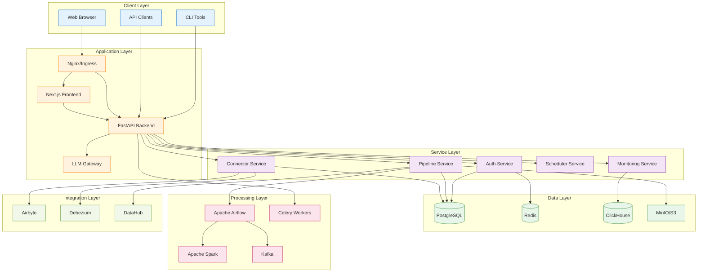
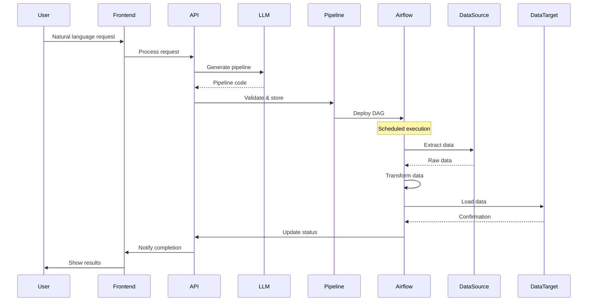
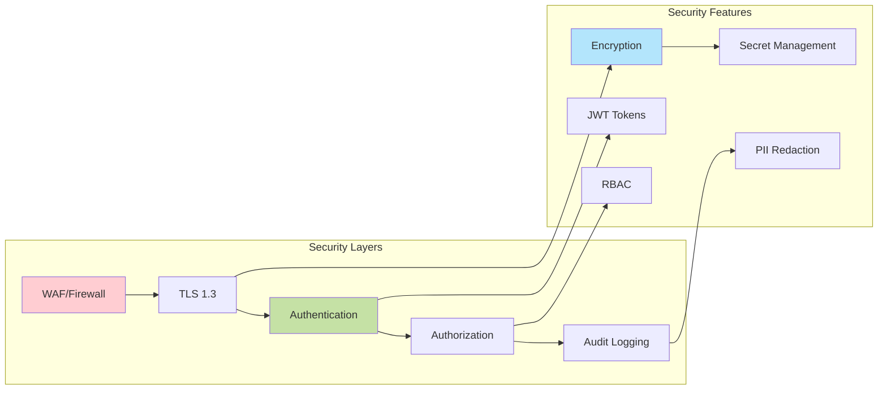

# 🏗️ System Architecture

## Overview

AI ETL Assistant is built on a modern microservices architecture designed for scalability, reliability, and extensibility.

## Architecture Diagram

## Core Components

### 1. Frontend (Next.js 14)
- **Purpose**: User interface and experience
- **Technology**: React 18, TypeScript, Tailwind CSS
- **Features**:
  - Server-side rendering for performance
  - Real-time updates via WebSocket
  - Responsive design
  - Progressive Web App capabilities

### 2. Backend API (FastAPI)
- **Purpose**: Business logic and API endpoints
- **Technology**: Python 3.10+, FastAPI, SQLAlchemy 2.0
- **Features**:
  - Async/await for high performance
  - Automatic API documentation
  - Type safety with Pydantic
  - JWT authentication

### 3. LLM Gateway
- **Purpose**: Manage LLM interactions
- **Technology**: Python, LangChain
- **Features**:
  - Multi-provider support (OpenAI, Anthropic, etc.)
  - Semantic caching
  - Circuit breaker pattern
  - Cost optimization

### 4. Data Storage

#### PostgreSQL
- **Purpose**: Primary database
- **Usage**:
  - User management
  - Pipeline definitions
  - Metadata storage
  - Configuration

#### Redis
- **Purpose**: Caching and sessions
- **Usage**:
  - Session storage
  - API response caching
  - Rate limiting
  - Pub/Sub messaging

#### ClickHouse
- **Purpose**: Analytics database
- **Usage**:
  - Telemetry data
  - Metrics storage
  - Log aggregation
  - Performance analytics

#### MinIO/S3
- **Purpose**: Object storage
- **Usage**:
  - Pipeline artifacts
  - Generated code
  - Data files
  - Backups

### 5. Processing Layer

#### Apache Airflow
- **Purpose**: Workflow orchestration
- **Features**:
  - DAG scheduling
  - Task dependencies
  - Monitoring
  - Alerting

#### Apache Spark
- **Purpose**: Big data processing
- **Features**:
  - Distributed computing
  - Batch processing
  - Stream processing
  - ML pipelines

#### Kafka
- **Purpose**: Event streaming
- **Features**:
  - Real-time data pipelines
  - Event sourcing
  - Stream processing
  - Message queuing

## Data Flow

## Scalability Patterns

### Horizontal Scaling
- **API Servers**: Load balanced with Nginx
- **Workers**: Celery worker pools
- **Databases**: Read replicas for PostgreSQL
- **Caching**: Redis cluster

### Vertical Scaling
- **Spark Clusters**: Dynamic executor allocation
- **Airflow Workers**: Resource-based scaling
- **Database**: Connection pooling

## Security Architecture

## High Availability

### Redundancy
- **Database**: Master-slave replication
- **Cache**: Redis Sentinel
- **Storage**: S3 multi-region
- **Services**: Multiple replicas

### Failover
- **Automatic**: Health checks and auto-restart
- **Manual**: Blue-green deployments
- **Backup**: Regular automated backups

## Performance Considerations

### Caching Strategy
1. **API Response**: Redis with 5-minute TTL
2. **LLM Responses**: Semantic caching (24 hours)
3. **Static Assets**: CDN caching
4. **Database**: Query result caching

### Optimization Techniques
- Connection pooling
- Lazy loading
- Index optimization
- Query batching
- Async processing

## Monitoring & Observability

### Metrics Collection
- **Prometheus**: System and application metrics
- **ClickHouse**: Business metrics
- **Loki**: Log aggregation

### Visualization
- **Grafana**: Dashboards and alerts
- **Custom Dashboard**: Business KPIs

## Related Documentation

- [Core Concepts](./concepts.md)
- [Data Flow](./data-flow.md)
- [Technology Stack](./tech-stack.md)
- [Security Overview](../security/overview.md)
- [Deployment Architecture](../deployment/kubernetes.md)

---

[← Back to Documentation](../README.md) | [Core Concepts →](./concepts.md)