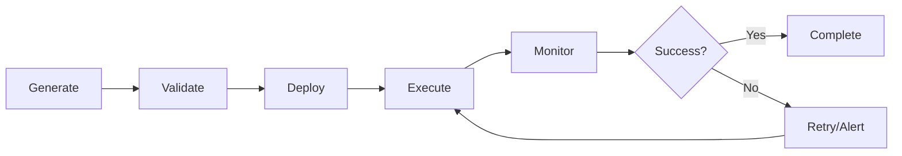
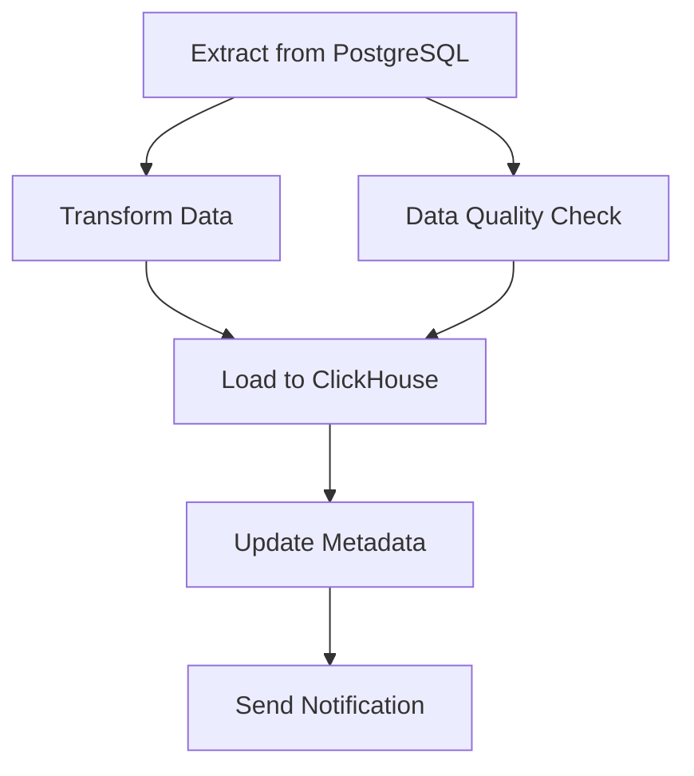
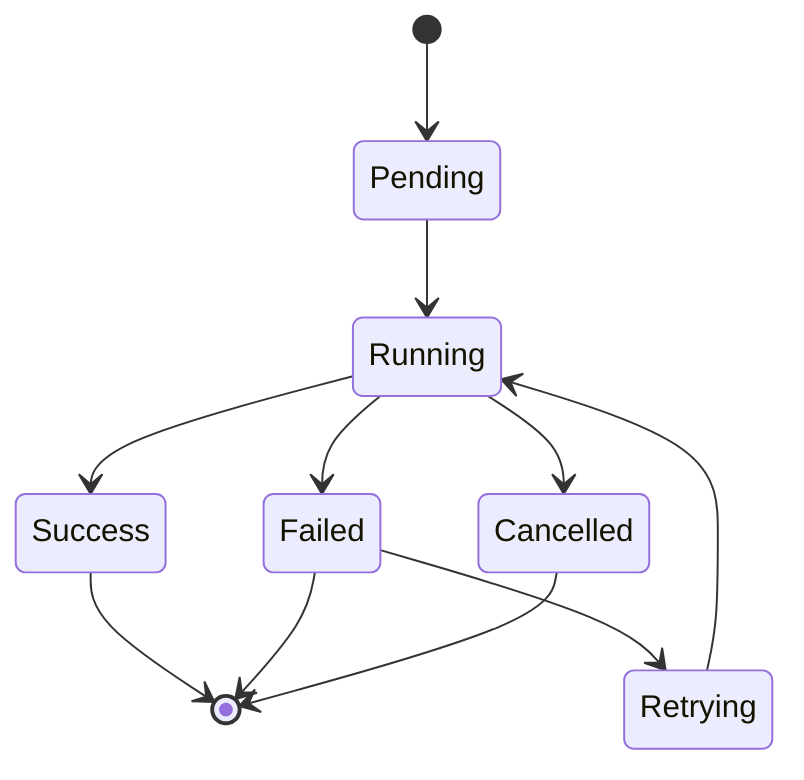

# 🎯 Core Concepts

## Introduction

AI ETL Assistant introduces several key concepts that form the foundation of the platform. Understanding these concepts is essential for effective use of the system.

---

## 📊 Projects

### What is a Project?

A **Project** is the top-level organizational unit that groups related pipelines, connectors, and resources.

### Project Components

- **Pipelines**: ETL/ELT workflows
- **Connectors**: Data source and target connections
- **Runs**: Pipeline execution history
- **Artifacts**: Generated code versions
- **Team Members**: Users with assigned roles

### Example

```
Project: "E-commerce Analytics"
├── Pipelines
│   ├── Daily Sales Sync
│   ├── Customer Data Update
│   └── Inventory Tracking
├── Connectors
│   ├── PostgreSQL (Production DB)
│   ├── ClickHouse (Analytics DB)
│   └── S3 (Data Lake)
└── Team
    ├── Alice (Architect)
    ├── Bob (Engineer)
    └── Carol (Analyst)
```

---

## 🔄 Pipelines

### What is a Pipeline?

A **Pipeline** is an automated workflow that moves and transforms data from sources to targets.

### Pipeline Types

| Type | Description | Use Case |
|------|-------------|----------|
| **Batch** | Scheduled data movement | Daily sync, hourly updates |
| **Streaming** | Real-time data processing | Live dashboards, event processing |
| **CDC** | Change Data Capture | Database replication, audit trails |
| **On-Demand** | Manual trigger execution | Ad-hoc reports, one-time migrations |

### Pipeline Lifecycle



### Pipeline Structure

```python
pipeline = {
    "id": "uuid",
    "name": "sales_sync",
    "description": "Daily sales data sync from PG to CH",
    "schedule": "0 2 * * *",  # Daily at 2 AM
    "source": {
        "type": "postgresql",
        "connector_id": "conn_123"
    },
    "target": {
        "type": "clickhouse",
        "connector_id": "conn_456"
    },
    "transformations": [
        {"type": "filter", "condition": "status = 'completed'"},
        {"type": "aggregate", "group_by": ["date", "region"]}
    ]
}
```

---

## 🔌 Connectors

### What is a Connector?

A **Connector** defines a connection to a data source or target with authentication and configuration.

### Connector Categories

#### 1. Data Sources
- **Databases**: PostgreSQL, MySQL, ClickHouse, MongoDB
- **Cloud Storage**: S3, Google Cloud Storage, Azure Blob
- **Applications**: Salesforce, HubSpot, Stripe
- **Files**: CSV, JSON, Excel, Parquet

#### 2. Data Targets
- **Data Warehouses**: ClickHouse, Snowflake, BigQuery
- **Data Lakes**: S3, HDFS, Delta Lake
- **Databases**: PostgreSQL, MySQL, MongoDB

#### 3. Integration Platforms
- **600+ Airbyte Connectors**: SaaS apps, databases, APIs
- **Custom Connectors**: Build your own with base connector class

### Connector Configuration

```python
connector = {
    "id": "conn_123",
    "name": "Production PostgreSQL",
    "type": "postgresql",
    "config": {
        "host": "db.company.com",
        "port": 5432,
        "database": "production",
        "schema": "public",
        "ssl_mode": "require"
    },
    "credentials": {
        # Encrypted storage
        "username": "***",
        "password": "***"
    }
}
```

---

## 🎨 DAGs (Directed Acyclic Graphs)

### What is a DAG?

A **DAG** represents a pipeline as a graph of tasks with dependencies.

### DAG Components

- **Tasks**: Individual operations (extract, transform, load)
- **Dependencies**: Task execution order
- **Operators**: Task implementations (Python, SQL, Bash)

### Example DAG



### DAG Code Example

```python
from airflow import DAG
from datetime import datetime

dag = DAG(
    'sales_sync',
    schedule_interval='@daily',
    start_date=datetime(2024, 1, 1)
)

extract_task = PostgresOperator(
    task_id='extract',
    sql='SELECT * FROM sales WHERE date = {{ ds }}',
    dag=dag
)

transform_task = PythonOperator(
    task_id='transform',
    python_callable=transform_sales_data,
    dag=dag
)

load_task = ClickHouseOperator(
    task_id='load',
    sql='INSERT INTO sales VALUES',
    dag=dag
)

extract_task >> transform_task >> load_task
```

---

## 🤖 AI-Powered Features

### Natural Language Generation

Convert plain English to pipelines:

```
User: "Load customer data from PostgreSQL to ClickHouse daily"
↓
AI ETL Assistant generates:
- Source configuration
- Transformation logic
- Target schema
- Airflow DAG
- Validation tests
```

### AI Agents System

Six specialized agents work together:

| Agent | Role | Responsibility |
|-------|------|----------------|
| **Planner** | Task decomposition | Break down user intent |
| **SQL Expert** | Query generation | Create optimized SQL |
| **Python Coder** | Code generation | Generate Python ETL code |
| **Schema Analyst** | Schema inference | Analyze data structures |
| **QA Validator** | Quality assurance | Test and validate |
| **Reflector** | Self-improvement | Critique and refine |

---

## 🏃 Runs

### What is a Run?

A **Run** is a single execution instance of a pipeline.

### Run States



### Run Metadata

```python
run = {
    "id": "run_789",
    "pipeline_id": "pipe_123",
    "status": "running",
    "started_at": "2024-01-26T10:00:00Z",
    "progress": 45,
    "current_task": "transforming_data",
    "metrics": {
        "rows_processed": 150000,
        "rows_failed": 12,
        "duration_seconds": 120
    }
}
```

---

## 📦 Artifacts

### What is an Artifact?

An **Artifact** is a versioned piece of generated code (SQL, Python, YAML).

### Artifact Types

| Type | Description | Example |
|------|-------------|---------|
| **SQL** | SQL scripts | `SELECT * FROM users` |
| **Python** | Python ETL code | `import pandas as pd...` |
| **YAML** | Configuration | Airflow DAG definition |
| **JSON** | Data schemas | JSON schema validation |

### Artifact Versioning

```python
artifact = {
    "id": "art_456",
    "pipeline_id": "pipe_123",
    "version": 3,
    "kind": "python",
    "content": "# Generated Python code...",
    "created_at": "2024-01-26T10:00:00Z",
    "created_by": "user_789"
}
```

---

## 🔐 RBAC (Role-Based Access Control)

### User Roles

| Role | Permissions | Use Case |
|------|-------------|----------|
| **Analyst** | Read pipelines, run executions | Business users |
| **Engineer** | Create/edit pipelines, manage connectors | Data engineers |
| **Architect** | Full project management | Tech leads |
| **Admin** | System administration | Platform admins |

### Permission Matrix

| Action | Analyst | Engineer | Architect | Admin |
|--------|---------|----------|-----------|-------|
| View Pipeline | ✅ | ✅ | ✅ | ✅ |
| Run Pipeline | ✅ | ✅ | ✅ | ✅ |
| Create Pipeline | ❌ | ✅ | ✅ | ✅ |
| Edit Pipeline | ❌ | ✅ | ✅ | ✅ |
| Delete Pipeline | ❌ | ❌ | ✅ | ✅ |
| Manage Users | ❌ | ❌ | ❌ | ✅ |
| System Config | ❌ | ❌ | ❌ | ✅ |

---

## 📊 Metrics & Monitoring

### Key Metrics

- **Pipeline Success Rate**: % of successful runs
- **Execution Duration**: Average pipeline runtime
- **Data Volume**: Rows/bytes processed
- **Error Rate**: Failed tasks per pipeline
- **Resource Usage**: CPU, memory, disk

### Monitoring Tools

- **Prometheus**: Metrics collection
- **Grafana**: Visualization dashboards
- **ClickHouse**: Telemetry storage
- **AI Observability**: ML-based anomaly detection

---

## 🔄 Caching & Performance

### Semantic Caching

AI responses are cached based on semantic similarity:

```
Query 1: "Load sales data from PostgreSQL"
Query 2: "Transfer sales records from Postgres database"
→ Same semantic meaning → Cache hit!
```

### Cache Benefits

- **30-50% reduction** in LLM API calls
- **Faster response times** for similar queries
- **Cost savings** on API usage

---

## 🌐 Multi-Tenancy

### Project Isolation

Each project has:
- Isolated resources
- Separate permissions
- Independent configuration
- Team-based access control

---

## 📚 Related Documentation

- [System Architecture](./README.md)
- [Technology Stack](./tech-stack.md)
- [Data Flow](../guides/first-pipeline.md)
- [API Reference](../api/rest-api.md)

---

[← Back to Documentation](../README.md) | [Tech Stack →](./tech-stack.md)
