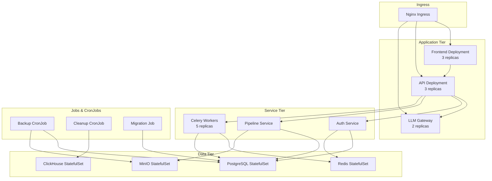

# ☸️ Kubernetes Deployment Guide

## Overview

This guide covers deploying AI ETL Assistant to a production Kubernetes cluster.

## Prerequisites

- Kubernetes 1.24+
- kubectl configured
- Helm 3.0+ (optional)
- 16GB RAM minimum for cluster
- Storage class for persistent volumes

## Architecture in Kubernetes



## Quick Deployment

### Using Our Scripts

```bash
# Production deployment to Yandex Cloud
kubectl apply -f k8s-production/production-yandex-cloud.yaml

# Or use the complete production setup
kubectl apply -f k8s-production/
```

### Using Helm (Recommended)

```bash
# Add our Helm repository
helm repo add ai-etl https://charts.ai-etl.com
helm repo update

# Install with default values
helm install ai-etl ai-etl/ai-etl-platform \
  --namespace ai-etl \
  --create-namespace

# Install with custom values
helm install ai-etl ai-etl/ai-etl-platform \
  --namespace ai-etl \
  --create-namespace \
  -f custom-values.yaml
```

## Step-by-Step Deployment

### 1. Create Namespace

```yaml
# namespace.yaml
apiVersion: v1
kind: Namespace
metadata:
  name: ai-etl
  labels:
    name: ai-etl
    environment: production
```

```bash
kubectl apply -f namespace.yaml
```

### 2. Create Secrets

```bash
# Create secret from .env file
kubectl create secret generic ai-etl-secrets \
  --from-env-file=.env \
  --namespace=ai-etl

# Or create manually
kubectl create secret generic ai-etl-secrets \
  --namespace=ai-etl \
  --from-literal=DATABASE_URL='postgresql://...' \
  --from-literal=OPENAI_API_KEY='sk-...' \
  --from-literal=JWT_SECRET_KEY='...'
```

### 3. Deploy PostgreSQL

```yaml
# postgres-deployment.yaml
apiVersion: apps/v1
kind: StatefulSet
metadata:
  name: postgresql
  namespace: ai-etl
spec:
  serviceName: postgresql
  replicas: 1
  selector:
    matchLabels:
      app: postgresql
  template:
    metadata:
      labels:
        app: postgresql
    spec:
      containers:
      - name: postgresql
        image: postgres:15-alpine
        env:
        - name: POSTGRES_DB
          value: ai_etl
        - name: POSTGRES_USER
          value: etl_user
        - name: POSTGRES_PASSWORD
          valueFrom:
            secretKeyRef:
              name: ai-etl-secrets
              key: POSTGRES_PASSWORD
        ports:
        - containerPort: 5432
        volumeMounts:
        - name: postgres-storage
          mountPath: /var/lib/postgresql/data
  volumeClaimTemplates:
  - metadata:
      name: postgres-storage
    spec:
      accessModes: ["ReadWriteOnce"]
      storageClassName: fast-ssd
      resources:
        requests:
          storage: 100Gi
```

### 4. Deploy Redis

```yaml
# redis-deployment.yaml
apiVersion: apps/v1
kind: StatefulSet
metadata:
  name: redis
  namespace: ai-etl
spec:
  serviceName: redis
  replicas: 1
  selector:
    matchLabels:
      app: redis
  template:
    metadata:
      labels:
        app: redis
    spec:
      containers:
      - name: redis
        image: redis:7-alpine
        command: ["redis-server", "--appendonly", "yes"]
        ports:
        - containerPort: 6379
        volumeMounts:
        - name: redis-storage
          mountPath: /data
  volumeClaimTemplates:
  - metadata:
      name: redis-storage
    spec:
      accessModes: ["ReadWriteOnce"]
      resources:
        requests:
          storage: 10Gi
```

### 5. Deploy Application

```yaml
# backend-deployment.yaml
apiVersion: apps/v1
kind: Deployment
metadata:
  name: ai-etl-backend
  namespace: ai-etl
spec:
  replicas: 3
  selector:
    matchLabels:
      app: ai-etl-backend
  template:
    metadata:
      labels:
        app: ai-etl-backend
    spec:
      containers:
      - name: backend
        image: your-registry/ai-etl-backend:latest
        ports:
        - containerPort: 8000
        envFrom:
        - secretRef:
            name: ai-etl-secrets
        env:
        - name: DATABASE_URL
          valueFrom:
            secretKeyRef:
              name: ai-etl-secrets
              key: DATABASE_URL
        resources:
          requests:
            memory: "512Mi"
            cpu: "250m"
          limits:
            memory: "2Gi"
            cpu: "1000m"
        livenessProbe:
          httpGet:
            path: /health
            port: 8000
          initialDelaySeconds: 30
          periodSeconds: 10
        readinessProbe:
          httpGet:
            path: /readiness
            port: 8000
          initialDelaySeconds: 5
          periodSeconds: 5
```

### 6. Configure Ingress

```yaml
# ingress.yaml
apiVersion: networking.k8s.io/v1
kind: Ingress
metadata:
  name: ai-etl-ingress
  namespace: ai-etl
  annotations:
    kubernetes.io/ingress.class: nginx
    cert-manager.io/cluster-issuer: letsencrypt-prod
    nginx.ingress.kubernetes.io/proxy-body-size: "100m"
spec:
  tls:
  - hosts:
    - ai-etl.your-domain.com
    - api.ai-etl.your-domain.com
    secretName: ai-etl-tls
  rules:
  - host: ai-etl.your-domain.com
    http:
      paths:
      - path: /
        pathType: Prefix
        backend:
          service:
            name: frontend-service
            port:
              number: 3000
  - host: api.ai-etl.your-domain.com
    http:
      paths:
      - path: /
        pathType: Prefix
        backend:
          service:
            name: backend-service
            port:
              number: 8000
```

## Scaling Configuration

### Horizontal Pod Autoscaler

```yaml
apiVersion: autoscaling/v2
kind: HorizontalPodAutoscaler
metadata:
  name: backend-hpa
  namespace: ai-etl
spec:
  scaleTargetRef:
    apiVersion: apps/v1
    kind: Deployment
    name: ai-etl-backend
  minReplicas: 3
  maxReplicas: 10
  metrics:
  - type: Resource
    resource:
      name: cpu
      target:
        type: Utilization
        averageUtilization: 70
  - type: Resource
    resource:
      name: memory
      target:
        type: Utilization
        averageUtilization: 80
```

### Vertical Pod Autoscaler

```yaml
apiVersion: autoscaling.k8s.io/v1
kind: VerticalPodAutoscaler
metadata:
  name: backend-vpa
  namespace: ai-etl
spec:
  targetRef:
    apiVersion: apps/v1
    kind: Deployment
    name: ai-etl-backend
  updatePolicy:
    updateMode: Auto
```

## Monitoring Setup

### Prometheus ServiceMonitor

```yaml
apiVersion: monitoring.coreos.com/v1
kind: ServiceMonitor
metadata:
  name: ai-etl-metrics
  namespace: ai-etl
spec:
  selector:
    matchLabels:
      app: ai-etl
  endpoints:
  - port: metrics
    interval: 30s
    path: /metrics
```

### Grafana Dashboard

Import our pre-built dashboard:
```bash
kubectl apply -f k8s-production/grafana-dashboard.yaml
```

## High Availability

### Multi-Region Deployment

```yaml
# Configure node affinity for multi-zone
affinity:
  podAntiAffinity:
    preferredDuringSchedulingIgnoredDuringExecution:
    - weight: 100
      podAffinityTerm:
        labelSelector:
          matchExpressions:
          - key: app
            operator: In
            values:
            - ai-etl-backend
        topologyKey: topology.kubernetes.io/zone
```

### Database Replication

```bash
# Deploy PostgreSQL with replication
helm install postgresql bitnami/postgresql \
  --set replication.enabled=true \
  --set replication.slaveReplicas=2 \
  --namespace ai-etl
```

## Backup Strategy

### Automated Backups

```yaml
apiVersion: batch/v1
kind: CronJob
metadata:
  name: database-backup
  namespace: ai-etl
spec:
  schedule: "0 2 * * *"
  jobTemplate:
    spec:
      template:
        spec:
          containers:
          - name: backup
            image: postgres:15-alpine
            command:
            - sh
            - -c
            - |
              pg_dump $DATABASE_URL | gzip > /backup/db-$(date +%Y%m%d).sql.gz
              mc cp /backup/db-$(date +%Y%m%d).sql.gz minio/backups/
            envFrom:
            - secretRef:
                name: ai-etl-secrets
          restartPolicy: OnFailure
```

## Troubleshooting

### Check Pod Status

```bash
kubectl get pods -n ai-etl
kubectl describe pod <pod-name> -n ai-etl
kubectl logs <pod-name> -n ai-etl
```

### Debug Running Pod

```bash
kubectl exec -it <pod-name> -n ai-etl -- /bin/bash
```

### Check Resources

```bash
kubectl top nodes
kubectl top pods -n ai-etl
```

### Common Issues

#### Pods Stuck in Pending
```bash
# Check for resource constraints
kubectl describe pod <pod-name> -n ai-etl

# Check node capacity
kubectl describe nodes
```

#### Database Connection Issues
```bash
# Test connection from pod
kubectl run -it --rm debug --image=postgres:15-alpine --restart=Never -n ai-etl -- psql $DATABASE_URL
```

## Security Considerations

### Network Policies

```yaml
apiVersion: networking.k8s.io/v1
kind: NetworkPolicy
metadata:
  name: backend-netpol
  namespace: ai-etl
spec:
  podSelector:
    matchLabels:
      app: ai-etl-backend
  policyTypes:
  - Ingress
  - Egress
  ingress:
  - from:
    - podSelector:
        matchLabels:
          app: ai-etl-frontend
    - podSelector:
        matchLabels:
          app: nginx-ingress
    ports:
    - protocol: TCP
      port: 8000
```

### Pod Security Policies

```yaml
apiVersion: policy/v1beta1
kind: PodSecurityPolicy
metadata:
  name: ai-etl-psp
spec:
  privileged: false
  runAsUser:
    rule: MustRunAsNonRoot
  seLinux:
    rule: RunAsAny
  fsGroup:
    rule: RunAsAny
  volumes:
  - configMap
  - secret
  - persistentVolumeClaim
```

## Related Documentation

- [Docker Deployment](./docker.md)
- [Cloud Deployment](./cloud.md)
- [Scaling Guide](./scaling.md)
- [Monitoring Setup](./monitoring.md)
- [Security Best Practices](../security/overview.md)

---

[← Back to Documentation](../README.md) | [Cloud Deployment →](./cloud.md)