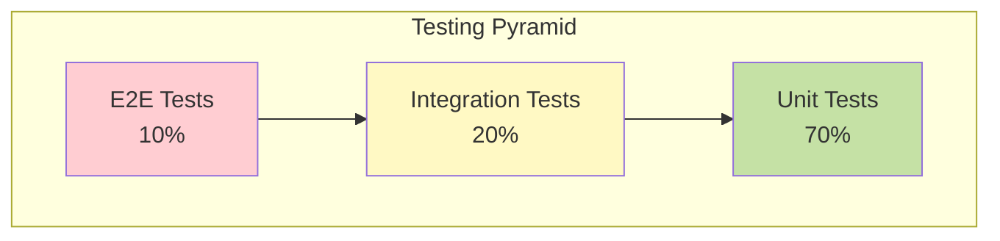

# 🧪 Testing Guide

## Testing Strategy

AI ETL Assistant follows a comprehensive testing pyramid approach:



## Test Organization

```
tests/
├── unit/                    # Fast, isolated tests
│   ├── services/           # Service layer tests
│   ├── models/            # Model tests
│   ├── validators/        # Validator tests
│   └── utils/             # Utility tests
├── integration/            # Component integration
│   ├── api/              # API endpoint tests
│   ├── database/         # Database tests
│   └── external/         # External service tests
├── e2e/                   # End-to-end scenarios
│   ├── pipelines/        # Pipeline workflows
│   └── user_flows/       # User journey tests
├── load/                  # Performance tests
│   └── locustfile.py     # Locust scenarios
└── fixtures/              # Test data and mocks
```

## Backend Testing

### Unit Testing

#### Basic Test Structure

```python
import pytest
from unittest.mock import Mock, patch, AsyncMock

from backend.services.pipeline_service import PipelineService
from backend.schemas.pipeline import PipelineCreate

class TestPipelineService:
    """Test suite for PipelineService"""

    @pytest.fixture
    def mock_db(self):
        """Mock database session"""
        return AsyncMock()

    @pytest.fixture
    def mock_llm_service(self):
        """Mock LLM service"""
        mock = AsyncMock()
        mock.generate.return_value = "generated code"
        return mock

    @pytest.fixture
    def pipeline_service(self, mock_db, mock_llm_service):
        """Create service instance with mocked dependencies"""
        return PipelineService(mock_db, mock_llm_service)

    @pytest.mark.asyncio
    async def test_generate_pipeline_success(self, pipeline_service):
        """Test successful pipeline generation"""
        # Arrange
        description = "Load data from PostgreSQL to ClickHouse"

        # Act
        result = await pipeline_service.generate_pipeline(description)

        # Assert
        assert result is not None
        assert result.code == "generated code"
        assert result.description == description
```

#### Testing Async Functions

```python
@pytest.mark.asyncio
async def test_async_operation():
    """Test async operations"""
    async with aiohttp.ClientSession() as session:
        async with session.get('http://api.example.com') as response:
            data = await response.json()
            assert data is not None
```

#### Mocking External Services

```python
@patch('backend.services.llm_service.openai.ChatCompletion.create')
async def test_llm_integration(mock_openai):
    """Test LLM service integration"""
    # Configure mock
    mock_openai.return_value = {
        "choices": [{
            "message": {
                "content": "Generated SQL query"
            }
        }]
    }

    # Test service
    service = LLMService()
    result = await service.generate_sql("Get all users")

    assert result == "Generated SQL query"
    mock_openai.assert_called_once()
```

### Integration Testing

#### Database Testing

```python
import pytest
from sqlalchemy.ext.asyncio import AsyncSession, create_async_engine
from backend.models import Pipeline
from backend.database import Base

@pytest.fixture
async def test_db():
    """Create test database"""
    # Use in-memory SQLite for tests
    engine = create_async_engine("sqlite+aiosqlite:///:memory:")

    async with engine.begin() as conn:
        await conn.run_sync(Base.metadata.create_all)

    async with AsyncSession(engine) as session:
        yield session

    await engine.dispose()

@pytest.mark.integration
async def test_pipeline_crud(test_db):
    """Test pipeline CRUD operations"""
    # Create
    pipeline = Pipeline(
        name="Test Pipeline",
        description="Test description",
        code="print('test')"
    )
    test_db.add(pipeline)
    await test_db.commit()

    # Read
    result = await test_db.get(Pipeline, pipeline.id)
    assert result.name == "Test Pipeline"

    # Update
    result.name = "Updated Pipeline"
    await test_db.commit()

    # Delete
    await test_db.delete(result)
    await test_db.commit()

    # Verify deletion
    deleted = await test_db.get(Pipeline, pipeline.id)
    assert deleted is None
```

#### API Testing

```python
from fastapi.testclient import TestClient
from backend.api.main import app

@pytest.fixture
def client():
    """Create test client"""
    return TestClient(app)

@pytest.mark.integration
def test_pipeline_generation_endpoint(client, mock_auth):
    """Test pipeline generation API endpoint"""
    response = client.post(
        "/api/v1/pipelines:generate",
        json={
            "description": "Test pipeline",
            "project_id": "test-project"
        },
        headers={"Authorization": "Bearer test-token"}
    )

    assert response.status_code == 200
    data = response.json()
    assert "pipeline_id" in data
    assert data["description"] == "Test pipeline"
```

### End-to-End Testing

```python
@pytest.mark.e2e
async def test_complete_pipeline_flow():
    """Test complete pipeline lifecycle"""
    async with TestClient(app) as client:
        # 1. Login
        login_response = await client.post(
            "/api/v1/auth/login",
            json={"email": "test@example.com", "password": "test123"}
        )
        token = login_response.json()["access_token"]
        headers = {"Authorization": f"Bearer {token}"}

        # 2. Generate pipeline
        generation_response = await client.post(
            "/api/v1/pipelines:generate",
            json={"description": "ETL test pipeline"},
            headers=headers
        )
        pipeline_id = generation_response.json()["pipeline_id"]

        # 3. Deploy pipeline
        deploy_response = await client.post(
            f"/api/v1/pipelines/{pipeline_id}:deploy",
            headers=headers
        )
        assert deploy_response.status_code == 200

        # 4. Run pipeline
        run_response = await client.post(
            f"/api/v1/pipelines/{pipeline_id}:run",
            headers=headers
        )
        run_id = run_response.json()["run_id"]

        # 5. Check status
        status_response = await client.get(
            f"/api/v1/runs/{run_id}/status",
            headers=headers
        )
        assert status_response.json()["status"] in ["running", "completed"]
```

## Frontend Testing

### Component Testing

```typescript
import { render, screen, fireEvent } from '@testing-library/react';
import { PipelineEditor } from '@/components/PipelineEditor';

describe('PipelineEditor', () => {
  it('renders editor with description field', () => {
    render(<PipelineEditor />);

    const textarea = screen.getByPlaceholderText(/describe your pipeline/i);
    expect(textarea).toBeInTheDocument();
  });

  it('generates pipeline on button click', async () => {
    const mockGenerate = jest.fn();
    render(<PipelineEditor onGenerate={mockGenerate} />);

    const textarea = screen.getByPlaceholderText(/describe your pipeline/i);
    const button = screen.getByText(/generate pipeline/i);

    fireEvent.change(textarea, { target: { value: 'Test pipeline' } });
    fireEvent.click(button);

    expect(mockGenerate).toHaveBeenCalledWith('Test pipeline');
  });
});
```

### Hook Testing

```typescript
import { renderHook, act } from '@testing-library/react';
import { usePipeline } from '@/hooks/usePipeline';

describe('usePipeline', () => {
  it('manages pipeline state correctly', async () => {
    const { result } = renderHook(() => usePipeline());

    // Initial state
    expect(result.current.pipelines).toEqual([]);
    expect(result.current.loading).toBe(false);

    // Generate pipeline
    await act(async () => {
      await result.current.generatePipeline('Test description');
    });

    expect(result.current.pipelines).toHaveLength(1);
    expect(result.current.pipelines[0].description).toBe('Test description');
  });
});
```

### E2E Testing with Cypress

```javascript
// cypress/e2e/pipeline-creation.cy.js
describe('Pipeline Creation Flow', () => {
  beforeEach(() => {
    cy.login('test@example.com', 'password123');
    cy.visit('/studio');
  });

  it('creates pipeline from natural language', () => {
    // Enter description
    cy.get('[data-cy=pipeline-description]')
      .type('Load customer data from PostgreSQL to ClickHouse daily');

    // Generate pipeline
    cy.get('[data-cy=generate-button]').click();

    // Wait for generation
    cy.get('[data-cy=pipeline-code]', { timeout: 10000 })
      .should('be.visible')
      .and('contain', 'def extract_data');

    // Validate pipeline
    cy.get('[data-cy=validate-button]').click();
    cy.get('[data-cy=validation-status]')
      .should('contain', 'Validation passed');

    // Deploy pipeline
    cy.get('[data-cy=deploy-button]').click();
    cy.get('[data-cy=deployment-status]')
      .should('contain', 'Successfully deployed');
  });
});
```

## Performance Testing

### Load Testing with Locust

```python
# tests/load/locustfile.py
from locust import HttpUser, task, between
import random

class AIETLUser(HttpUser):
    wait_time = between(1, 3)

    def on_start(self):
        """Login and get token"""
        response = self.client.post(
            "/api/v1/auth/login",
            json={
                "email": "load_test@example.com",
                "password": "test123"
            }
        )
        self.token = response.json()["access_token"]
        self.headers = {"Authorization": f"Bearer {self.token}"}

    @task(3)
    def generate_pipeline(self):
        """Test pipeline generation endpoint"""
        descriptions = [
            "Load sales data to warehouse",
            "Sync customer data hourly",
            "Process log files daily"
        ]

        self.client.post(
            "/api/v1/pipelines:generate",
            json={"description": random.choice(descriptions)},
            headers=self.headers,
            name="/api/v1/pipelines:generate"
        )

    @task(5)
    def list_pipelines(self):
        """Test pipeline listing"""
        self.client.get(
            "/api/v1/pipelines",
            headers=self.headers,
            name="/api/v1/pipelines"
        )

    @task(2)
    def get_metrics(self):
        """Test metrics endpoint"""
        self.client.get(
            "/api/v1/observability/metrics",
            headers=self.headers,
            name="/api/v1/observability/metrics"
        )
```

### Running Load Tests

```bash
# Run with 100 users ramping up over 30 seconds
locust -f tests/load/locustfile.py \
  --host=http://localhost:8000 \
  --users=100 \
  --spawn-rate=3 \
  --time=5m

# Headless mode
locust -f tests/load/locustfile.py \
  --host=http://localhost:8000 \
  --users=1000 \
  --spawn-rate=10 \
  --time=10m \
  --headless \
  --html=report.html
```

## Test Data Management

### Fixtures

```python
# tests/fixtures/pipelines.py
import pytest
from datetime import datetime

@pytest.fixture
def sample_pipeline():
    """Sample pipeline data"""
    return {
        "id": "pipe_123",
        "name": "Test Pipeline",
        "description": "Test description",
        "code": "def process(): pass",
        "created_at": datetime.utcnow(),
        "status": "draft"
    }

@pytest.fixture
def sample_user():
    """Sample user data"""
    return {
        "id": 1,
        "email": "test@example.com",
        "role": "engineer",
        "is_active": True
    }
```

### Factory Pattern

```python
# tests/factories.py
import factory
from backend.models import Pipeline, User

class UserFactory(factory.Factory):
    class Meta:
        model = User

    email = factory.Faker('email')
    name = factory.Faker('name')
    role = factory.Iterator(['viewer', 'analyst', 'engineer'])
    is_active = True

class PipelineFactory(factory.Factory):
    class Meta:
        model = Pipeline

    name = factory.Sequence(lambda n: f"Pipeline {n}")
    description = factory.Faker('text')
    code = factory.LazyAttribute(
        lambda obj: f"# Pipeline: {obj.name}\nprint('Processing')"
    )
    user = factory.SubFactory(UserFactory)
```

## Test Coverage

### Measuring Coverage

```bash
# Backend coverage
pytest --cov=backend --cov-report=html --cov-report=term

# Frontend coverage
npm run test:coverage

# Combined coverage report
coverage combine
coverage report
coverage html
```

### Coverage Requirements

```yaml
# .coveragerc
[run]
source = backend
omit =
    */tests/*
    */migrations/*
    */venv/*

[report]
precision = 2
fail_under = 80

[html]
directory = htmlcov
```

## Continuous Integration

### GitHub Actions Workflow

```yaml
# .github/workflows/test.yml
name: Tests

on: [push, pull_request]

jobs:
  backend-tests:
    runs-on: ubuntu-latest
    steps:
      - uses: actions/checkout@v3

      - name: Set up Python
        uses: actions/setup-python@v4
        with:
          python-version: '3.10'

      - name: Install dependencies
        run: |
          pip install poetry
          poetry install --with dev

      - name: Run tests
        run: |
          poetry run pytest --cov=backend --cov-report=xml

      - name: Upload coverage
        uses: codecov/codecov-action@v3

  frontend-tests:
    runs-on: ubuntu-latest
    steps:
      - uses: actions/checkout@v3

      - name: Setup Node.js
        uses: actions/setup-node@v3
        with:
          node-version: '18'

      - name: Install dependencies
        run: |
          cd frontend
          npm ci

      - name: Run tests
        run: |
          cd frontend
          npm test -- --coverage

      - name: Run E2E tests
        run: |
          cd frontend
          npm run test:e2e
```

## Testing Best Practices

### 1. Test Naming

```python
# Good test names
def test_pipeline_generation_with_valid_description_returns_pipeline():
    pass

def test_pipeline_generation_with_empty_description_raises_validation_error():
    pass

# Bad test names
def test1():
    pass

def test_pipeline():
    pass
```

### 2. AAA Pattern

```python
def test_service_method():
    # Arrange - Set up test data and mocks
    mock_db = Mock()
    service = MyService(mock_db)
    input_data = {"key": "value"}

    # Act - Execute the operation
    result = service.process(input_data)

    # Assert - Verify the outcome
    assert result.success is True
    mock_db.save.assert_called_once()
```

### 3. Test Isolation

```python
@pytest.fixture(autouse=True)
def reset_database():
    """Reset database before each test"""
    yield
    # Cleanup after test
    db.session.rollback()
    db.drop_all()
```

### 4. Parametrized Testing

```python
@pytest.mark.parametrize("input,expected", [
    ("", ValidationError),
    ("short", ValidationError),
    ("valid description here", None),
    ("x" * 10001, ValidationError),  # Too long
])
def test_description_validation(input, expected):
    if expected:
        with pytest.raises(expected):
            validate_description(input)
    else:
        assert validate_description(input) is None
```

## Test Markers

```python
# Mark slow tests
@pytest.mark.slow
def test_heavy_computation():
    pass

# Mark tests requiring external services
@pytest.mark.external
def test_openai_integration():
    pass

# Run specific markers
# pytest -m "not slow"
# pytest -m "unit and not external"
```

## Debugging Tests

### Using debugger

```python
def test_complex_logic():
    # Set breakpoint
    import pdb; pdb.set_trace()

    # Or use built-in breakpoint (Python 3.7+)
    breakpoint()

    result = complex_function()
    assert result == expected
```

### Verbose output

```bash
# Show print statements
pytest -s

# Verbose output
pytest -vv

# Show local variables on failure
pytest -l
```

## Test Documentation

### Docstrings

```python
def test_pipeline_deployment():
    """
    Test that pipeline deployment:
    1. Validates the pipeline code
    2. Creates Airflow DAG
    3. Schedules the pipeline
    4. Returns deployment status

    This test mocks external Airflow API calls.
    """
    pass
```

## Related Documentation

- [Development Setup](./setup.md)
- [Backend Development](./backend.md)
- [Frontend Development](./frontend.md)
- [CI/CD Pipeline](../deployment/ci-cd.md)

---

[← Back to Development](./README.md) | [Contributing →](./contributing.md)