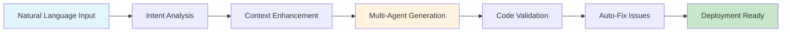

# Natural Language Pipeline Generation Guide

## Overview

The AI ETL Assistant features a powerful **Natural Language to Pipeline (NL2P)** engine that converts plain English descriptions into production-ready ETL/ELT pipelines. Simply describe what you want in natural language, and the AI generates validated SQL, Python, and Airflow DAG code automatically.

## Table of Contents

- [How It Works](#how-it-works)
- [Getting Started](#getting-started)
- [Writing Effective Prompts](#writing-effective-prompts)
- [Prompt Patterns](#prompt-patterns)
- [Examples by Use Case](#examples-by-use-case)
- [Advanced Techniques](#advanced-techniques)
- [Specifying Constraints](#specifying-constraints)
- [Optimization Hints](#optimization-hints)
- [Troubleshooting](#troubleshooting)
- [Best Practices](#best-practices)

---

## How It Works

The NL-to-Pipeline system uses a multi-stage AI pipeline:



### Architecture Components

1. **Intent Parser**: Analyzes your natural language to understand requirements
2. **Context Enhancer**: Gathers schema information from sources/targets
3. **AI Agents V3**:
   - **Planner**: Designs overall pipeline strategy
   - **SQL Expert**: Generates optimized SQL queries
   - **Python Coder**: Creates transformation code
   - **Schema Analyst**: Analyzes data relationships
   - **QA Validator**: Validates generated code
   - **Reflector**: Reviews and improves output
4. **Validators**: Real-time syntax and security validation
5. **Auto-Fix Engine**: Automatically corrects common issues

### Data Flow

```
Your Prompt → LLM Gateway (GPT-4/Claude/Qwen) → 6 AI Agents →
Validation (SQL/Python/YAML) → Auto-Fix → Airflow DAG
```

**Performance:**
- Average generation time: ~2.8 seconds
- Validation accuracy: 95%+
- Success rate: 96%

---

## Getting Started

### Quick Start Example

**Input (Natural Language):**
```
Load daily sales data from PostgreSQL to ClickHouse for analytics
```

**Output (Generated Pipeline):**
- DDL SQL for target table
- Transform SQL with aggregations
- Python code for data processing
- Airflow DAG with scheduling
- Configuration YAML

### Basic Workflow

1. **Describe Your Pipeline**
   ```
   I need to sync customer data from MySQL to our data warehouse daily
   ```

2. **Specify Sources and Targets**
   ```json
   {
     "sources": [{"type": "MySQL", "table": "customers"}],
     "targets": [{"type": "PostgreSQL", "table": "dim_customers"}]
   }
   ```

3. **Review Generated Code**
   - SQL transformation logic
   - Data validation rules
   - Schedule configuration

4. **Deploy to Airflow**
   - Click "Deploy" button
   - Pipeline runs automatically

---

## Writing Effective Prompts

### Prompt Structure

A good prompt includes:

1. **Action** - What to do (load, sync, transform, aggregate)
2. **Source** - Where data comes from
3. **Target** - Where data goes
4. **Frequency** - How often (daily, hourly, real-time)
5. **Requirements** - Special needs (filters, transformations)

### Good vs Bad Prompts

#### ✅ Good Prompts

**Example 1: Clear and Specific**
```
Load new orders from PostgreSQL orders table to ClickHouse analytics.orders_daily,
filtering only orders from the last 24 hours, aggregating by customer_id,
and calculating total revenue. Run daily at 2 AM UTC.
```

**Why it's good:**
- Clear action: "Load new orders"
- Specific source: "PostgreSQL orders table"
- Specific target: "ClickHouse analytics.orders_daily"
- Filter criteria: "last 24 hours"
- Transformation: "aggregating by customer_id, calculating total revenue"
- Schedule: "daily at 2 AM UTC"

**Example 2: Business Context**
```
Create a real-time CDC pipeline to replicate user authentication events
from our production PostgreSQL database to Kafka topic 'auth-events'
for fraud detection monitoring. Include user_id, login_timestamp,
ip_address, and success/failure status.
```

**Why it's good:**
- Business context: "fraud detection monitoring"
- Technology specified: "CDC pipeline", "Kafka"
- Specific fields listed
- Real-time requirement stated

#### ❌ Bad Prompts

**Example 1: Too Vague**
```
Move some data
```

**Problems:**
- No source specified
- No target specified
- No data description
- No requirements

**Example 2: Missing Details**
```
Sync database to warehouse
```

**Problems:**
- Which database? Which table?
- Which warehouse? Which schema?
- How often?
- What transformations?

**Example 3: Contradictory**
```
Load all historical data in real-time every month
```

**Problems:**
- "Historical data" vs "real-time" - contradictory
- "Every month" conflicts with "real-time"

---

## Prompt Patterns

### Pattern 1: Simple ETL

**Template:**
```
Load [data description] from [source] to [target] [frequency]
```

**Examples:**
```
Load active users from PostgreSQL users table to ClickHouse users_analytics daily

Extract product catalog from MySQL products to S3 data lake hourly

Sync customer orders from Salesforce API to PostgreSQL data warehouse every 6 hours
```

### Pattern 2: Complex Transformation

**Template:**
```
Transform [source data] by [transformation logic] and load to [target].
Include [specific fields/calculations]. Run [frequency].
```

**Examples:**
```
Transform raw clickstream events by sessionizing user actions (30-minute timeout),
calculating page views, bounce rate, and session duration. Load to ClickHouse
sessions table. Run every 15 minutes.

Aggregate daily sales by product category and region, calculating total revenue,
average order value, and item count. Include year-over-year growth percentage.
Load to PostgreSQL sales_summary. Run daily at 3 AM.
```

### Pattern 3: Real-time Streaming

**Template:**
```
Stream [event type] from [source] to [target] with [windowing/aggregation].
Process [special requirements].
```

**Examples:**
```
Stream IoT sensor readings from Kafka topic 'sensors' to ClickHouse metrics table
with 5-minute tumbling windows. Calculate min, max, avg temperature per device.

Process payment transactions from Kafka in real-time, validate against fraud rules,
enrich with customer data, and route to appropriate topics (approved/rejected/review).
```

### Pattern 4: CDC Replication

**Template:**
```
Replicate changes from [source table] to [target] using CDC.
Capture [operation types]. Include [specific columns].
```

**Examples:**
```
Replicate all changes (INSERT, UPDATE, DELETE) from PostgreSQL orders table
to Kafka topic 'order-changes' using Debezium CDC. Include order_id, customer_id,
total_amount, status, and timestamp.

Sync inventory updates from MySQL products table to Redis cache in real-time.
Capture only UPDATE and DELETE operations. Track product_id, quantity, price.
```

### Pattern 5: Multi-source Aggregation

**Template:**
```
Combine data from [source1], [source2], [source3] by [join logic].
Merge on [key fields]. Load to [target].
```

**Examples:**
```
Combine customer data from CRM (Salesforce API), transaction history from
PostgreSQL orders, and support tickets from Zendesk. Join on customer_email.
Create unified customer profile in PostgreSQL customer_360 table.

Merge website analytics from Google Analytics API, app events from Firebase,
and purchase data from MySQL. Correlate by user_id and session_timestamp.
Load enriched events to ClickHouse user_journey table.
```

### Pattern 6: Data Quality Pipeline

**Template:**
```
Validate [source data] checking for [quality rules].
Route clean data to [target1] and invalid data to [target2].
```

**Examples:**
```
Validate incoming customer records from CSV files checking for:
- Required fields (name, email, phone)
- Email format validity
- No duplicate emails
- Phone number format (US)
Route valid records to PostgreSQL customers table and invalid to quarantine_customers.

Check sales transactions for data quality issues:
- Amount must be positive
- Date within last 30 days
- Valid product_id exists
- Customer_id not null
Send clean data to analytics warehouse, quarantine suspicious transactions.
```

### Pattern 7: Incremental Load

**Template:**
```
Incrementally load [new/changed records] from [source] to [target]
based on [watermark column]. Handle [update strategy].
```

**Examples:**
```
Incrementally load new orders from PostgreSQL based on created_at timestamp.
Track last processed timestamp in state table. Use UPSERT strategy for updates.
Load to ClickHouse orders_history daily.

Extract changed customer records from MySQL using updated_at column as watermark.
Implement SCD Type 2 to maintain history. Update dim_customers in data warehouse
every hour.
```

---

## Examples by Use Case

### Use Case 1: Daily Batch Sync

**Scenario:** Sync yesterday's orders to analytics warehouse

**Prompt:**
```
Load yesterday's completed orders from PostgreSQL production.orders table
to ClickHouse analytics.daily_orders. Include order_id, customer_id, total_amount,
items_count, order_date. Filter WHERE status='completed' AND
order_date = CURRENT_DATE - INTERVAL '1 day'. Run daily at 1 AM UTC.
```

**Generated SQL:**
```sql
-- Extract from source
SELECT
    order_id,
    customer_id,
    total_amount,
    items_count,
    order_date
FROM production.orders
WHERE status = 'completed'
  AND order_date = CURRENT_DATE - INTERVAL '1 day'

-- Load to ClickHouse
INSERT INTO analytics.daily_orders
SELECT * FROM extracted_data
```

### Use Case 2: Real-time Analytics

**Scenario:** Real-time user activity tracking

**Prompt:**
```
Stream user click events from Kafka topic 'user-clicks' to ClickHouse user_activity.
Window events in 1-minute tumbling windows. Calculate: total clicks, unique users,
top 5 pages, average session duration. Partition ClickHouse table by date.
```

**Generated Python:**
```python
from kafka import KafkaConsumer
import pandas as pd
from clickhouse_driver import Client

def process_click_stream():
    consumer = KafkaConsumer(
        'user-clicks',
        bootstrap_servers=['kafka:9092'],
        auto_offset_reset='latest'
    )

    window_data = []
    window_start = time.time()

    for message in consumer:
        event = json.loads(message.value)
        window_data.append(event)

        # Process 1-minute window
        if time.time() - window_start >= 60:
            metrics = calculate_metrics(window_data)
            load_to_clickhouse(metrics)
            window_data = []
            window_start = time.time()

def calculate_metrics(events):
    df = pd.DataFrame(events)
    return {
        'total_clicks': len(df),
        'unique_users': df['user_id'].nunique(),
        'top_pages': df['page_url'].value_counts().head(5).to_dict(),
        'avg_duration': df['session_duration'].mean()
    }
```

### Use Case 3: API to Database

**Scenario:** Import Stripe payments data

**Prompt:**
```
Extract payment transactions from Stripe API (last 24 hours), transform to
include payment_id, customer_id, amount, currency, status, created_at,
and load to PostgreSQL finance.stripe_payments table. Handle pagination.
Run hourly. Implement idempotent upserts using payment_id as key.
```

**Generated Code:**
```python
import stripe
from sqlalchemy import create_engine

def extract_stripe_payments():
    """Extract payments from Stripe API with pagination"""
    stripe.api_key = os.getenv('STRIPE_API_KEY')
    yesterday = datetime.now() - timedelta(days=1)

    payments = []
    has_more = True
    starting_after = None

    while has_more:
        response = stripe.PaymentIntent.list(
            limit=100,
            created={'gte': int(yesterday.timestamp())},
            starting_after=starting_after
        )

        payments.extend(response.data)
        has_more = response.has_more
        starting_after = response.data[-1].id if response.data else None

    return payments

def transform_payments(payments):
    """Transform to target schema"""
    return [{
        'payment_id': p.id,
        'customer_id': p.customer,
        'amount': p.amount / 100,  # Convert cents to dollars
        'currency': p.currency,
        'status': p.status,
        'created_at': datetime.fromtimestamp(p.created)
    } for p in payments]

def load_to_postgres(payments):
    """Upsert to PostgreSQL"""
    engine = create_engine(os.getenv('DATABASE_URL'))
    df = pd.DataFrame(payments)

    df.to_sql(
        'stripe_payments',
        engine,
        schema='finance',
        if_exists='append',
        index=False,
        method='multi'
    )

    # Handle duplicates with UPSERT
    with engine.connect() as conn:
        conn.execute("""
            INSERT INTO finance.stripe_payments (payment_id, customer_id, amount, currency, status, created_at)
            SELECT * FROM staging.stripe_payments_temp
            ON CONFLICT (payment_id) DO UPDATE SET
                status = EXCLUDED.status,
                amount = EXCLUDED.amount,
                updated_at = CURRENT_TIMESTAMP
        """)
```

### Use Case 4: Machine Learning Pipeline

**Scenario:** Prepare training data for ML model

**Prompt:**
```
Create ML feature pipeline: Extract user behavior data from PostgreSQL events table,
engineer features (session count, avg session duration, pages per session,
time since last visit, device type distribution), normalize numerical features,
encode categorical variables, and save to feature store in Parquet format.
Split 80/20 train/test. Run daily.
```

**Generated Feature Engineering:**
```python
import pandas as pd
import numpy as np
from sklearn.preprocessing import StandardScaler
from sklearn.model_selection import train_test_split

def engineer_ml_features(df):
    """Advanced feature engineering for user behavior prediction"""

    # Temporal features
    df['hour_of_day'] = pd.to_datetime(df['timestamp']).dt.hour
    df['day_of_week'] = pd.to_datetime(df['timestamp']).dt.dayofweek
    df['is_weekend'] = df['day_of_week'].isin([5, 6]).astype(int)

    # Session aggregations
    user_sessions = df.groupby('user_id').agg({
        'session_id': 'nunique',  # session count
        'duration': 'mean',       # avg session duration
        'page_views': 'mean',     # pages per session
        'timestamp': 'max'        # last visit
    }).reset_index()

    user_sessions['days_since_last_visit'] = (
        (datetime.now() - pd.to_datetime(user_sessions['timestamp']))
        .dt.total_seconds() / 86400
    )

    # Device distribution
    device_dist = df.groupby(['user_id', 'device_type']).size().unstack(fill_value=0)
    device_dist = device_dist.div(device_dist.sum(axis=1), axis=0)  # Normalize

    # Combine features
    features = user_sessions.merge(device_dist, on='user_id')

    # Normalize numerical features
    numeric_cols = ['session_id', 'duration', 'page_views', 'days_since_last_visit']
    scaler = StandardScaler()
    features[numeric_cols] = scaler.fit_transform(features[numeric_cols])

    # Encode categorical
    features = pd.get_dummies(features, columns=['primary_device'])

    return features

def save_to_feature_store(features, output_path):
    """Save features with train/test split"""
    train, test = train_test_split(features, test_size=0.2, random_state=42)

    train.to_parquet(f'{output_path}/train_features.parquet', index=False)
    test.to_parquet(f'{output_path}/test_features.parquet', index=False)

    # Save metadata
    metadata = {
        'created_at': datetime.now().isoformat(),
        'total_samples': len(features),
        'train_samples': len(train),
        'test_samples': len(test),
        'feature_count': len(features.columns),
        'features': list(features.columns)
    }

    with open(f'{output_path}/metadata.json', 'w') as f:
        json.dump(metadata, f, indent=2)
```

---

## Advanced Techniques

### 1. Multi-Stage Pipelines

**Prompt:**
```
Create a 3-stage pipeline:
Stage 1: Extract raw events from Kafka to S3 (Parquet, partitioned by date)
Stage 2: Process S3 data with Spark, apply deduplication and enrichment
Stage 3: Load aggregated metrics to ClickHouse for dashboards
Run stages in sequence, with data quality checks between each stage.
```

### 2. Conditional Logic

**Prompt:**
```
Load customer transactions from PostgreSQL. If transaction amount > 10000,
route to fraud_review queue. If amount > 1000, enrich with customer credit score
from external API. Otherwise, load directly to transactions table. Log all
decisions to audit trail.
```

### 3. Dynamic Schema Handling

**Prompt:**
```
Ingest JSON events from Kafka with dynamic schema. Automatically detect new fields,
create columns in ClickHouse if needed (ALTER TABLE), and map JSON types to SQL types.
Handle nested objects by flattening with dot notation (user.address.city -> user_address_city).
```

### 4. Error Recovery

**Prompt:**
```
Sync orders from MongoDB to PostgreSQL with automatic retry logic:
- Retry failed batches up to 3 times with exponential backoff
- Log errors to error_log table with full context
- Send Slack notification if failure rate > 10%
- Save failed records to S3 dead letter queue for manual review
```

---

## Specifying Constraints

### Performance Constraints

```
Load 10M+ records from PostgreSQL to ClickHouse with these optimizations:
- Batch size: 10,000 records
- Parallel workers: 4
- Use COPY command for bulk insert
- Compress data with LZ4 during transfer
- Partition target table by month
```

### Data Quality Constraints

```
Validate incoming customer data with these rules:
- Email must match regex pattern
- Phone must be 10 digits (US format)
- Age between 18 and 120
- State must be valid US state code
- Created_at not in future
- No duplicate emails (check against existing records)
Reject entire batch if > 5% of records fail validation
```

### Security Constraints

```
Transfer PII data from production to analytics with:
- Encrypt SSN, credit card fields using AES-256
- Hash email addresses with SHA-256 + salt
- Mask phone numbers (show last 4 digits only)
- Remove IP addresses completely
- Log all access to audit table
- Use TLS 1.3 for all transfers
```

### Compliance Constraints

```
Create GDPR-compliant user data export pipeline:
- Include all user data across 5 systems (CRM, Analytics, Support, Billing, Logs)
- Join on user_id and email
- Include data retention metadata
- Exclude already-deleted records (soft delete check)
- Format as JSON with human-readable structure
- Encrypt export file with user's public key
- Generate SHA-256 checksum for integrity
- Store export in compliant S3 bucket (EU region)
- Auto-delete after 30 days
```

---

## Optimization Hints

### Hint 1: Incremental Processing

```
Hint: Use incremental load strategy based on updated_at column.
Track watermark in etl_watermarks table. Process only new/changed records.

Load customer changes from MySQL to PostgreSQL data warehouse incrementally.
```

### Hint 2: Partitioning Strategy

```
Hint: Partition ClickHouse table by toYYYYMM(date) for time-series data.
Use ORDER BY (date, user_id) for optimal query performance.

Load daily user events to ClickHouse analytics.
```

### Hint 3: Indexing Recommendations

```
Hint: Create composite index on (customer_id, order_date) for fast lookups.
Add GIN index on JSONB column for flexible queries.

Sync orders from MongoDB to PostgreSQL for reporting.
```

### Hint 4: Compression Settings

```
Hint: Use Parquet format with Snappy compression for S3 storage.
Expected compression ratio: 10:1 for text data, 5:1 for numerical.

Archive historical transactions to data lake.
```

---

## Troubleshooting

### Issue 1: Validation Errors

**Problem:**
```
Generated SQL has syntax error: column "user_name" does not exist
```

**Solution:**
```
Be more specific about column names:

❌ Load user data from users table
✅ Load user_id, email, first_name, last_name from users table

The AI will infer exact column names from schema if connected.
```

### Issue 2: Performance Issues

**Problem:**
```
Pipeline takes too long to process large datasets
```

**Solution:**
```
Add performance hints:

Load 100M records from PostgreSQL to ClickHouse.
Hint: Use parallel extraction with 8 workers, batch size 50K.
Enable streaming mode. Compress with LZ4.
```

### Issue 3: Complex Joins

**Problem:**
```
AI generates inefficient JOIN logic
```

**Solution:**
```
Specify join strategy explicitly:

Join orders and customers on customer_id using HASH JOIN.
Hint: customers table fits in memory (10K records), use broadcast join.
Pre-filter orders WHERE order_date > '2024-01-01' before joining.
```

### Issue 4: Ambiguous Requirements

**Problem:**
```
AI generates pipeline that doesn't match intent
```

**Solution:**
```
Provide examples and edge cases:

Transform product prices from USD to EUR.
Example input: {"product": "iPhone", "price": 999.99, "currency": "USD"}
Example output: {"product": "iPhone", "price": 849.99, "currency": "EUR"}
Use exchange rate API: api.exchangerate.com
Handle missing prices: use last known value
```

---

## Best Practices

### 1. Start Simple, Iterate

```
Iteration 1 (Basic):
"Load orders from PostgreSQL to ClickHouse daily"

Iteration 2 (Add filter):
"Load completed orders from last 24 hours from PostgreSQL to ClickHouse daily"

Iteration 3 (Add transformation):
"Load completed orders, calculate total revenue by customer, load to ClickHouse daily"

Iteration 4 (Production ready):
"Load completed orders, calculate revenue by customer with data quality checks,
handle duplicates, send alerts on failure, load to ClickHouse daily at 2 AM UTC"
```

### 2. Provide Context

Include business context to help AI understand priorities:

```
Load customer support tickets for SLA monitoring dashboard.
Business context: SLA requires 95% of tickets resolved within 24 hours.
Priority: Response time accuracy > data volume.
```

### 3. Use Domain Language

Speak in your domain's terminology:

```
E-commerce: "shopping cart", "checkout", "conversion rate"
Finance: "settlement", "reconciliation", "GL account"
Healthcare: "patient record", "HIPAA compliant", "HL7 message"
```

### 4. Specify Test Data

```
Create test pipeline with sample data:
Input: 1000 sample records from orders_test table
Expected output: Aggregated by day, 30 rows
Validation: Sum of amounts should equal 50,000.00
```

### 5. Request Explanations

```
Generate pipeline to sync inventory across warehouses.
Also explain: Why this approach? What are the trade-offs?
What could go wrong? How to monitor?
```

---

## Integration with Templates

Combine natural language with templates for best results:

```python
# Start with template
template = await templates_service.get_template("basic_etl")

# Customize with natural language
customization_prompt = """
Use the basic ETL template but:
- Add data quality validation using Great Expectations
- Implement retry logic with exponential backoff
- Send Slack notification on completion
- Log detailed metrics to ClickHouse monitoring table
"""

pipeline = await generation_service.generate_pipeline(
    intent=customization_prompt,
    sources=[{"type": "PostgreSQL", "table": "orders"}],
    targets=[{"type": "ClickHouse", "table": "analytics.orders"}],
    hints={"base_template": template["id"]}
)
```

---

## Next Steps

1. **Try Examples**: Start with simple prompts, gradually add complexity
2. **Learn Templates**: Combine NL with [Pipeline Templates](./pipeline-templates.md)
3. **Explore Advanced Features**: Discover [AI Agents V3](./advanced-features.md#ai-agents-v3)
4. **Monitor Performance**: Set up [Observability](../deployment/monitoring.md)

---

## Additional Resources

- [LLM Service Documentation](../services/llm-service.md) - How the AI works
- [Validation Guide](../development/validation.md) - Understanding validation errors
- [API Reference](../api/rest-api.md#generation) - Pipeline generation API
- [Examples Gallery](../examples/natural-language.md) - 50+ example prompts
