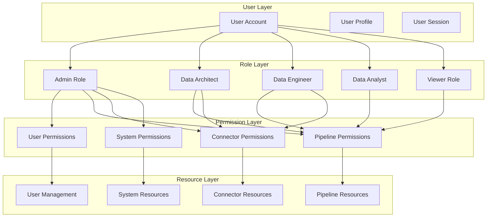

# 🔐 Authentication & Authorization Implementation

This document provides detailed implementation guidance for Role-Based Access Control (RBAC) in AI ETL Assistant, including user management, permission systems, and security enforcement.

## RBAC Architecture Overview



## User Model Implementation

### Database Schema

```python
# backend/models/user.py
from sqlalchemy import Column, String, DateTime, Boolean, Text, Enum as SQLEnum
from sqlalchemy.dialects.postgresql import UUID, ARRAY
from sqlalchemy.orm import relationship
import uuid
from datetime import datetime
from enum import Enum

class UserRole(str, Enum):
    ADMIN = "admin"
    ARCHITECT = "data_architect"
    ENGINEER = "data_engineer"
    ANALYST = "data_analyst"
    VIEWER = "viewer"

class UserStatus(str, Enum):
    ACTIVE = "active"
    INACTIVE = "inactive"
    PENDING = "pending"
    SUSPENDED = "suspended"

class User(Base):
    __tablename__ = "users"

    id = Column(UUID(as_uuid=True), primary_key=True, default=uuid.uuid4)
    email = Column(String(255), unique=True, nullable=False, index=True)
    full_name = Column(String(100), nullable=False)
    hashed_password = Column(String(255), nullable=True)  # Null for OAuth users

    # Role and Status
    role = Column(SQLEnum(UserRole), nullable=False, default=UserRole.ANALYST)
    status = Column(SQLEnum(UserStatus), nullable=False, default=UserStatus.PENDING)

    # Profile Information
    avatar_url = Column(String(500))
    organization = Column(String(100))
    department = Column(String(100))
    timezone = Column(String(50), default="UTC")
    language = Column(String(10), default="en")

    # Security Settings
    is_email_verified = Column(Boolean, default=False)
    two_factor_enabled = Column(Boolean, default=False)
    two_factor_secret = Column(String(32))

    # Account Lockout
    failed_login_attempts = Column(Integer, default=0)
    locked_until = Column(DateTime)

    # OAuth Integration
    oauth_provider = Column(String(50))  # 'google', 'github', etc.
    oauth_id = Column(String(100))

    # Audit Fields
    created_at = Column(DateTime, default=datetime.utcnow)
    updated_at = Column(DateTime, default=datetime.utcnow, onupdate=datetime.utcnow)
    last_login = Column(DateTime)
    last_activity = Column(DateTime)

    # Relationships
    api_keys = relationship("APIKey", back_populates="user")
    pipelines = relationship("Pipeline", back_populates="created_by")
    user_sessions = relationship("UserSession", back_populates="user")

    def __repr__(self):
        return f"<User {self.email}>"

    @property
    def is_active(self) -> bool:
        """Check if user account is active"""
        return (
            self.status == UserStatus.ACTIVE and
            self.is_email_verified and
            (not self.locked_until or self.locked_until < datetime.utcnow())
        )

    @property
    def permissions(self) -> List[str]:
        """Get user permissions based on role"""
        from backend.auth.permissions import ROLE_PERMISSIONS
        return ROLE_PERMISSIONS.get(self.role, [])
```

### User Session Management

```python
# backend/models/user_session.py
from sqlalchemy import Column, String, DateTime, Boolean, Text
from sqlalchemy.dialects.postgresql import UUID
from sqlalchemy.orm import relationship

class UserSession(Base):
    __tablename__ = "user_sessions"

    id = Column(UUID(as_uuid=True), primary_key=True, default=uuid.uuid4)
    user_id = Column(UUID(as_uuid=True), ForeignKey("users.id"), nullable=False)
    session_token = Column(String(255), unique=True, nullable=False)
    refresh_token = Column(String(255), unique=True, nullable=False)

    # Session metadata
    ip_address = Column(String(45))
    user_agent = Column(Text)
    device_info = Column(Text)

    # Session lifecycle
    created_at = Column(DateTime, default=datetime.utcnow)
    last_activity = Column(DateTime, default=datetime.utcnow)
    expires_at = Column(DateTime, nullable=False)
    is_active = Column(Boolean, default=True)

    # Relationships
    user = relationship("User", back_populates="user_sessions")

    def is_expired(self) -> bool:
        return datetime.utcnow() > self.expires_at
```

## Permission System Implementation

### Permission Definitions

```python
# backend/auth/permissions.py
from enum import Enum
from typing import Dict, List, Set
from backend.models.user import UserRole

class Permission(str, Enum):
    # User Management
    USERS_CREATE = "users:create"
    USERS_READ = "users:read"
    USERS_UPDATE = "users:update"
    USERS_DELETE = "users:delete"
    USERS_IMPERSONATE = "users:impersonate"

    # Pipeline Management
    PIPELINES_CREATE = "pipelines:create"
    PIPELINES_READ = "pipelines:read"
    PIPELINES_UPDATE = "pipelines:update"
    PIPELINES_DELETE = "pipelines:delete"
    PIPELINES_DEPLOY = "pipelines:deploy"
    PIPELINES_EXECUTE = "pipelines:execute"
    PIPELINES_SHARE = "pipelines:share"

    # Connector Management
    CONNECTORS_CREATE = "connectors:create"
    CONNECTORS_READ = "connectors:read"
    CONNECTORS_UPDATE = "connectors:update"
    CONNECTORS_DELETE = "connectors:delete"
    CONNECTORS_TEST = "connectors:test"

    # System Administration
    SYSTEM_SETTINGS = "system:settings"
    SYSTEM_MONITORING = "system:monitoring"
    SYSTEM_LOGS = "system:logs"
    SYSTEM_BACKUP = "system:backup"
    SYSTEM_MAINTENANCE = "system:maintenance"

    # Data Management
    DATA_READ = "data:read"
    DATA_WRITE = "data:write"
    DATA_DELETE = "data:delete"
    DATA_EXPORT = "data:export"

    # Organization Management
    ORG_SETTINGS = "organization:settings"
    ORG_BILLING = "organization:billing"
    ORG_AUDIT = "organization:audit"

# Role-Permission Mapping
ROLE_PERMISSIONS: Dict[UserRole, List[Permission]] = {
    UserRole.ADMIN: [
        # Full system access
        Permission.USERS_CREATE,
        Permission.USERS_READ,
        Permission.USERS_UPDATE,
        Permission.USERS_DELETE,
        Permission.USERS_IMPERSONATE,

        Permission.PIPELINES_CREATE,
        Permission.PIPELINES_READ,
        Permission.PIPELINES_UPDATE,
        Permission.PIPELINES_DELETE,
        Permission.PIPELINES_DEPLOY,
        Permission.PIPELINES_EXECUTE,
        Permission.PIPELINES_SHARE,

        Permission.CONNECTORS_CREATE,
        Permission.CONNECTORS_READ,
        Permission.CONNECTORS_UPDATE,
        Permission.CONNECTORS_DELETE,
        Permission.CONNECTORS_TEST,

        Permission.SYSTEM_SETTINGS,
        Permission.SYSTEM_MONITORING,
        Permission.SYSTEM_LOGS,
        Permission.SYSTEM_BACKUP,
        Permission.SYSTEM_MAINTENANCE,

        Permission.DATA_READ,
        Permission.DATA_WRITE,
        Permission.DATA_DELETE,
        Permission.DATA_EXPORT,

        Permission.ORG_SETTINGS,
        Permission.ORG_BILLING,
        Permission.ORG_AUDIT,
    ],

    UserRole.ARCHITECT: [
        # Architecture and design focus
        Permission.USERS_READ,

        Permission.PIPELINES_CREATE,
        Permission.PIPELINES_READ,
        Permission.PIPELINES_UPDATE,
        Permission.PIPELINES_DELETE,
        Permission.PIPELINES_DEPLOY,
        Permission.PIPELINES_EXECUTE,
        Permission.PIPELINES_SHARE,

        Permission.CONNECTORS_CREATE,
        Permission.CONNECTORS_READ,
        Permission.CONNECTORS_UPDATE,
        Permission.CONNECTORS_DELETE,
        Permission.CONNECTORS_TEST,

        Permission.SYSTEM_MONITORING,
        Permission.SYSTEM_LOGS,

        Permission.DATA_READ,
        Permission.DATA_WRITE,
        Permission.DATA_EXPORT,
    ],

    UserRole.ENGINEER: [
        # Implementation and deployment focus
        Permission.USERS_READ,

        Permission.PIPELINES_CREATE,
        Permission.PIPELINES_READ,
        Permission.PIPELINES_UPDATE,
        Permission.PIPELINES_DELETE,
        Permission.PIPELINES_DEPLOY,
        Permission.PIPELINES_EXECUTE,
        Permission.PIPELINES_SHARE,

        Permission.CONNECTORS_CREATE,
        Permission.CONNECTORS_READ,
        Permission.CONNECTORS_UPDATE,
        Permission.CONNECTORS_DELETE,
        Permission.CONNECTORS_TEST,

        Permission.SYSTEM_MONITORING,
        Permission.SYSTEM_LOGS,

        Permission.DATA_READ,
        Permission.DATA_WRITE,
        Permission.DATA_EXPORT,
    ],

    UserRole.ANALYST: [
        # Data analysis focus
        Permission.PIPELINES_CREATE,
        Permission.PIPELINES_READ,
        Permission.PIPELINES_UPDATE,
        Permission.PIPELINES_EXECUTE,

        Permission.CONNECTORS_READ,
        Permission.CONNECTORS_UPDATE,

        Permission.DATA_READ,
        Permission.DATA_EXPORT,
    ],

    UserRole.VIEWER: [
        # Read-only access
        Permission.PIPELINES_READ,
        Permission.CONNECTORS_READ,
        Permission.DATA_READ,
    ]
}

def get_user_permissions(role: UserRole) -> Set[Permission]:
    """Get all permissions for a user role"""
    return set(ROLE_PERMISSIONS.get(role, []))

def has_permission(user_role: UserRole, permission: Permission) -> bool:
    """Check if a user role has a specific permission"""
    return permission in get_user_permissions(user_role)

def check_permissions(user_role: UserRole, required_permissions: List[Permission]) -> bool:
    """Check if user role has all required permissions"""
    user_perms = get_user_permissions(user_role)
    return all(perm in user_perms for perm in required_permissions)
```

### Resource-Based Permissions

```python
# backend/auth/resource_permissions.py
from typing import Optional, Dict, Any
from backend.models.user import User
from backend.models.pipeline import Pipeline
from backend.auth.permissions import Permission, has_permission

class ResourcePermissionChecker:
    """Check permissions on specific resources"""

    @staticmethod
    async def can_access_pipeline(
        user: User,
        pipeline: Pipeline,
        permission: Permission
    ) -> bool:
        """Check if user can access specific pipeline"""

        # Admin can access anything
        if user.role == UserRole.ADMIN:
            return True

        # Basic role-based permission check
        if not has_permission(user.role, permission):
            return False

        # Owner can always access their own pipelines
        if pipeline.created_by_id == user.id:
            return True

        # Check if pipeline is shared with user
        if permission in [Permission.PIPELINES_READ, Permission.PIPELINES_EXECUTE]:
            return await pipeline.is_shared_with_user(user.id)

        # For modification permissions, only owner or admin
        if permission in [Permission.PIPELINES_UPDATE, Permission.PIPELINES_DELETE]:
            return pipeline.created_by_id == user.id

        return False

    @staticmethod
    async def can_access_user_data(
        requesting_user: User,
        target_user: User,
        permission: Permission
    ) -> bool:
        """Check if user can access another user's data"""

        # Users can always access their own data
        if requesting_user.id == target_user.id:
            return True

        # Admin can access any user data
        if requesting_user.role == UserRole.ADMIN:
            return True

        # Check role-based permissions
        return has_permission(requesting_user.role, permission)

    @staticmethod
    async def filter_pipelines_by_permission(
        user: User,
        pipelines: List[Pipeline],
        permission: Permission
    ) -> List[Pipeline]:
        """Filter list of pipelines by user permissions"""
        accessible_pipelines = []

        for pipeline in pipelines:
            if await ResourcePermissionChecker.can_access_pipeline(user, pipeline, permission):
                accessible_pipelines.append(pipeline)

        return accessible_pipelines
```

## Authentication Service Implementation

### Core Authentication Service

```python
# backend/auth/service.py
from datetime import datetime, timedelta
from typing import Optional, Dict, Any
from sqlalchemy.orm import Session
from fastapi import HTTPException, status
from jose import JWTError, jwt
from passlib.context import CryptContext
import secrets
import pyotp
from backend.models.user import User, UserRole, UserStatus
from backend.models.user_session import UserSession
from backend.auth.permissions import get_user_permissions
from backend.config.auth import AuthConfig

class AuthenticationService:
    def __init__(self, db: Session):
        self.db = db
        self.pwd_context = CryptContext(schemes=["bcrypt"], deprecated="auto")
        self.config = AuthConfig()

    async def authenticate_user(
        self,
        email: str,
        password: str,
        ip_address: str = None,
        user_agent: str = None
    ) -> Dict[str, Any]:
        """Authenticate user with email and password"""

        # Get user by email
        user = await self.get_user_by_email(email)
        if not user:
            await self._record_failed_attempt(email, ip_address)
            raise InvalidCredentialsError()

        # Check account status
        if not user.is_active:
            raise AccountInactiveError(user.status)

        # Check account lockout
        if await self._is_account_locked(user):
            raise AccountLockedError(user.locked_until)

        # Verify password
        if not self.verify_password(password, user.hashed_password):
            await self._record_failed_attempt(email, ip_address, user)
            raise InvalidCredentialsError()

        # Reset failed attempts on successful login
        await self._reset_failed_attempts(user)

        # Create session and tokens
        session = await self._create_user_session(user, ip_address, user_agent)
        tokens = await self._generate_tokens(user, session)

        # Update last login
        user.last_login = datetime.utcnow()
        await self.db.commit()

        return {
            "access_token": tokens["access_token"],
            "refresh_token": tokens["refresh_token"],
            "token_type": "Bearer",
            "expires_in": self.config.ACCESS_TOKEN_EXPIRE_MINUTES * 60,
            "user": await self._serialize_user(user)
        }

    async def refresh_access_token(self, refresh_token: str) -> Dict[str, Any]:
        """Refresh access token using refresh token"""
        try:
            payload = jwt.decode(
                refresh_token,
                self.config.SECRET_KEY,
                algorithms=[self.config.ALGORITHM]
            )

            if payload.get("type") != "refresh":
                raise InvalidTokenError("Invalid token type")

            session_id = payload.get("jti")
            session = await self.get_session(session_id)

            if not session or not session.is_active or session.is_expired():
                raise InvalidTokenError("Invalid or expired session")

            user = await self.get_user(session.user_id)
            if not user or not user.is_active:
                raise InvalidTokenError("User not found or inactive")

            # Generate new tokens
            tokens = await self._generate_tokens(user, session)

            return {
                "access_token": tokens["access_token"],
                "refresh_token": tokens["refresh_token"],
                "expires_in": self.config.ACCESS_TOKEN_EXPIRE_MINUTES * 60
            }

        except JWTError:
            raise InvalidTokenError("Invalid refresh token")

    async def logout_user(self, access_token: str) -> bool:
        """Logout user and invalidate session"""
        try:
            payload = jwt.decode(
                access_token,
                self.config.SECRET_KEY,
                algorithms=[self.config.ALGORITHM]
            )

            session_id = payload.get("sid")
            if session_id:
                session = await self.get_session(session_id)
                if session:
                    session.is_active = False
                    await self.db.commit()

            return True

        except JWTError:
            return False

    async def create_user(
        self,
        email: str,
        password: str,
        full_name: str,
        role: UserRole = UserRole.ANALYST,
        **kwargs
    ) -> User:
        """Create new user account"""

        # Check if email already exists
        existing_user = await self.get_user_by_email(email)
        if existing_user:
            raise UserAlreadyExistsError(email)

        # Validate password
        self._validate_password(password)

        # Create user
        user = User(
            email=email.lower(),
            full_name=full_name,
            hashed_password=self.hash_password(password),
            role=role,
            status=UserStatus.PENDING,
            **kwargs
        )

        self.db.add(user)
        await self.db.commit()
        await self.db.refresh(user)

        # Send verification email
        await self._send_verification_email(user)

        return user

    async def verify_email(self, verification_token: str) -> Dict[str, Any]:
        """Verify user email address"""
        try:
            payload = jwt.decode(
                verification_token,
                self.config.SECRET_KEY,
                algorithms=[self.config.ALGORITHM]
            )

            if payload.get("type") != "email_verification":
                raise InvalidTokenError("Invalid token type")

            user_id = payload.get("sub")
            user = await self.get_user(user_id)

            if not user:
                raise InvalidTokenError("User not found")

            # Verify email
            user.is_email_verified = True
            user.status = UserStatus.ACTIVE
            await self.db.commit()

            # Auto-login after verification
            session = await self._create_user_session(user)
            tokens = await self._generate_tokens(user, session)

            return {
                "user": await self._serialize_user(user),
                "auto_login": {
                    "access_token": tokens["access_token"],
                    "refresh_token": tokens["refresh_token"]
                }
            }

        except JWTError:
            raise InvalidTokenError("Invalid verification token")

    # Two-Factor Authentication
    async def enable_2fa(self, user: User) -> Dict[str, Any]:
        """Enable two-factor authentication"""
        secret = pyotp.random_base32()
        user.two_factor_secret = secret

        # Don't enable until first successful verification
        totp = pyotp.TOTP(secret)
        qr_url = totp.provisioning_uri(
            user.email,
            issuer_name="AI ETL Assistant"
        )

        return {
            "secret": secret,
            "qr_url": qr_url,
            "backup_codes": await self._generate_backup_codes(user)
        }

    async def verify_2fa(self, user: User, token: str) -> bool:
        """Verify 2FA token"""
        if not user.two_factor_secret:
            return False

        totp = pyotp.TOTP(user.two_factor_secret)

        # Check current token
        if totp.verify(token):
            # Enable 2FA on first successful verification
            if not user.two_factor_enabled:
                user.two_factor_enabled = True
                await self.db.commit()
            return True

        # Check backup codes
        return await self._verify_backup_code(user, token)

    # Private methods
    async def _generate_tokens(self, user: User, session: UserSession) -> Dict[str, str]:
        """Generate JWT tokens"""
        now = datetime.utcnow()

        # Access token
        access_payload = {
            "sub": str(user.id),
            "email": user.email,
            "role": user.role.value,
            "permissions": [p.value for p in get_user_permissions(user.role)],
            "sid": str(session.id),
            "iat": now,
            "exp": now + timedelta(minutes=self.config.ACCESS_TOKEN_EXPIRE_MINUTES),
            "type": "access"
        }

        # Refresh token
        refresh_payload = {
            "sub": str(user.id),
            "jti": str(session.id),
            "iat": now,
            "exp": now + timedelta(days=self.config.REFRESH_TOKEN_EXPIRE_DAYS),
            "type": "refresh"
        }

        access_token = jwt.encode(
            access_payload,
            self.config.SECRET_KEY,
            algorithm=self.config.ALGORITHM
        )

        refresh_token = jwt.encode(
            refresh_payload,
            self.config.SECRET_KEY,
            algorithm=self.config.ALGORITHM
        )

        return {
            "access_token": access_token,
            "refresh_token": refresh_token
        }

    async def _create_user_session(
        self,
        user: User,
        ip_address: str = None,
        user_agent: str = None
    ) -> UserSession:
        """Create new user session"""
        session = UserSession(
            user_id=user.id,
            session_token=secrets.token_urlsafe(32),
            refresh_token=secrets.token_urlsafe(32),
            ip_address=ip_address,
            user_agent=user_agent,
            expires_at=datetime.utcnow() + timedelta(days=self.config.REFRESH_TOKEN_EXPIRE_DAYS)
        )

        self.db.add(session)
        await self.db.commit()
        await self.db.refresh(session)

        return session

    def hash_password(self, password: str) -> str:
        """Hash password"""
        return self.pwd_context.hash(password)

    def verify_password(self, plain_password: str, hashed_password: str) -> bool:
        """Verify password"""
        return self.pwd_context.verify(plain_password, hashed_password)

    def _validate_password(self, password: str) -> None:
        """Validate password strength"""
        if len(password) < self.config.PASSWORD_MIN_LENGTH:
            raise WeakPasswordError(f"Password must be at least {self.config.PASSWORD_MIN_LENGTH} characters")

        if self.config.PASSWORD_REQUIRE_UPPERCASE and not any(c.isupper() for c in password):
            raise WeakPasswordError("Password must contain uppercase letter")

        if self.config.PASSWORD_REQUIRE_NUMERIC and not any(c.isdigit() for c in password):
            raise WeakPasswordError("Password must contain number")

        if self.config.PASSWORD_REQUIRE_SPECIAL:
            special_chars = "!@#$%^&*(),.?\":{}|<>"
            if not any(c in special_chars for c in password):
                raise WeakPasswordError("Password must contain special character")
```

## FastAPI Dependencies

### Authentication Dependencies

```python
# backend/auth/dependencies.py
from typing import Optional, List
from fastapi import Depends, HTTPException, status, Request
from fastapi.security import HTTPBearer, HTTPAuthorizationCredentials
from jose import JWTError, jwt
from backend.auth.service import AuthenticationService
from backend.auth.permissions import Permission, has_permission
from backend.models.user import User
from backend.database import get_db

security = HTTPBearer()

async def get_current_user(
    credentials: HTTPAuthorizationCredentials = Depends(security),
    db: Session = Depends(get_db)
) -> User:
    """Get current authenticated user from JWT token"""

    credentials_exception = HTTPException(
        status_code=status.HTTP_401_UNAUTHORIZED,
        detail="Could not validate credentials",
        headers={"WWW-Authenticate": "Bearer"},
    )

    try:
        auth_service = AuthenticationService(db)
        payload = jwt.decode(
            credentials.credentials,
            auth_service.config.SECRET_KEY,
            algorithms=[auth_service.config.ALGORITHM]
        )

        user_id: str = payload.get("sub")
        token_type: str = payload.get("type")

        if user_id is None or token_type != "access":
            raise credentials_exception

    except JWTError:
        raise credentials_exception

    user = await auth_service.get_user(user_id)
    if user is None or not user.is_active:
        raise credentials_exception

    # Update last activity
    user.last_activity = datetime.utcnow()
    await db.commit()

    return user

async def get_current_active_user(
    current_user: User = Depends(get_current_user)
) -> User:
    """Get current active user"""
    if not current_user.is_active:
        raise HTTPException(
            status_code=status.HTTP_403_FORBIDDEN,
            detail="Inactive user account"
        )
    return current_user

def require_permissions(*permissions: Permission):
    """Dependency factory for permission checking"""
    async def permission_checker(
        current_user: User = Depends(get_current_active_user)
    ) -> User:
        """Check if user has all required permissions"""

        for permission in permissions:
            if not has_permission(current_user.role, permission):
                raise HTTPException(
                    status_code=status.HTTP_403_FORBIDDEN,
                    detail=f"Permission denied: {permission.value}"
                )

        return current_user

    return permission_checker

def require_role(*roles: UserRole):
    """Dependency factory for role checking"""
    async def role_checker(
        current_user: User = Depends(get_current_active_user)
    ) -> User:
        """Check if user has one of the required roles"""

        if current_user.role not in roles:
            raise HTTPException(
                status_code=status.HTTP_403_FORBIDDEN,
                detail=f"Access denied. Required roles: {[r.value for r in roles]}"
            )

        return current_user

    return role_checker

async def get_optional_user(
    credentials: Optional[HTTPAuthorizationCredentials] = Depends(HTTPBearer(auto_error=False)),
    db: Session = Depends(get_db)
) -> Optional[User]:
    """Get current user if authenticated, None otherwise"""

    if not credentials:
        return None

    try:
        return await get_current_user(credentials, db)
    except HTTPException:
        return None
```

### Usage in API Routes

```python
# backend/api/routes/pipelines.py
from fastapi import APIRouter, Depends, HTTPException
from backend.auth.dependencies import require_permissions, get_current_user
from backend.auth.permissions import Permission
from backend.models.user import User

router = APIRouter()

@router.post("/pipelines/")
async def create_pipeline(
    pipeline_data: PipelineCreate,
    current_user: User = Depends(require_permissions(Permission.PIPELINES_CREATE))
):
    """Create new pipeline - requires pipelines:create permission"""
    return await pipeline_service.create_pipeline(pipeline_data, current_user)

@router.get("/pipelines/")
async def list_pipelines(
    current_user: User = Depends(require_permissions(Permission.PIPELINES_READ)),
    skip: int = 0,
    limit: int = 100
):
    """List pipelines - requires pipelines:read permission"""

    # Filter pipelines by user permissions
    pipelines = await pipeline_service.get_user_accessible_pipelines(
        current_user, skip=skip, limit=limit
    )
    return {"pipelines": pipelines}

@router.delete("/pipelines/{pipeline_id}")
async def delete_pipeline(
    pipeline_id: str,
    current_user: User = Depends(require_permissions(Permission.PIPELINES_DELETE))
):
    """Delete pipeline - requires pipelines:delete permission"""

    # Check resource-level permissions
    pipeline = await pipeline_service.get_pipeline(pipeline_id)
    if not pipeline:
        raise HTTPException(status_code=404, detail="Pipeline not found")

    # Only admin or owner can delete
    if (current_user.role != UserRole.ADMIN and
        pipeline.created_by_id != current_user.id):
        raise HTTPException(
            status_code=403,
            detail="Can only delete your own pipelines"
        )

    await pipeline_service.delete_pipeline(pipeline_id)
    return {"message": "Pipeline deleted successfully"}

@router.post("/admin/users/")
async def create_user(
    user_data: UserCreate,
    current_user: User = Depends(require_role(UserRole.ADMIN))
):
    """Admin endpoint - create user"""
    return await user_service.create_user(user_data)
```

## User Management Implementation

### User Service

```python
# backend/services/user_service.py
from typing import List, Optional, Dict, Any
from sqlalchemy.orm import Session
from backend.models.user import User, UserRole, UserStatus
from backend.auth.service import AuthenticationService
from backend.auth.permissions import Permission, get_user_permissions

class UserService:
    def __init__(self, db: Session):
        self.db = db
        self.auth_service = AuthenticationService(db)

    async def create_user(
        self,
        email: str,
        full_name: str,
        role: UserRole,
        password: Optional[str] = None,
        send_invite: bool = True,
        created_by: User = None
    ) -> User:
        """Create new user account"""

        # Generate random password if not provided
        if not password:
            password = secrets.token_urlsafe(12)

        user = await self.auth_service.create_user(
            email=email,
            password=password,
            full_name=full_name,
            role=role
        )

        if send_invite:
            await self._send_invitation_email(user, password, created_by)

        return user

    async def update_user_role(
        self,
        user_id: str,
        new_role: UserRole,
        updated_by: User
    ) -> User:
        """Update user role - admin only"""

        user = await self.get_user(user_id)
        if not user:
            raise UserNotFoundError(user_id)

        # Log role change for audit
        await self._log_role_change(user, user.role, new_role, updated_by)

        old_role = user.role
        user.role = new_role
        await self.db.commit()

        # Invalidate all user sessions to force re-authentication
        await self._invalidate_user_sessions(user_id)

        return user

    async def deactivate_user(self, user_id: str, deactivated_by: User) -> User:
        """Deactivate user account"""

        user = await self.get_user(user_id)
        if not user:
            raise UserNotFoundError(user_id)

        user.status = UserStatus.INACTIVE
        await self.db.commit()

        # Invalidate all sessions
        await self._invalidate_user_sessions(user_id)

        # Log deactivation
        await self._log_user_action("deactivated", user, deactivated_by)

        return user

    async def list_users(
        self,
        requesting_user: User,
        skip: int = 0,
        limit: int = 100,
        role_filter: Optional[UserRole] = None,
        status_filter: Optional[UserStatus] = None
    ) -> Dict[str, Any]:
        """List users with filtering"""

        # Build query
        query = self.db.query(User)

        # Apply filters
        if role_filter:
            query = query.filter(User.role == role_filter)
        if status_filter:
            query = query.filter(User.status == status_filter)

        # Apply permissions-based filtering
        if requesting_user.role != UserRole.ADMIN:
            # Non-admins can only see limited user info
            query = query.filter(User.status == UserStatus.ACTIVE)

        total = query.count()
        users = query.offset(skip).limit(limit).all()

        return {
            "users": [
                await self._serialize_user_for_listing(user, requesting_user)
                for user in users
            ],
            "total": total,
            "skip": skip,
            "limit": limit
        }

    async def get_user_permissions(self, user_id: str) -> List[str]:
        """Get effective permissions for user"""
        user = await self.get_user(user_id)
        if not user:
            raise UserNotFoundError(user_id)

        return [p.value for p in get_user_permissions(user.role)]

    async def _serialize_user_for_listing(
        self,
        user: User,
        requesting_user: User
    ) -> Dict[str, Any]:
        """Serialize user data based on requesting user's permissions"""

        # Basic info everyone can see
        data = {
            "id": str(user.id),
            "full_name": user.full_name,
            "role": user.role.value
        }

        # Additional info for admins/managers
        if requesting_user.role == UserRole.ADMIN:
            data.update({
                "email": user.email,
                "status": user.status.value,
                "last_login": user.last_login,
                "created_at": user.created_at,
                "is_email_verified": user.is_email_verified,
                "two_factor_enabled": user.two_factor_enabled
            })

        return data
```

## Audit Logging

### Audit Trail Implementation

```python
# backend/models/audit_log.py
from sqlalchemy import Column, String, DateTime, Text, JSON
from sqlalchemy.dialects.postgresql import UUID
from datetime import datetime
import uuid

class AuditLog(Base):
    __tablename__ = "audit_logs"

    id = Column(UUID(as_uuid=True), primary_key=True, default=uuid.uuid4)

    # Who performed the action
    user_id = Column(UUID(as_uuid=True), ForeignKey("users.id"), nullable=True)
    user_email = Column(String(255))  # Store email for deleted users

    # What action was performed
    action = Column(String(100), nullable=False)  # 'login', 'create_user', 'delete_pipeline'
    resource_type = Column(String(50))  # 'user', 'pipeline', 'connector'
    resource_id = Column(String(100))   # ID of the resource

    # Additional context
    details = Column(JSON)  # Store additional details as JSON
    ip_address = Column(String(45))
    user_agent = Column(Text)

    # Timestamps
    timestamp = Column(DateTime, default=datetime.utcnow)

# Audit service
class AuditService:
    def __init__(self, db: Session):
        self.db = db

    async def log_user_action(
        self,
        user: Optional[User],
        action: str,
        resource_type: Optional[str] = None,
        resource_id: Optional[str] = None,
        details: Optional[Dict] = None,
        ip_address: Optional[str] = None,
        user_agent: Optional[str] = None
    ):
        """Log user action for audit trail"""

        log_entry = AuditLog(
            user_id=user.id if user else None,
            user_email=user.email if user else None,
            action=action,
            resource_type=resource_type,
            resource_id=resource_id,
            details=details or {},
            ip_address=ip_address,
            user_agent=user_agent
        )

        self.db.add(log_entry)
        await self.db.commit()

    async def get_audit_logs(
        self,
        user_id: Optional[str] = None,
        action: Optional[str] = None,
        resource_type: Optional[str] = None,
        start_date: Optional[datetime] = None,
        end_date: Optional[datetime] = None,
        limit: int = 100
    ) -> List[AuditLog]:
        """Query audit logs with filters"""

        query = self.db.query(AuditLog)

        if user_id:
            query = query.filter(AuditLog.user_id == user_id)
        if action:
            query = query.filter(AuditLog.action == action)
        if resource_type:
            query = query.filter(AuditLog.resource_type == resource_type)
        if start_date:
            query = query.filter(AuditLog.timestamp >= start_date)
        if end_date:
            query = query.filter(AuditLog.timestamp <= end_date)

        return query.order_by(AuditLog.timestamp.desc()).limit(limit).all()
```

## Security Middleware

### Rate Limiting by User Role

```python
# backend/middleware/security.py
from fastapi import Request, HTTPException
from slowapi import Limiter
from slowapi.util import get_remote_address
from backend.auth.dependencies import get_optional_user

def get_user_identifier(request: Request) -> str:
    """Get user identifier for rate limiting"""
    user = request.state.user if hasattr(request.state, 'user') else None

    if user:
        # Use user ID for authenticated requests
        return f"user:{user.id}"
    else:
        # Use IP address for anonymous requests
        return f"ip:{get_remote_address(request)}"

def get_rate_limit_by_role(request: Request) -> str:
    """Get rate limit based on user role"""
    user = request.state.user if hasattr(request.state, 'user') else None

    if not user:
        return "10/minute"  # Anonymous users

    role_limits = {
        UserRole.ADMIN: "1000/minute",
        UserRole.ARCHITECT: "500/minute",
        UserRole.ENGINEER: "500/minute",
        UserRole.ANALYST: "200/minute",
        UserRole.VIEWER: "100/minute"
    }

    return role_limits.get(user.role, "10/minute")

limiter = Limiter(key_func=get_user_identifier)
```

## Testing RBAC Implementation

### Unit Tests

```python
# tests/test_rbac.py
import pytest
from backend.models.user import User, UserRole
from backend.auth.permissions import Permission, has_permission, get_user_permissions

class TestRBACPermissions:
    def test_admin_has_all_permissions(self):
        """Test that admin role has all permissions"""
        admin_perms = get_user_permissions(UserRole.ADMIN)

        # Admin should have user management permissions
        assert Permission.USERS_CREATE in admin_perms
        assert Permission.USERS_DELETE in admin_perms

        # Admin should have system permissions
        assert Permission.SYSTEM_SETTINGS in admin_perms
        assert Permission.SYSTEM_LOGS in admin_perms

    def test_viewer_has_read_only_permissions(self):
        """Test that viewer role has only read permissions"""
        viewer_perms = get_user_permissions(UserRole.VIEWER)

        # Viewer should have read permissions
        assert Permission.PIPELINES_READ in viewer_perms
        assert Permission.DATA_READ in viewer_perms

        # Viewer should NOT have write permissions
        assert Permission.PIPELINES_CREATE not in viewer_perms
        assert Permission.PIPELINES_DELETE not in viewer_perms

    def test_permission_checking(self):
        """Test permission checking functions"""
        assert has_permission(UserRole.ADMIN, Permission.USERS_CREATE)
        assert not has_permission(UserRole.VIEWER, Permission.USERS_CREATE)
        assert has_permission(UserRole.ANALYST, Permission.PIPELINES_CREATE)

@pytest.mark.asyncio
class TestResourcePermissions:
    async def test_pipeline_owner_permissions(self, db_session, sample_user, sample_pipeline):
        """Test that pipeline owners have full access to their pipelines"""
        sample_pipeline.created_by_id = sample_user.id

        can_read = await ResourcePermissionChecker.can_access_pipeline(
            sample_user, sample_pipeline, Permission.PIPELINES_READ
        )
        can_update = await ResourcePermissionChecker.can_access_pipeline(
            sample_user, sample_pipeline, Permission.PIPELINES_UPDATE
        )
        can_delete = await ResourcePermissionChecker.can_access_pipeline(
            sample_user, sample_pipeline, Permission.PIPELINES_DELETE
        )

        assert can_read
        assert can_update
        assert can_delete

    async def test_non_owner_permissions(self, db_session, sample_user, sample_pipeline, other_user):
        """Test permissions for non-owners"""
        sample_pipeline.created_by_id = other_user.id

        # Should be able to read if role allows and pipeline is shared
        can_read = await ResourcePermissionChecker.can_access_pipeline(
            sample_user, sample_pipeline, Permission.PIPELINES_READ
        )

        # Should NOT be able to modify
        can_update = await ResourcePermissionChecker.can_access_pipeline(
            sample_user, sample_pipeline, Permission.PIPELINES_UPDATE
        )

        assert not can_update  # Non-owners can't modify
```

## Related Documentation

- [Security Overview](./overview.md)
- [Authentication API](../api/authentication.md)
- [User Management](../guides/user-management.md)
- [Security Best Practices](../guides/security-best-practices.md)

---

[← Back to Security](./README.md) | [Data Protection →](./data-protection.md)