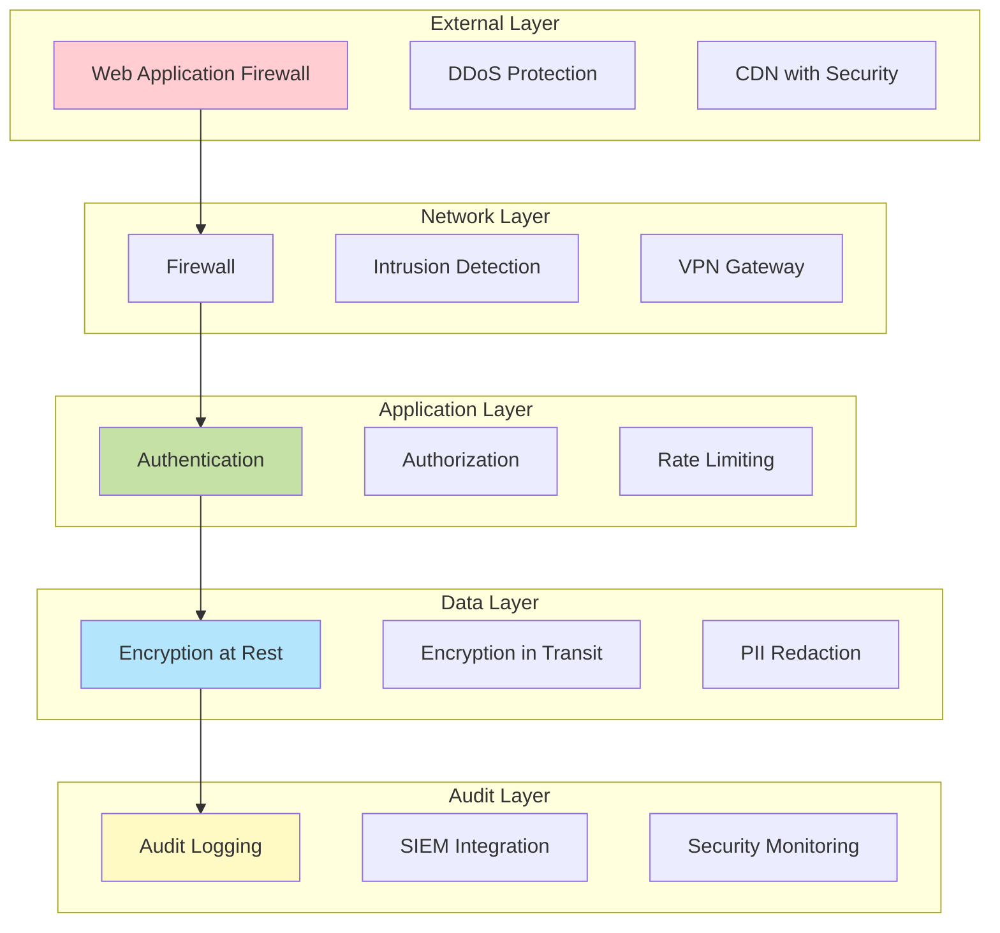
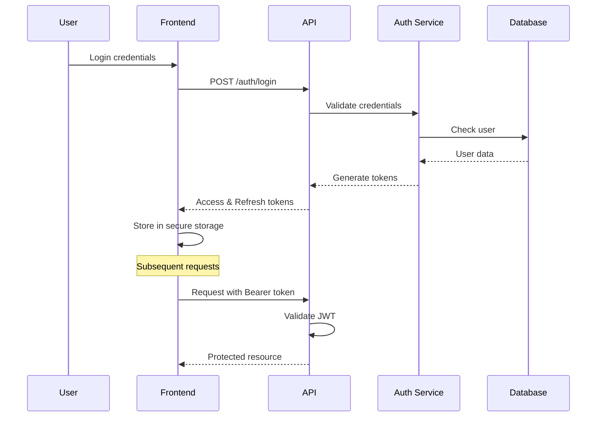

# 🔒 Security Overview

## Security Architecture

AI ETL Assistant implements defense-in-depth security with multiple layers of protection.



## Authentication

### JWT Token Authentication

The platform uses JWT (JSON Web Tokens) for stateless authentication:

```python
# Token structure
{
  "sub": "user_id",
  "email": "user@example.com",
  "roles": ["analyst", "engineer"],
  "exp": 1706268000,
  "iat": 1706264400,
  "jti": "unique_token_id"
}
```

### Token Lifecycle



### Multi-Factor Authentication (MFA)

Optional MFA support via:
- TOTP (Time-based One-Time Password)
- SMS verification
- Email verification

## Authorization

### Role-Based Access Control (RBAC)

Four default roles with hierarchical permissions:

| Role | Permissions | Use Case |
|------|------------|----------|
| **Viewer** | Read-only access | Monitoring, reporting |
| **Analyst** | Create/run pipelines, read data | Data analysis |
| **Engineer** | Full pipeline control, connector config | Pipeline development |
| **Architect** | System configuration, user management | System design |
| **Admin** | Full system access | Administration |

### Permission Matrix

```python
PERMISSIONS = {
    "viewer": [
        "pipeline:read",
        "data:preview",
        "metrics:read"
    ],
    "analyst": [
        *viewer_permissions,
        "pipeline:create",
        "pipeline:run",
        "query:execute"
    ],
    "engineer": [
        *analyst_permissions,
        "pipeline:deploy",
        "connector:configure",
        "schedule:manage"
    ],
    "architect": [
        *engineer_permissions,
        "system:configure",
        "user:manage",
        "security:audit"
    ],
    "admin": ["*:*"]
}
```

### Resource-Level Permissions

Fine-grained permissions per resource:

```python
# Project-based isolation
@require_permission("project:read", resource="project_id")
async def get_project_data(project_id: str):
    # Only users with access to this project
    pass
```

## Data Protection

### Encryption

#### At Rest
- Database: AES-256 encryption
- File storage: Server-side encryption (SSE)
- Secrets: HashiCorp Vault or AWS KMS

#### In Transit
- TLS 1.3 for all connections
- Certificate pinning for mobile apps
- Perfect Forward Secrecy (PFS)

### PII Handling

```python
class PIIRedactor:
    """Automatically redact sensitive data"""

    patterns = {
        "email": r'[\w\.-]+@[\w\.-]+\.\w+',
        "phone": r'\+?[1-9]\d{1,14}',
        "ssn": r'\d{3}-\d{2}-\d{4}',
        "credit_card": r'\d{4}[\s-]?\d{4}[\s-]?\d{4}[\s-]?\d{4}'
    }

    def redact(self, text: str) -> str:
        for pattern in self.patterns.values():
            text = re.sub(pattern, "[REDACTED]", text)
        return text
```

### Data Masking

Dynamic data masking for sensitive fields:

```sql
-- Masked view for analysts
CREATE VIEW masked_customers AS
SELECT
    id,
    CASE
        WHEN current_user_role() = 'admin'
        THEN email
        ELSE CONCAT(LEFT(email, 2), '***', '@', SPLIT_PART(email, '@', 2))
    END as email,
    CASE
        WHEN current_user_role() IN ('admin', 'engineer')
        THEN phone
        ELSE 'XXX-XXX-' || RIGHT(phone, 4)
    END as phone
FROM customers;
```

## Network Security

### API Security

#### Rate Limiting
```python
from slowapi import Limiter

limiter = Limiter(
    key_func=get_remote_address,
    default_limits=["100/hour", "1000/day"]
)

@app.post("/api/v1/pipeline:generate")
@limiter.limit("10/minute")
async def generate_pipeline():
    pass
```

#### Input Validation
```python
from pydantic import BaseModel, validator

class PipelineRequest(BaseModel):
    description: str
    schedule: str

    @validator('description')
    def validate_description(cls, v):
        if len(v) > 10000:
            raise ValueError('Description too long')
        # Check for injection attempts
        if any(keyword in v.lower() for keyword in ['drop', 'delete', 'truncate']):
            raise ValueError('Potentially dangerous content')
        return v
```

### SQL Injection Prevention

Always use parameterized queries:

```python
# Safe
query = "SELECT * FROM users WHERE email = %s"
result = await db.execute(query, [user_email])

# Never do this
# query = f"SELECT * FROM users WHERE email = '{user_email}'"
```

## Secrets Management

### Environment Variables

```bash
# Use secret management service
export DATABASE_URL=$(vault kv get -field=url secret/database)
export JWT_SECRET=$(aws secretsmanager get-secret-value --secret-id jwt-secret)
```

### Kubernetes Secrets

```yaml
apiVersion: v1
kind: Secret
metadata:
  name: api-secrets
type: Opaque
data:
  jwt-secret: <base64-encoded>
  database-url: <base64-encoded>
```

### HashiCorp Vault Integration

```python
import hvac

class SecretManager:
    def __init__(self):
        self.client = hvac.Client(
            url='https://vault.example.com',
            token=os.getenv('VAULT_TOKEN')
        )

    def get_secret(self, path: str) -> str:
        response = self.client.secrets.kv.v2.read_secret_version(
            path=path
        )
        return response['data']['data']
```

## Audit Logging

### Comprehensive Audit Trail

```python
@audit_log
async def sensitive_operation(user_id: int, action: str):
    """All sensitive operations are logged"""
    audit_entry = {
        "timestamp": datetime.utcnow(),
        "user_id": user_id,
        "action": action,
        "ip_address": request.client.host,
        "user_agent": request.headers.get("user-agent"),
        "result": "success"
    }
    await audit_logger.log(audit_entry)
```

### Log Format

```json
{
  "timestamp": "2024-01-26T10:15:30Z",
  "level": "AUDIT",
  "user_id": "123",
  "session_id": "abc-def-ghi",
  "action": "pipeline:deploy",
  "resource": "pipeline:456",
  "ip_address": "192.168.1.100",
  "user_agent": "Mozilla/5.0...",
  "result": "success",
  "duration_ms": 150
}
```

## Compliance

### GDPR Compliance

- Right to be forgotten
- Data portability
- Consent management
- Privacy by design

### Russian Compliance (GOST)

```python
# GOST R 34.11-2012 (Streebog) hashing
from pygost import gost34112012256

def hash_sensitive_data(data: bytes) -> str:
    return gost34112012256.new(data).hexdigest()

# GOST R 34.10-2012 digital signatures
from pygost import gost3410

def sign_document(document: bytes, private_key: bytes) -> bytes:
    signature = gost3410.sign(private_key, document)
    return signature
```

### SOC 2 Type II

- Security controls
- Availability monitoring
- Processing integrity
- Confidentiality measures

## Security Headers

```python
from fastapi.middleware.cors import CORSMiddleware
from starlette.middleware.security import SecurityHeadersMiddleware

app.add_middleware(
    SecurityHeadersMiddleware,
    headers={
        "X-Content-Type-Options": "nosniff",
        "X-Frame-Options": "DENY",
        "X-XSS-Protection": "1; mode=block",
        "Strict-Transport-Security": "max-age=31536000; includeSubDomains",
        "Content-Security-Policy": "default-src 'self'",
        "Referrer-Policy": "strict-origin-when-cross-origin"
    }
)
```

## Vulnerability Management

### Dependency Scanning

```yaml
# GitHub Actions workflow
- name: Security Scan
  uses: actions/dependency-review-action@v3
  with:
    fail-on-severity: moderate

- name: SAST Scan
  uses: github/super-linter@v4
  env:
    VALIDATE_PYTHON_BANDIT: true
```

### Security Testing

```bash
# Run security tests
bandit -r backend/
safety check
npm audit
```

## Incident Response

### Response Plan

1. **Detection**: Automated alerts via SIEM
2. **Containment**: Isolate affected systems
3. **Eradication**: Remove threat
4. **Recovery**: Restore normal operations
5. **Lessons Learned**: Post-incident review

### Security Contacts

```yaml
security_team:
  email: security@ai-etl.com
  slack: #security-incidents
  pagerduty: security-team
  response_time: 15_minutes
```

## Security Best Practices

### For Developers

1. **Never commit secrets** to version control
2. **Use parameterized queries** always
3. **Validate all input** before processing
4. **Implement proper error handling** without exposing internals
5. **Keep dependencies updated** regularly
6. **Use security linters** in CI/CD
7. **Follow OWASP guidelines**

### For Users

1. **Use strong passwords** (min 12 characters)
2. **Enable MFA** when available
3. **Review access logs** regularly
4. **Report suspicious activity** immediately
5. **Keep API keys secure** and rotate regularly

## Security Monitoring

### Real-time Monitoring

```python
# Anomaly detection
class SecurityMonitor:
    def detect_anomalies(self, user_id: int):
        # Check for suspicious patterns
        recent_actions = self.get_recent_actions(user_id)

        # Unusual access times
        if self.is_unusual_time(recent_actions):
            self.alert("Unusual access time", user_id)

        # Rapid API calls
        if self.exceeds_threshold(recent_actions):
            self.alert("Potential abuse", user_id)

        # Geographic anomalies
        if self.location_changed(recent_actions):
            self.alert("Location change", user_id)
```

### Security Metrics

- Failed login attempts
- API error rates
- Response times
- Active sessions
- Permission denials

## Related Documentation

- [Authentication Guide](./auth.md)
- [Data Protection](./data-protection.md)
- [Compliance](./compliance.md)
- [Security Checklist](./checklist.md)

---

[← Back to Documentation](../README.md) | [Authentication →](./auth.md)