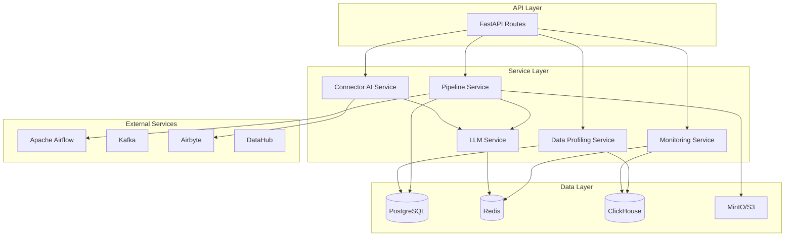

# 🔧 Backend Services Documentation

## Overview

AI ETL Assistant's backend consists of 56+ specialized services that handle different aspects of data pipeline automation, from AI-powered generation to execution monitoring.

## Service Categories

### 🤖 AI Services

#### Core AI Services
- [**Pipeline Service**](./pipeline-service.md) - Main pipeline generation and management
- [**LLM Service**](./llm-service.md) - LLM provider integration and routing
- [**Connector AI Service**](./connector-ai-service.md) - AI-powered connector configuration
- [**NL Query Service**](./nl-query-service.md) - Natural language to SQL conversion
- [**Generation Service**](./generation-service.md) - Code generation orchestration

#### Smart Analysis
- [**Smart Analysis Service**](./smart-analysis-service.md) - AI storage recommendations
- [**Schema Inference Service**](./schema-inference-service.md) - Automatic schema detection
- [**Relationship Detection Service**](./relationship-detection-service.md) - Table relationship discovery
- [**Partitioning Strategy Service**](./partitioning-strategy-service.md) - Optimal partitioning suggestions

### 📊 Data Services

#### Data Processing
- [**Data Profiling Service**](./data-profiling-service.md) - Statistical data analysis
- [**Data Quality Service**](./data-quality-service.md) - Quality checks and validation
- [**Data Preview Service**](./data-preview-service.md) - Safe data sampling
- [**Data Catalog Service**](./data-catalog-service.md) - Metadata management

#### Data Transformation
- [**DDL Generator Service**](./ddl-generator-service.md) - SQL DDL generation
- [**Datamart Service**](./datamart-service.md) - Automated datamart creation
- [**Excel Export Service**](./excel-export-service.md) - Excel file generation
- [**File Parser Service**](./file-parser-service.md) - Multi-format file parsing

### 🔌 Integration Services

#### External Integrations
- [**Airbyte Integration Service**](./airbyte-integration-service.md) - 600+ connectors
- [**DataHub Lineage Service**](./datahub-lineage-service.md) - Data lineage tracking
- [**CDC Service**](./cdc-service.md) - Change Data Capture with Debezium
- [**Streaming Service**](./streaming-service.md) - Kafka streaming pipelines

#### Storage Services
- [**Network Storage Service**](./network-storage-service.md) - SMB/NFS support
- [**Artifact Service**](./artifact-service.md) - Code artifact management
- [**ClickHouse Service**](./clickhouse-service.md) - ClickHouse operations

### 🔒 Security & Compliance

- [**Auth Service**](./auth-service.md) - Authentication and authorization
- [**Security Service**](./security-service.md) - Security operations
- [**Digital Signature Service**](./digital-signature-service.md) - Document signing
- [**Government Templates Service**](./government-templates-service.md) - GOST compliance
- [**GIS GMP Service**](./gis-gmp-service.md) - GIS integration

### 📈 Monitoring & Operations

- [**Observability Service**](./observability-service.md) - System observability
- [**Monitoring Service**](./monitoring-service.md) - Real-time monitoring
- [**Metrics Service**](./metrics-service.md) - Metrics collection
- [**Dashboard Service**](./dashboard-service.md) - Dashboard generation

### 🚀 Execution & Orchestration

- [**Orchestrator Service**](./orchestrator-service.md) - Airflow DAG management
- [**Simple Scheduler Service**](./simple-scheduler-service.md) - Basic scheduling
- [**Pipeline Optimization Service**](./pipeline-optimization-service.md) - Performance optimization
- [**Code Quality Service**](./code-quality-service.md) - Code validation

### 🎨 Templates & Gallery

- [**Pipeline Templates Service**](./pipeline-templates-service.md) - Pre-built templates
- [**Pipeline Gallery Service**](./pipeline-gallery-service.md) - Template gallery

### 🛡️ Resilience & Performance

- [**Circuit Breaker Service**](./circuit-breaker-service.md) - Fault tolerance
- [**Semantic Cache Service**](./semantic-cache-service.md) - Intelligent caching

## Service Architecture



## Common Patterns

### Dependency Injection

All services use FastAPI's dependency injection:

```python
from fastapi import Depends

async def get_pipeline_service(
    db: AsyncSession = Depends(get_db),
    llm_service: LLMService = Depends(get_llm_service)
) -> PipelineService:
    return PipelineService(db, llm_service)
```

### Async Operations

Services use async/await for non-blocking operations:

```python
class DataService:
    async def process_data(self, data: pd.DataFrame) -> ProcessedData:
        result = await self._async_processing(data)
        return result
```

### Error Handling

Standard error handling pattern:

```python
from backend.core.exceptions import ServiceError

class MyService:
    async def operation(self):
        try:
            # Service logic
            pass
        except SpecificError as e:
            logger.error(f"Operation failed: {e}")
            raise ServiceError(f"Failed to complete operation: {e}")
```

### Caching Strategy

Services implement caching where appropriate:

```python
from functools import lru_cache
import redis

class CachedService:
    def __init__(self):
        self.redis = redis.Redis()

    @lru_cache(maxsize=128)
    def expensive_operation(self, param: str):
        # Check Redis first
        cached = self.redis.get(f"cache:{param}")
        if cached:
            return json.loads(cached)

        # Compute result
        result = self._compute(param)

        # Cache for future
        self.redis.setex(
            f"cache:{param}",
            3600,  # 1 hour TTL
            json.dumps(result)
        )
        return result
```

## Service Configuration

### Environment Variables

Each service can be configured via environment variables:

```bash
# Service-specific configuration
PIPELINE_SERVICE_TIMEOUT=300
LLM_SERVICE_MAX_RETRIES=3
CACHE_SERVICE_TTL=3600
MONITORING_SERVICE_INTERVAL=60
```

### Service Registration

Services are registered in `backend/core/dependencies.py`:

```python
# Singleton services
pipeline_service = PipelineService()
llm_service = LLMService()

# Request-scoped services
def get_data_service(db: AsyncSession = Depends(get_db)):
    return DataService(db)
```

## Testing Services

### Unit Testing

```python
import pytest
from unittest.mock import Mock, patch

@pytest.mark.asyncio
async def test_pipeline_service():
    # Mock dependencies
    mock_db = Mock()
    mock_llm = Mock()

    # Test service
    service = PipelineService(mock_db, mock_llm)
    result = await service.generate_pipeline("test")

    assert result is not None
    mock_llm.generate.assert_called_once()
```

### Integration Testing

```python
@pytest.mark.integration
async def test_pipeline_end_to_end():
    async with TestClient(app) as client:
        response = await client.post(
            "/api/v1/pipelines:generate",
            json={"description": "test pipeline"}
        )
        assert response.status_code == 200
```

## Performance Considerations

### Connection Pooling

```python
# Database connection pool
engine = create_async_engine(
    DATABASE_URL,
    pool_size=20,
    max_overflow=10,
    pool_pre_ping=True,
    pool_recycle=3600
)
```

### Batch Processing

```python
async def process_batch(items: List[Item]):
    # Process in chunks
    chunk_size = 100
    for i in range(0, len(items), chunk_size):
        chunk = items[i:i+chunk_size]
        await self._process_chunk(chunk)
```

### Lazy Loading

```python
class LazyService:
    def __init__(self):
        self._heavy_resource = None

    @property
    def heavy_resource(self):
        if self._heavy_resource is None:
            self._heavy_resource = self._load_resource()
        return self._heavy_resource
```

## Monitoring & Logging

### Service Metrics

```python
from prometheus_client import Counter, Histogram

# Define metrics
pipeline_generations = Counter(
    'pipeline_generations_total',
    'Total pipeline generations'
)

generation_duration = Histogram(
    'pipeline_generation_duration_seconds',
    'Pipeline generation duration'
)

# Use in service
class PipelineService:
    @generation_duration.time()
    async def generate_pipeline(self, description: str):
        pipeline_generations.inc()
        # Service logic
```

### Structured Logging

```python
import structlog

logger = structlog.get_logger()

class MyService:
    async def operation(self, user_id: int):
        logger.info(
            "Starting operation",
            user_id=user_id,
            service="MyService",
            operation="operation"
        )
```

## Best Practices

1. **Single Responsibility**: Each service handles one domain
2. **Dependency Injection**: Use FastAPI's DI system
3. **Async First**: Prefer async operations
4. **Error Handling**: Consistent error patterns
5. **Logging**: Structured logging with context
6. **Testing**: Unit and integration tests
7. **Documentation**: Docstrings and type hints
8. **Caching**: Cache expensive operations
9. **Monitoring**: Metrics and health checks
10. **Configuration**: Environment-based config

## Service Health Checks

Each service implements health checks:

```python
class ServiceHealth:
    async def check_health(self) -> HealthStatus:
        try:
            # Check service dependencies
            await self._check_database()
            await self._check_external_services()
            return HealthStatus(healthy=True)
        except Exception as e:
            return HealthStatus(
                healthy=False,
                error=str(e)
            )
```

## Related Documentation

- [API Routes](../api/rest-api.md)
- [Database Schema](../architecture/database.md)
- [Development Guide](../development/backend.md)
- [Testing Guide](../development/testing.md)

---

[← Back to Documentation](../README.md)