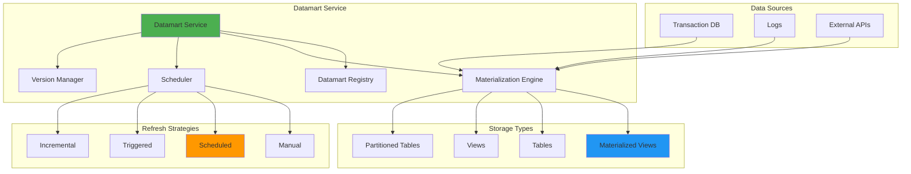

# 📊 Datamart Service

## Overview

The Datamart Service manages materialized views and data marts in PostgreSQL, providing high-performance query optimization through pre-computed, cached datasets. Supports versioning, scheduled refreshes, and multiple storage strategies.

## Architecture



## Location

```
backend/services/datamart_service.py
backend/api/routes/mvp_features.py (datamarts endpoints)
```

## Dependencies

```python
import pandas as pd
from sqlalchemy.ext.asyncio import AsyncSession
from sqlalchemy import text
from backend.services.llm_service import LLMService
from backend.services.nl_query_service import NLQueryService
```

## Class: DatamartService

### Initialization

```python
from backend.services.datamart_service import DatamartService

service = DatamartService(db_session=db)
```

---

## Core Enums

### DatamartType

```python
class DatamartType(Enum):
    VIEW = "view"                          # Standard database view
    MATERIALIZED_VIEW = "materialized_view" # Cached results (faster queries)
    TABLE = "table"                        # Physical table
    PARTITIONED_TABLE = "partitioned_table" # Partitioned for large data
    TEMPORARY = "temporary"                # Session-scoped
```

### RefreshStrategy

```python
class RefreshStrategy(Enum):
    MANUAL = "manual"               # Refresh on demand
    ON_COMMIT = "on_commit"         # Refresh on transaction commit
    SCHEDULED = "scheduled"         # Cron-based refresh
    TRIGGERED = "triggered"         # Event-driven refresh
    INCREMENTAL = "incremental"     # Refresh only new data
    FULL = "full"                   # Full rebuild
```

### DatamartStatus

```python
class DatamartStatus(Enum):
    CREATING = "creating"
    ACTIVE = "active"
    REFRESHING = "refreshing"
    STALE = "stale"
    ERROR = "error"
    DROPPED = "dropped"
```

---

## Methods

### create_datamart

Create a new datamart with specified strategy.

```python
async def create_datamart(
    name: str,
    query: str,
    datamart_type: DatamartType = DatamartType.MATERIALIZED_VIEW,
    refresh_strategy: RefreshStrategy = RefreshStrategy.MANUAL,
    schema: str = "public",
    description: Optional[str] = None,
    metadata: Optional[Dict[str, Any]] = None
) -> Dict[str, Any]
```

**Parameters:**
- `name`: Datamart name
- `query`: SQL query defining the datamart
- `datamart_type`: Type of storage (default: MATERIALIZED_VIEW)
- `refresh_strategy`: How to refresh data (default: MANUAL)
- `schema`: Database schema (default: "public")
- `description`: Human-readable description
- `metadata`: Additional metadata

**Returns:**
```python
{
    "status": "success",
    "datamart": {
        "name": "sales_summary",
        "schema": "public",
        "full_name": "public.sales_summary",
        "type": "materialized_view",
        "refresh_strategy": "scheduled",
        "query": "SELECT ...",
        "row_count": 125000,
        "size_mb": 45,
        "status": "active",
        "created_at": "2024-06-30T10:00:00Z"
    },
    "message": "Datamart 'sales_summary' created successfully"
}
```

**Example:**
```python
# Create sales summary datamart
result = await service.create_datamart(
    name="sales_summary",
    query="""
        SELECT
            DATE_TRUNC('day', order_date) as date,
            product_category,
            COUNT(*) as order_count,
            SUM(amount) as total_amount,
            AVG(amount) as avg_amount
        FROM orders
        WHERE order_date >= CURRENT_DATE - INTERVAL '90 days'
        GROUP BY date, product_category
    """,
    datamart_type=DatamartType.MATERIALIZED_VIEW,
    refresh_strategy=RefreshStrategy.SCHEDULED,
    description="90-day sales summary by product category"
)
```

**Performance Benefits:**
- **Query Speed**: 10-1000x faster than querying raw data
- **Resource Usage**: Reduces load on transaction database
- **Concurrency**: Multiple queries can access cached results

---

### materialize_view

Materialize query results into a physical table.

```python
async def materialize_view(
    query: str,
    target_table: str,
    schema: str = "public",
    replace_existing: bool = False,
    with_indexes: bool = True
) -> Dict[str, Any]
```

**Parameters:**
- `query`: SQL query to materialize
- `target_table`: Target table name
- `schema`: Database schema
- `replace_existing`: Overwrite if exists
- `with_indexes`: Auto-create indexes

**Returns:**
```python
{
    "status": "success",
    "table": "public.customer_insights",
    "row_count": 50000,
    "indexes_created": ["idx_customer_insights_customer_id"],
    "timestamp": "2024-06-30T10:00:00Z"
}
```

**Example:**
```python
# Materialize customer insights
result = await service.materialize_view(
    query="""
        SELECT
            c.customer_id,
            c.name,
            COUNT(o.order_id) as order_count,
            SUM(o.amount) as lifetime_value,
            MAX(o.order_date) as last_order_date,
            CASE
                WHEN SUM(o.amount) > 10000 THEN 'vip'
                WHEN SUM(o.amount) > 1000 THEN 'premium'
                ELSE 'standard'
            END as customer_segment
        FROM customers c
        LEFT JOIN orders o ON c.customer_id = o.customer_id
        GROUP BY c.customer_id, c.name
    """,
    target_table="customer_insights",
    replace_existing=True,
    with_indexes=True
)
```

**Use Cases:**
- **ETL Pipelines**: Cache transformation results
- **Reporting**: Pre-compute reports for dashboards
- **ML Training**: Create training datasets

---

### refresh_datamart

Refresh materialized view or datamart with new data.

```python
async def refresh_datamart(
    name: str,
    schema: str = "public",
    concurrent: bool = True
) -> Dict[str, Any]
```

**Parameters:**
- `name`: Datamart name
- `schema`: Database schema
- `concurrent`: Use CONCURRENTLY option (allows queries during refresh)

**Returns:**
```python
{
    "status": "success",
    "datamart": {
        "name": "sales_summary",
        "status": "active",
        "last_refreshed": "2024-06-30T10:00:00Z",
        "version": 2,
        "row_count": 126000,
        "size_mb": 46
    },
    "message": "Datamart 'sales_summary' refreshed successfully"
}
```

**Example:**
```python
# Refresh with concurrent access (no downtime)
result = await service.refresh_datamart(
    name="sales_summary",
    concurrent=True
)

# Refresh multiple datamarts in parallel
import asyncio

datamarts = ["sales_summary", "customer_insights", "product_performance"]
await asyncio.gather(*[
    service.refresh_datamart(name)
    for name in datamarts
])
```

**Concurrent vs Non-Concurrent:**
- **Concurrent**: Allows SELECT queries during refresh, requires unique index
- **Non-Concurrent**: Exclusive lock, faster refresh, blocks queries

---

### schedule_refresh

Schedule automatic datamart refresh.

```python
async def schedule_refresh(
    name: str,
    schedule: str,
    schema: str = "public"
) -> Dict[str, Any]
```

**Parameters:**
- `name`: Datamart name
- `schedule`: Cron expression or interval (e.g., "0 * * * *", "1h", "30m")
- `schema`: Database schema

**Returns:**
```python
{
    "status": "success",
    "job_id": "job_refresh_sales_summary_1719831600",
    "schedule": "0 */4 * * *",
    "message": "Refresh scheduled for datamart 'sales_summary'"
}
```

**Example:**
```python
# Refresh every 4 hours
result = await service.schedule_refresh(
    name="sales_summary",
    schedule="0 */4 * * *"  # Cron format
)

# Refresh every 30 minutes
result = await service.schedule_refresh(
    name="realtime_metrics",
    schedule="30m"  # Interval format
)

# Daily at 2 AM
result = await service.schedule_refresh(
    name="daily_reports",
    schedule="0 2 * * *"
)
```

**Schedule Formats:**
- **Cron**: Standard cron expressions (`0 2 * * *`)
- **Interval**: Simple intervals (`1h`, `30m`, `5m`)

---

### create_versioned_datamart

Create a versioned datamart that maintains history.

```python
async def create_versioned_datamart(
    name: str,
    query: str,
    schema: str = "public",
    keep_versions: int = 3
) -> Dict[str, Any]
```

**Parameters:**
- `name`: Base datamart name
- `query`: SQL query
- `schema`: Database schema
- `keep_versions`: Number of historical versions to retain

**Returns:**
```python
{
    "status": "success",
    "datamart": "sales_snapshot",
    "current_version": "sales_snapshot_v1",
    "version_info": {
        "base_name": "sales_snapshot",
        "current_version": 1,
        "versions": ["sales_snapshot_v1"],
        "keep_versions": 3
    }
}
```

**Example:**
```python
# Create versioned snapshot
result = await service.create_versioned_datamart(
    name="sales_snapshot",
    query="""
        SELECT
            DATE_TRUNC('hour', event_timestamp) as hour,
            product_id,
            SUM(quantity) as total_quantity,
            SUM(revenue) as total_revenue
        FROM sales_events
        WHERE event_timestamp >= CURRENT_TIMESTAMP - INTERVAL '24 hours'
        GROUP BY hour, product_id
    """,
    keep_versions=5  # Keep last 5 versions
)

# Update creates new version automatically
result = await service.update_versioned_datamart(
    name="sales_snapshot",
    query="""
        SELECT
            DATE_TRUNC('hour', event_timestamp) as hour,
            product_id,
            SUM(quantity) as total_quantity,
            SUM(revenue) as total_revenue,
            COUNT(DISTINCT customer_id) as unique_customers  -- New field
        FROM sales_events
        WHERE event_timestamp >= CURRENT_TIMESTAMP - INTERVAL '24 hours'
        GROUP BY hour, product_id
    """
)

# Query always uses current version via view
df = await db.execute("SELECT * FROM sales_snapshot")

# Access specific version
df_old = await db.execute("SELECT * FROM sales_snapshot_v1")
```

**Use Cases:**
- **A/B Testing**: Compare different metric definitions
- **Rollback**: Revert to previous version if needed
- **Auditing**: Track changes to derived metrics
- **Time Travel**: Query historical snapshots

---

### update_versioned_datamart

Create new version of versioned datamart.

```python
async def update_versioned_datamart(
    name: str,
    query: str,
    schema: str = "public"
) -> Dict[str, Any]
```

**Returns:**
```python
{
    "status": "success",
    "datamart": "sales_snapshot",
    "new_version": "sales_snapshot_v2",
    "version": 2,
    "version_info": {
        "current_version": 2,
        "versions": ["sales_snapshot_v1", "sales_snapshot_v2"]
    }
}
```

---

### get_datamart_statistics

Get comprehensive statistics about a datamart.

```python
async def get_datamart_statistics(
    name: str,
    schema: str = "public"
) -> Dict[str, Any]
```

**Returns:**
```python
{
    "row_count": 125430,
    "size": "45 MB",
    "size_bytes": 47185920,
    "column_count": 12,
    "columns": [
        {"name": "date", "type": "timestamp without time zone"},
        {"name": "product_category", "type": "character varying"},
        {"name": "order_count", "type": "bigint"},
        {"name": "total_amount", "type": "numeric"}
    ]
}
```

**Example:**
```python
stats = await service.get_datamart_statistics("sales_summary")

print(f"Rows: {stats['row_count']:,}")
print(f"Size: {stats['size']}")
print(f"Columns: {', '.join(c['name'] for c in stats['columns'])}")
```

---

### preview_datamart

Preview datamart contents with sampling.

```python
async def preview_datamart(
    name: str,
    schema: str = "public",
    limit: int = 100
) -> Dict[str, Any]
```

**Returns:**
```python
{
    "status": "success",
    "datamart": "sales_summary",
    "columns": ["date", "product_category", "order_count", "total_amount"],
    "rows": [
        {
            "date": "2024-06-30",
            "product_category": "Electronics",
            "order_count": 1250,
            "total_amount": 125000.50
        },
        # ... more rows
    ],
    "preview_count": 100,
    "total_rows": 125430
}
```

**Example:**
```python
# Preview first 50 rows
preview = await service.preview_datamart(
    name="sales_summary",
    limit=50
)

# Convert to pandas DataFrame
import pandas as pd
df = pd.DataFrame(preview["rows"])
```

---

### list_datamarts

List all datamarts in schema.

```python
async def list_datamarts(
    schema: str = "public",
    include_stats: bool = False
) -> List[Dict[str, Any]]
```

**Returns:**
```python
[
    {
        "name": "sales_summary",
        "type": "materialized_view",
        "schema": "public",
        "full_name": "public.sales_summary",
        "row_count": 125430,      # If include_stats=True
        "size": "45 MB"           # If include_stats=True
    },
    {
        "name": "customer_insights",
        "type": "materialized_view",
        "schema": "public",
        "full_name": "public.customer_insights"
    }
]
```

**Example:**
```python
# List all datamarts with statistics
datamarts = await service.list_datamarts(
    schema="public",
    include_stats=True
)

for dm in datamarts:
    print(f"{dm['name']}: {dm['row_count']:,} rows, {dm['size']}")
```

---

### drop_datamart

Drop a datamart permanently.

```python
async def drop_datamart(
    name: str,
    schema: str = "public",
    cascade: bool = False
) -> Dict[str, Any]
```

**Parameters:**
- `name`: Datamart name
- `schema`: Database schema
- `cascade`: Drop dependent objects (views, indexes)

**Returns:**
```python
{
    "status": "success",
    "message": "Datamart 'sales_summary' dropped successfully"
}
```

**Example:**
```python
# Drop datamart and all dependent views
result = await service.drop_datamart(
    name="sales_summary",
    cascade=True
)
```

---

## Use Cases

### 1. Dashboard Performance Optimization

```python
async def create_dashboard_datamarts():
    """Create datamarts for high-traffic dashboards."""

    service = DatamartService(db)

    # Revenue metrics datamart
    await service.create_datamart(
        name="dashboard_revenue_metrics",
        query="""
            SELECT
                DATE_TRUNC('day', order_date) as date,
                product_category,
                region,
                SUM(amount) as revenue,
                COUNT(*) as order_count,
                AVG(amount) as avg_order_value,
                COUNT(DISTINCT customer_id) as unique_customers
            FROM orders
            WHERE order_date >= CURRENT_DATE - INTERVAL '365 days'
            GROUP BY date, product_category, region
        """,
        datamart_type=DatamartType.MATERIALIZED_VIEW,
        description="Daily revenue metrics for dashboard"
    )

    # Customer segments datamart
    await service.create_datamart(
        name="dashboard_customer_segments",
        query="""
            SELECT
                customer_id,
                CASE
                    WHEN lifetime_value > 10000 THEN 'VIP'
                    WHEN lifetime_value > 1000 THEN 'Premium'
                    WHEN lifetime_value > 100 THEN 'Regular'
                    ELSE 'New'
                END as segment,
                lifetime_value,
                order_count,
                last_order_date,
                days_since_last_order,
                CASE
                    WHEN days_since_last_order > 180 THEN 'at_risk'
                    WHEN days_since_last_order > 90 THEN 'inactive'
                    ELSE 'active'
                END as status
            FROM (
                SELECT
                    customer_id,
                    SUM(amount) as lifetime_value,
                    COUNT(*) as order_count,
                    MAX(order_date) as last_order_date,
                    CURRENT_DATE - MAX(order_date) as days_since_last_order
                FROM orders
                GROUP BY customer_id
            ) customer_stats
        """,
        datamart_type=DatamartType.MATERIALIZED_VIEW
    )

    # Schedule refresh every hour
    await service.schedule_refresh("dashboard_revenue_metrics", "0 * * * *")
    await service.schedule_refresh("dashboard_customer_segments", "0 * * * *")

    return {
        "datamarts_created": 2,
        "refresh_schedule": "hourly"
    }
```

**Performance Impact:**
- **Before**: Dashboard loads in 15-30 seconds (complex joins on 100M+ rows)
- **After**: Dashboard loads in <1 second (simple SELECT from pre-computed data)
- **Cost Savings**: 95% reduction in database CPU usage

---

### 2. Incremental Datamart Updates

```python
async def incremental_datamart_refresh(
    datamart_name: str,
    source_table: str,
    timestamp_column: str
):
    """Efficiently refresh datamart with only new data."""

    service = DatamartService(db)

    # Get last refresh timestamp
    last_refresh_result = await db.execute(
        text(f"""
            SELECT MAX({timestamp_column}) as last_timestamp
            FROM {datamart_name}
        """)
    )
    last_timestamp = last_refresh_result.scalar()

    if last_timestamp:
        # Incremental refresh: insert only new data
        await db.execute(
            text(f"""
                INSERT INTO {datamart_name}
                SELECT *
                FROM {source_table}
                WHERE {timestamp_column} > :last_timestamp
            """),
            {"last_timestamp": last_timestamp}
        )

        # Update statistics
        await db.execute(text(f"ANALYZE {datamart_name}"))

        rows_added = await db.execute(
            text(f"""
                SELECT COUNT(*)
                FROM {source_table}
                WHERE {timestamp_column} > :last_timestamp
            """),
            {"last_timestamp": last_timestamp}
        )

        return {
            "status": "success",
            "refresh_type": "incremental",
            "rows_added": rows_added.scalar(),
            "last_timestamp": last_timestamp
        }
    else:
        # Full refresh if first time
        result = await service.refresh_datamart(datamart_name, concurrent=False)
        return {
            **result,
            "refresh_type": "full"
        }
```

**Benefits:**
- **Speed**: Refresh in seconds instead of minutes/hours
- **Resources**: Only process new data, not entire dataset
- **Availability**: Minimal lock time

---

### 3. Multi-Level Aggregation Datamarts

```python
async def create_aggregation_pyramid():
    """Create multiple granularity levels for flexible querying."""

    service = DatamartService(db)

    # Level 1: Hourly aggregations
    await service.create_datamart(
        name="metrics_hourly",
        query="""
            SELECT
                DATE_TRUNC('hour', event_timestamp) as hour,
                product_id,
                region,
                COUNT(*) as event_count,
                SUM(revenue) as revenue,
                AVG(session_duration) as avg_session_duration
            FROM events
            WHERE event_timestamp >= CURRENT_DATE - INTERVAL '30 days'
            GROUP BY hour, product_id, region
        """,
        datamart_type=DatamartType.MATERIALIZED_VIEW,
        refresh_strategy=RefreshStrategy.SCHEDULED
    )

    # Level 2: Daily aggregations (built from hourly)
    await service.create_datamart(
        name="metrics_daily",
        query="""
            SELECT
                DATE_TRUNC('day', hour) as day,
                product_id,
                region,
                SUM(event_count) as event_count,
                SUM(revenue) as revenue,
                AVG(avg_session_duration) as avg_session_duration
            FROM metrics_hourly
            GROUP BY day, product_id, region
        """,
        datamart_type=DatamartType.MATERIALIZED_VIEW
    )

    # Level 3: Monthly aggregations (built from daily)
    await service.create_datamart(
        name="metrics_monthly",
        query="""
            SELECT
                DATE_TRUNC('month', day) as month,
                product_id,
                region,
                SUM(event_count) as event_count,
                SUM(revenue) as revenue,
                AVG(avg_session_duration) as avg_session_duration
            FROM metrics_daily
            GROUP BY month, product_id, region
        """,
        datamart_type=DatamartType.MATERIALIZED_VIEW
    )

    # Schedule cascade refresh
    await service.schedule_refresh("metrics_hourly", "0 * * * *")    # Every hour
    await service.schedule_refresh("metrics_daily", "0 1 * * *")     # Daily at 1 AM
    await service.schedule_refresh("metrics_monthly", "0 2 1 * *")   # Monthly at 2 AM on 1st

    return {
        "levels": ["hourly", "daily", "monthly"],
        "message": "Aggregation pyramid created"
    }
```

**Query Strategy:**
- **Hourly**: Last 7 days
- **Daily**: Last 90 days
- **Monthly**: All-time history

---

### 4. Partitioned Datamart for Large Datasets

```python
async def create_partitioned_datamart(
    name: str,
    query: str,
    partition_column: str,
    partition_type: str = "RANGE"
):
    """Create partitioned datamart for billion-row datasets."""

    service = DatamartService(db)

    # Create parent table
    await db.execute(
        text(f"""
            CREATE TABLE {name} (
                LIKE ({query} LIMIT 0)
            ) PARTITION BY {partition_type} ({partition_column})
        """)
    )

    # Create partitions for last 12 months
    for month_offset in range(12):
        partition_date = datetime.utcnow() - timedelta(days=30 * month_offset)
        partition_name = f"{name}_y{partition_date.year}_m{partition_date.month:02d}"

        start_date = partition_date.replace(day=1)
        end_date = (start_date + timedelta(days=32)).replace(day=1)

        await db.execute(
            text(f"""
                CREATE TABLE {partition_name}
                PARTITION OF {name}
                FOR VALUES FROM ('{start_date}') TO ('{end_date}')
            """)
        )

        # Populate partition
        await db.execute(
            text(f"""
                INSERT INTO {partition_name}
                SELECT * FROM ({query}) data
                WHERE {partition_column} >= '{start_date}'
                AND {partition_column} < '{end_date}'
            """)
        )

        # Create indexes on partition
        await db.execute(
            text(f"""
                CREATE INDEX idx_{partition_name}_{partition_column}
                ON {partition_name} ({partition_column})
            """)
        )

    # Create default partition for future data
    await db.execute(
        text(f"""
            CREATE TABLE {name}_default
            PARTITION OF {name} DEFAULT
        """)
    )

    return {
        "status": "success",
        "datamart": name,
        "partitions_created": 13  # 12 months + default
    }
```

**Benefits:**
- **Query Performance**: Only scan relevant partitions
- **Maintenance**: Drop old partitions instead of DELETE
- **Parallelism**: Query partitions in parallel

---

## Performance Optimization

### Refresh Strategies by Size

```python
def choose_refresh_strategy(row_count: int, refresh_time_seconds: int) -> RefreshStrategy:
    """Choose optimal refresh strategy based on datamart size."""

    if row_count < 100_000:
        # Small datamarts: Full refresh is fast
        return RefreshStrategy.FULL

    elif row_count < 1_000_000 and refresh_time_seconds < 60:
        # Medium datamarts: CONCURRENT refresh if acceptable
        return RefreshStrategy.FULL

    elif row_count < 10_000_000:
        # Large datamarts: Incremental when possible
        return RefreshStrategy.INCREMENTAL

    else:
        # Very large datamarts: Partitioned incremental
        return RefreshStrategy.INCREMENTAL
```

### Optimal Scheduling

```python
async def optimize_refresh_schedules():
    """Distribute refresh jobs to avoid resource contention."""

    service = DatamartService(db)
    datamarts = await service.list_datamarts(include_stats=True)

    # Sort by size (refresh largest first)
    datamarts.sort(key=lambda dm: dm.get("size_bytes", 0), reverse=True)

    schedules = [
        "0 0 * * *",   # 00:00
        "0 1 * * *",   # 01:00
        "0 2 * * *",   # 02:00
        "0 3 * * *",   # 03:00
    ]

    for i, datamart in enumerate(datamarts):
        schedule = schedules[i % len(schedules)]

        await service.schedule_refresh(
            name=datamart["name"],
            schedule=schedule
        )

        logger.info(f"Scheduled {datamart['name']} at {schedule}")
```

---

## Configuration

### Environment Variables

```bash
# Datamart Configuration
DATAMART_DEFAULT_SCHEMA=public
DATAMART_MAX_SIZE_GB=100
DATAMART_REFRESH_TIMEOUT_SECONDS=3600
DATAMART_CONCURRENT_REFRESH=true
DATAMART_AUTO_INDEX=true
DATAMART_KEEP_VERSIONS=3

# Performance
DATAMART_MAINTENANCE_WORK_MEM=2GB
DATAMART_MAX_PARALLEL_WORKERS=4
```

---

## Monitoring

### Metrics

```python
from prometheus_client import Counter, Histogram, Gauge

datamart_refreshes = Counter(
    'datamart_refreshes_total',
    'Total datamart refreshes',
    ['datamart', 'status']
)

datamart_refresh_duration = Histogram(
    'datamart_refresh_duration_seconds',
    'Datamart refresh duration',
    ['datamart']
)

datamart_size_bytes = Gauge(
    'datamart_size_bytes',
    'Datamart size in bytes',
    ['datamart']
)

datamart_rows = Gauge(
    'datamart_rows_total',
    'Total rows in datamart',
    ['datamart']
)
```

### Health Check

```python
async def check_datamart_health(self) -> Dict[str, Any]:
    """Check datamart service health."""

    health = {
        "status": "healthy",
        "datamarts": []
    }

    datamarts = await self.list_datamarts(include_stats=True)

    for dm in datamarts:
        dm_health = {
            "name": dm["name"],
            "status": "healthy"
        }

        # Check if stale
        if "last_refreshed" in dm:
            last_refresh = datetime.fromisoformat(dm["last_refreshed"])
            hours_since_refresh = (datetime.utcnow() - last_refresh).total_seconds() / 3600

            if hours_since_refresh > 24:
                dm_health["status"] = "stale"
                dm_health["warning"] = f"Not refreshed for {hours_since_refresh:.1f} hours"
                health["status"] = "degraded"

        health["datamarts"].append(dm_health)

    return health
```

---

## Best Practices

### 1. Naming Conventions

```python
# Good naming
"dashboard_revenue_daily"       # Purpose_metric_granularity
"report_customer_segments"      # Purpose_entity
"cache_product_inventory"       # Type_entity

# Avoid
"mv1"                          # Meaningless
"temp_data"                    # Too generic
"johns_test"                   # Personal names
```

### 2. Index Strategy

```python
# Create indexes on common filter columns
await db.execute(text("""
    CREATE INDEX idx_sales_summary_date
    ON sales_summary (date);

    CREATE INDEX idx_sales_summary_category
    ON sales_summary (product_category);

    CREATE INDEX idx_sales_summary_date_category
    ON sales_summary (date, product_category);  -- Composite for both filters
"""))
```

### 3. Maintenance Window

```python
# Schedule heavy operations during low-traffic hours
MAINTENANCE_WINDOW = {
    "start_hour": 2,   # 2 AM
    "end_hour": 5,     # 5 AM
    "timezone": "UTC"
}

async def is_maintenance_window() -> bool:
    now = datetime.utcnow()
    return MAINTENANCE_WINDOW["start_hour"] <= now.hour < MAINTENANCE_WINDOW["end_hour"]

# Only run non-concurrent refresh during maintenance
async def smart_refresh(name: str):
    concurrent = not await is_maintenance_window()
    return await service.refresh_datamart(name, concurrent=concurrent)
```

---

## Related Documentation

- [MVP Features API](../api/mvp-features.md)
- [Database Setup](../configuration/database.md)
- [Performance Tuning](../troubleshooting/performance.md)

---

[← Back to Services](./README.md)
