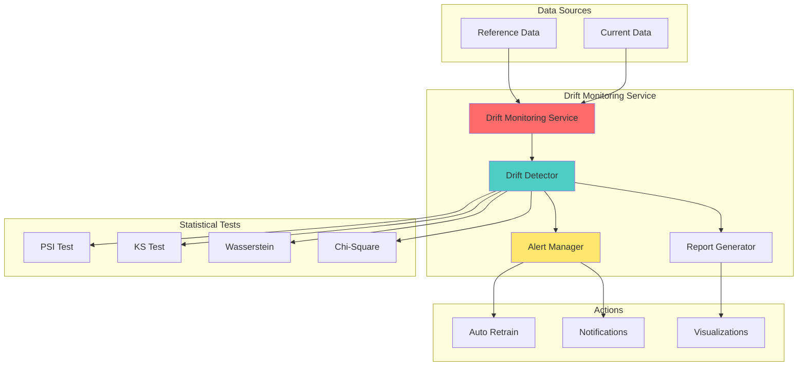

# 📊 Drift Monitoring Service

## Overview

The Drift Monitoring Service detects data drift, feature drift, and target drift in ML pipelines using Evidently AI. Automatically triggers model retraining when significant drift is detected.

## Architecture



## Location

```
backend/services/drift_monitoring_service.py
```

## Dependencies

```python
from evidently import ColumnMapping
from evidently.report import Report
from evidently.metric_preset import DataDriftPreset, TargetDriftPreset
from evidently.test_suite import TestSuite
from evidently.tests import *
import pandas as pd
import numpy as np
from scipy import stats
```

## Class: DriftMonitoringService

### Initialization

```python
from backend.services.drift_monitoring_service import DriftMonitoringService

service = DriftMonitoringService(
    db=db_session,
    threshold=0.1,  # Drift detection threshold
    stattest="psi"  # Statistical test: psi, ks, wasserstein
)
```

### Methods

#### detect_data_drift

Detect drift between reference and current datasets.

```python
async def detect_data_drift(
    reference_data: pd.DataFrame,
    current_data: pd.DataFrame,
    columns: List[str] = None,
    threshold: float = 0.1,
    stattest: str = "psi"
) -> Dict[str, Any]
```

**Parameters:**
- `reference_data`: Baseline dataset (training data)
- `current_data`: Production data to compare
- `columns`: Columns to monitor (None = all numeric)
- `threshold`: Drift detection threshold (0.0-1.0)
- `stattest`: Statistical test ("psi", "ks", "wasserstein", "jensenshannon")

**Returns:**
```python
{
    "drift_detected": True,
    "drift_score": 0.24,
    "drift_share": 0.45,  # 45% of columns drifted
    "columns_with_drift": [
        {
            "column": "income",
            "drift_score": 0.35,
            "threshold": 0.1,
            "drift_detected": True,
            "distribution_change": {
                "reference_mean": 65000,
                "current_mean": 72000,
                "percentage_change": 10.77
            }
        }
    ],
    "recommendation": "RETRAIN_REQUIRED"
}
```

**Example:**
```python
# Load datasets
reference_df = pd.read_parquet("s3://data/reference/2024_Q1.parquet")
current_df = pd.read_parquet("s3://data/current/2024_Q2.parquet")

# Detect drift
result = await service.detect_data_drift(
    reference_data=reference_df,
    current_data=current_df,
    columns=["age", "income", "tenure_days"],
    threshold=0.1,
    stattest="psi"
)

if result["drift_detected"]:
    logger.warning(f"Drift detected: {result['drift_score']}")
    # Trigger retraining
    await trigger_model_retraining()
```

---

#### analyze_feature_drift

Detailed feature-level drift analysis with statistical tests.

```python
async def analyze_feature_drift(
    pipeline_id: str,
    reference_period: Dict[str, str],
    current_period: Dict[str, str],
    features: List[str],
    target_column: str = None
) -> Dict[str, Any]
```

**Returns:**
```python
{
    "overall_drift": {
        "detected": True,
        "severity": "high",
        "drift_score": 0.31
    },
    "feature_analysis": [
        {
            "feature": "income",
            "drift_detected": True,
            "drift_score": 0.42,
            "p_value": 0.001,
            "statistics": {
                "reference": {"mean": 65000, "std": 15000},
                "current": {"mean": 72000, "std": 18000}
            }
        }
    ],
    "recommendations": [
        {
            "action": "RETRAIN_MODEL",
            "priority": "high",
            "reason": "Significant drift in 3/6 features"
        }
    ]
}
```

**Example:**
```python
analysis = await service.analyze_feature_drift(
    pipeline_id="pipe_churn_prediction",
    reference_period={"start": "2024-01-01", "end": "2024-03-31"},
    current_period={"start": "2024-06-01", "end": "2024-06-30"},
    features=["age", "income", "tenure_days", "total_purchases"],
    target_column="churned"
)

# Process recommendations
for rec in analysis["recommendations"]:
    if rec["priority"] == "high":
        await handle_drift_recommendation(rec)
```

---

#### generate_drift_report

Generate comprehensive drift report with visualizations.

```python
async def generate_drift_report(
    reference_data: pd.DataFrame,
    current_data: pd.DataFrame,
    column_mapping: ColumnMapping = None,
    output_path: str = None
) -> Dict[str, Any]
```

**Returns:**
```python
{
    "report_id": "drift_report_abc123",
    "html_url": "https://storage/reports/drift_2024_06_30.html",
    "summary": {
        "total_features": 15,
        "features_with_drift": 5,
        "drift_percentage": 33.33
    },
    "visualizations": {
        "drift_heatmap": "https://storage/viz/heatmap.png",
        "distribution_comparison": "https://storage/viz/distributions.png"
    }
}
```

**Example:**
```python
from evidently import ColumnMapping

# Define column mapping
column_mapping = ColumnMapping(
    target="churned",
    prediction="prediction",
    numerical_features=["age", "income", "tenure_days"],
    categorical_features=["segment", "region"]
)

report = await service.generate_drift_report(
    reference_data=reference_df,
    current_data=current_df,
    column_mapping=column_mapping,
    output_path="/reports/drift_report.html"
)

# Send to stakeholders
await send_email(
    to="ml-team@company.com",
    subject="Drift Report - June 2024",
    body=f"Report available at: {report['html_url']}"
)
```

---

#### check_retraining_needed

Check if model retraining is recommended based on drift.

```python
async def check_retraining_needed(
    pipeline_id: str,
    drift_score: float,
    features_drifted: int,
    days_since_training: int
) -> Dict[str, Any]
```

**Returns:**
```python
{
    "retraining_required": True,
    "trigger_conditions": [
        {
            "condition": "drift_score > 0.25",
            "current_value": 0.31,
            "threshold": 0.25,
            "status": "triggered"
        },
        {
            "condition": "features_drifted > 3",
            "current_value": 5,
            "threshold": 3,
            "status": "triggered"
        }
    ],
    "recommendation": {
        "priority": "high",
        "estimated_accuracy_drop": 12.5,
        "suggested_action": "immediate_retraining"
    }
}
```

---

## Statistical Tests

### PSI (Population Stability Index)

```python
def calculate_psi(
    reference: np.ndarray,
    current: np.ndarray,
    buckets: int = 10
) -> float:
    """
    Calculate PSI between two distributions.

    PSI Interpretation:
    - < 0.1: No significant change
    - 0.1-0.25: Moderate change, investigate
    - > 0.25: Significant change, action required
    """
    # Create bins
    breakpoints = np.percentile(
        reference,
        np.arange(0, 100, 100/buckets)
    )

    # Calculate distributions
    ref_percents = np.histogram(reference, breakpoints)[0] / len(reference)
    cur_percents = np.histogram(current, breakpoints)[0] / len(current)

    # Avoid division by zero
    ref_percents = np.where(ref_percents == 0, 0.0001, ref_percents)
    cur_percents = np.where(cur_percents == 0, 0.0001, cur_percents)

    # Calculate PSI
    psi = np.sum((cur_percents - ref_percents) * np.log(cur_percents / ref_percents))

    return psi
```

### Kolmogorov-Smirnov Test

```python
def ks_test(
    reference: np.ndarray,
    current: np.ndarray
) -> Dict[str, float]:
    """
    Perform KS test for distribution comparison.

    Returns:
    - statistic: KS statistic (0-1)
    - p_value: p-value (< 0.05 indicates drift)
    """
    statistic, p_value = stats.ks_2samp(reference, current)

    return {
        "statistic": statistic,
        "p_value": p_value,
        "drift_detected": p_value < 0.05
    }
```

---

## Use Cases

### 1. Continuous ML Monitoring

```python
async def monitor_ml_pipeline_continuously(
    pipeline_id: str,
    check_interval_hours: int = 24
):
    """Monitor ML pipeline for drift continuously"""

    service = DriftMonitoringService(db)

    while True:
        # Get reference data (training data)
        reference_df = await load_training_data(pipeline_id)

        # Get current production data
        current_df = await load_production_data(
            pipeline_id,
            days=7  # Last 7 days
        )

        # Detect drift
        result = await service.detect_data_drift(
            reference_data=reference_df,
            current_data=current_df,
            threshold=0.15
        )

        if result["drift_detected"]:
            logger.warning(f"Drift detected: {result}")

            # Generate detailed report
            report = await service.generate_drift_report(
                reference_data=reference_df,
                current_data=current_df
            )

            # Check if retraining needed
            retraining = await service.check_retraining_needed(
                pipeline_id=pipeline_id,
                drift_score=result["drift_score"],
                features_drifted=len(result["columns_with_drift"]),
                days_since_training=await get_days_since_training(pipeline_id)
            )

            if retraining["retraining_required"]:
                # Trigger retraining
                await trigger_model_retraining(
                    pipeline_id=pipeline_id,
                    reason="drift_detected",
                    drift_score=result["drift_score"]
                )

                # Send alert
                await send_alert(
                    type="drift_alert",
                    severity="high",
                    message=f"Model retraining triggered for {pipeline_id}",
                    report_url=report["html_url"]
                )

        # Wait for next check
        await asyncio.sleep(check_interval_hours * 3600)
```

### 2. Automated Drift Alerts

```python
async def setup_drift_alerts(
    pipeline_id: str,
    alert_config: Dict
):
    """Set up automated drift alerts"""

    service = DriftMonitoringService(db)

    # Configure alert thresholds
    thresholds = {
        "warning": 0.15,
        "critical": 0.25
    }

    async def check_and_alert():
        result = await service.detect_data_drift(
            reference_data=await load_reference_data(pipeline_id),
            current_data=await load_current_data(pipeline_id),
            threshold=thresholds["warning"]
        )

        if result["drift_score"] >= thresholds["critical"]:
            # Critical alert
            await send_alert(
                channels=["email", "slack", "pagerduty"],
                severity="critical",
                message=f"Critical drift detected: {result['drift_score']:.2f}",
                pipeline_id=pipeline_id
            )
        elif result["drift_score"] >= thresholds["warning"]:
            # Warning alert
            await send_alert(
                channels=["email", "slack"],
                severity="warning",
                message=f"Drift warning: {result['drift_score']:.2f}",
                pipeline_id=pipeline_id
            )

    # Schedule periodic checks
    schedule.every().day.at("02:00").do(check_and_alert)
```

### 3. A/B Test Drift Detection

```python
async def detect_ab_test_drift(
    control_group: pd.DataFrame,
    treatment_group: pd.DataFrame,
    metric_column: str
) -> Dict:
    """Detect if A/B test results drifted from initial observations"""

    service = DriftMonitoringService(db)

    # Use control as reference, treatment as current
    result = await service.detect_data_drift(
        reference_data=control_group,
        current_data=treatment_group,
        columns=[metric_column],
        stattest="ks"
    )

    # Additional statistical test
    t_stat, p_value = stats.ttest_ind(
        control_group[metric_column],
        treatment_group[metric_column]
    )

    return {
        "drift_detected": result["drift_detected"],
        "drift_score": result["drift_score"],
        "t_statistic": t_stat,
        "p_value": p_value,
        "significant": p_value < 0.05,
        "recommendation": (
            "Continue test - significant difference"
            if p_value < 0.05
            else "No significant effect detected"
        )
    }
```

---

## Configuration

### Environment Variables

```bash
# Drift Monitoring
DRIFT_MONITORING_ENABLED=true
DRIFT_CHECK_INTERVAL_HOURS=24
DRIFT_THRESHOLD_WARNING=0.15
DRIFT_THRESHOLD_CRITICAL=0.25

# Auto Retraining
AUTO_RETRAIN_ENABLED=true
AUTO_RETRAIN_DRIFT_THRESHOLD=0.25
AUTO_RETRAIN_MIN_FEATURES_DRIFTED=3
AUTO_RETRAIN_MIN_DAYS_SINCE_TRAINING=30

# Alerts
DRIFT_ALERT_EMAIL=ml-team@company.com
DRIFT_ALERT_SLACK_WEBHOOK=https://hooks.slack.com/...
DRIFT_ALERT_PAGERDUTY_KEY=your_key

# Storage
DRIFT_REPORTS_STORAGE=s3://bucket/drift-reports/
DRIFT_REPORTS_RETENTION_DAYS=90
```

### Retraining Policies

```python
RETRAINING_POLICIES = {
    "aggressive": {
        "drift_threshold": 0.15,
        "min_features_drifted": 2,
        "min_days_since_training": 14
    },
    "moderate": {  # Default
        "drift_threshold": 0.25,
        "min_features_drifted": 3,
        "min_days_since_training": 30
    },
    "conservative": {
        "drift_threshold": 0.35,
        "min_features_drifted": 5,
        "min_days_since_training": 60
    }
}
```

---

## Performance Considerations

### Large Dataset Handling

```python
async def detect_drift_large_dataset(
    reference_path: str,
    current_path: str,
    sample_size: int = 10000
):
    """Detect drift on large datasets using sampling"""

    # Sample reference data
    reference_df = pd.read_parquet(reference_path)
    if len(reference_df) > sample_size:
        reference_df = reference_df.sample(n=sample_size, random_state=42)

    # Sample current data
    current_df = pd.read_parquet(current_path)
    if len(current_df) > sample_size:
        current_df = current_df.sample(n=sample_size, random_state=42)

    # Detect drift on samples
    service = DriftMonitoringService(db)
    return await service.detect_data_drift(
        reference_data=reference_df,
        current_data=current_df
    )
```

### Parallel Feature Processing

```python
async def parallel_feature_drift_detection(
    reference_df: pd.DataFrame,
    current_df: pd.DataFrame,
    features: List[str]
) -> List[Dict]:
    """Process features in parallel for faster drift detection"""

    async def detect_single_feature(feature: str):
        return await detect_feature_drift(
            reference_df[feature],
            current_df[feature]
        )

    # Process features in parallel
    results = await asyncio.gather(*[
        detect_single_feature(f) for f in features
    ])

    return results
```

---

## Error Handling

```python
from backend.core.exceptions import ServiceError

class DriftMonitoringService:
    async def detect_data_drift(self, ...):
        # Validate data
        if len(reference_data) < 1000:
            raise ServiceError(
                f"Reference data too small: {len(reference_data)} rows, minimum 1000 required",
                error_code="INSUFFICIENT_DATA"
            )

        # Check schema compatibility
        if not set(reference_data.columns).issubset(current_data.columns):
            missing_cols = set(reference_data.columns) - set(current_data.columns)
            raise ServiceError(
                f"Schema mismatch: {missing_cols} missing in current data",
                error_code="INCOMPATIBLE_SCHEMAS"
            )

        try:
            # Drift detection logic
            pass
        except Exception as e:
            logger.error(f"Drift detection failed: {e}")
            raise ServiceError(
                f"Drift detection failed: {e}",
                error_code="DRIFT_DETECTION_FAILED"
            )
```

---

## Testing

```python
@pytest.mark.asyncio
async def test_drift_detection():
    service = DriftMonitoringService(db)

    # Create reference data
    reference_df = pd.DataFrame({
        "feature1": np.random.normal(0, 1, 1000),
        "feature2": np.random.normal(0, 1, 1000)
    })

    # Create drifted current data
    current_df = pd.DataFrame({
        "feature1": np.random.normal(0.5, 1, 1000),  # Mean shifted
        "feature2": np.random.normal(0, 1, 1000)     # No drift
    })

    result = await service.detect_data_drift(
        reference_data=reference_df,
        current_data=current_df,
        threshold=0.1
    )

    assert result["drift_detected"] == True
    assert len(result["columns_with_drift"]) == 1
    assert result["columns_with_drift"][0]["column"] == "feature1"
```

---

## Related Documentation

- [Drift Monitoring API](../api/drift-monitoring.md)
- [ML Monitoring Guide](../guides/ml-monitoring.md)
- [Evidently AI Integration](../AI_ENHANCEMENTS_SETUP.md)

---

[← Back to Services](./README.md)
