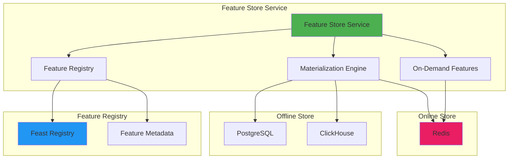

# 🎯 Feature Store Service

## Overview

The Feature Store Service provides real-time feature serving for ML pipelines with support for both offline (training) and online (inference) feature stores. Integrates with Feast for production-grade feature management.

## Architecture



## Location

```
backend/services/feature_store_service.py
backend/api/routes/feast_features.py
```

## Dependencies

```python
import pandas as pd
import numpy as np
from feast import FeatureStore
from sqlalchemy.ext.asyncio import AsyncSession
import redis.asyncio as redis
```

## Class: FeatureStoreService

### Initialization

```python
from backend.services.feature_store_service import FeatureStoreService

service = FeatureStoreService(
    db=db_session,
    user_id="user_123",
    redis_client=redis_client
)
```

### Configuration

```python
# Default settings
online_ttl_default = 86400  # 24 hours
batch_size = 1000
```

---

## Core Data Structures

### FeatureDefinition

```python
@dataclass
class FeatureDefinition:
    name: str                              # Feature name
    feature_type: FeatureType              # INT, FLOAT, STRING, BOOL, etc.
    description: str                       # Human-readable description
    entity: str                            # Entity type (user, pipeline, connector)
    source: str                            # Source pipeline/table
    version: str = "v1"                    # Feature version
    tags: List[str] = None                 # Tags for organization
    owner: str = None                      # Owner email
    ttl_seconds: Optional[int] = None      # Online store TTL
    storage_type: FeatureStorageType = BOTH # OFFLINE, ONLINE, or BOTH
```

**Example:**
```python
feature_def = FeatureDefinition(
    name="avg_pipeline_execution_time",
    feature_type=FeatureType.FLOAT,
    description="Average execution time in seconds (7-day window)",
    entity="pipeline",
    source="pipeline_metrics",
    version="v1",
    tags=["performance", "ml"],
    owner="data-eng@company.com",
    ttl_seconds=86400,
    storage_type=FeatureStorageType.BOTH
)
```

### FeatureValue

```python
@dataclass
class FeatureValue:
    feature_name: str
    entity_id: str
    value: Any
    timestamp: datetime
    version: str = "v1"
```

### FeatureVector

```python
@dataclass
class FeatureVector:
    entity_id: str
    features: Dict[str, Any]  # feature_name -> value
    timestamp: datetime
    version: str = "v1"
```

---

## Methods

### register_feature

Register a new feature in the feature store.

```python
async def register_feature(
    feature_def: FeatureDefinition
) -> Dict[str, Any]
```

**Parameters:**
- `feature_def`: Feature definition with metadata

**Returns:**
```python
{
    "success": True,
    "feature_name": "avg_execution_time",
    "version": "v1",
    "storage_type": "both"
}
```

**Example:**
```python
feature_def = FeatureDefinition(
    name="pipeline_success_rate",
    feature_type=FeatureType.FLOAT,
    description="Success rate over last 100 runs",
    entity="pipeline",
    source="run_metrics",
    ttl_seconds=3600
)

result = await service.register_feature(feature_def)
```

---

### write_features_offline

Write features to offline store (PostgreSQL/ClickHouse) for training.

```python
async def write_features_offline(
    features: List[FeatureValue],
    storage_table: str
) -> Dict[str, Any]
```

**Parameters:**
- `features`: List of feature values to write
- `storage_table`: Target table name

**Returns:**
```python
{
    "success": True,
    "features_written": 1000,
    "storage": "offline",
    "table": "feature_store"
}
```

**Example:**
```python
features = [
    FeatureValue(
        feature_name="avg_execution_time",
        entity_id="pipeline_123",
        value=125.5,
        timestamp=datetime.utcnow()
    ),
    FeatureValue(
        feature_name="success_rate",
        entity_id="pipeline_123",
        value=0.95,
        timestamp=datetime.utcnow()
    )
]

result = await service.write_features_offline(
    features=features,
    storage_table="pipeline_features_offline"
)
```

---

### write_features_online

Write features to online store (Redis) for low-latency inference serving.

```python
async def write_features_online(
    features: List[FeatureValue],
    ttl_seconds: Optional[int] = None
) -> Dict[str, Any]
```

**Parameters:**
- `features`: List of feature values
- `ttl_seconds`: Time-to-live in seconds (default: 24 hours)

**Returns:**
```python
{
    "success": True,
    "features_written": 1000,
    "storage": "online",
    "ttl_seconds": 86400
}
```

**Example:**
```python
# Write with custom TTL
result = await service.write_features_online(
    features=features,
    ttl_seconds=3600  # 1 hour TTL for fresh features
)
```

**Performance:**
- Batch writes using Redis pipeline
- ~10,000 features/second write throughput
- Sub-millisecond latency per feature

---

### get_online_features

Retrieve features from online store for real-time inference (<10ms latency).

```python
async def get_online_features(
    feature_names: List[str],
    entity_ids: List[str]
) -> Dict[str, FeatureVector]
```

**Parameters:**
- `feature_names`: List of feature names to retrieve
- `entity_ids`: List of entity IDs

**Returns:**
```python
{
    "pipeline_123": FeatureVector(
        entity_id="pipeline_123",
        features={
            "avg_execution_time": 125.5,
            "success_rate": 0.95,
            "failure_probability": 0.05
        },
        timestamp=datetime(2024, 6, 30, 10, 0, 0),
        version="v1"
    )
}
```

**Example:**
```python
# Get features for multiple pipelines
features = await service.get_online_features(
    feature_names=[
        "avg_execution_time",
        "success_rate",
        "failure_probability"
    ],
    entity_ids=["pipeline_123", "pipeline_456"]
)

# Use for ML inference
for entity_id, feature_vector in features.items():
    prediction = ml_model.predict([
        feature_vector.features["avg_execution_time"],
        feature_vector.features["success_rate"],
        feature_vector.features["failure_probability"]
    ])
```

**Performance:**
- Batch retrieval using Redis MGET
- <5ms p95 latency for 10 features
- <10ms p99 latency

---

### get_offline_features

Retrieve features from offline store for model training.

```python
async def get_offline_features(
    feature_names: List[str],
    entity_ids: List[str],
    storage_table: str,
    point_in_time: Optional[datetime] = None
) -> pd.DataFrame
```

**Parameters:**
- `feature_names`: List of feature names
- `entity_ids`: List of entity IDs
- `storage_table`: Source table
- `point_in_time`: Point-in-time for historical features (for temporal consistency)

**Returns:**
DataFrame with columns: `entity_id` + feature columns

**Example:**
```python
# Get historical features for training
training_data = await service.get_offline_features(
    feature_names=[
        "avg_execution_time",
        "success_rate",
        "error_count",
        "avg_latency"
    ],
    entity_ids=pipeline_ids,
    storage_table="pipeline_features_offline",
    point_in_time=datetime(2024, 6, 1)  # Features as of June 1st
)

# Use for training
X = training_data[["avg_execution_time", "success_rate", "error_count", "avg_latency"]]
y = training_data["label"]
model.fit(X, y)
```

**Point-in-Time Correctness:**
- Ensures temporal consistency for training
- Prevents label leakage
- Retrieves feature values as they existed at a specific timestamp

---

### compute_on_demand_features

Compute on-demand feature views (ODFVs) at query time.

```python
async def compute_on_demand_features(
    feature_view_name: str,
    request_data: Dict[str, Any],
    materialized_features: Optional[Dict[str, Any]] = None
) -> Dict[str, Any]
```

**Parameters:**
- `feature_view_name`: Name of feature view
- `request_data`: Request-time data
- `materialized_features`: Pre-computed features (optional)

**Returns:**
Dictionary of computed features

**Example:**
```python
# Compute derived features at inference time
request_data = {
    "execution_times": [120, 125, 130, 135],  # Last 4 runs
    "error_counts": [0, 1, 0, 2]
}

computed_features = await service.compute_on_demand_features(
    feature_view_name="pipeline_realtime_metrics",
    request_data=request_data,
    materialized_features={
        "avg_execution_time_7d": 128.5,  # Pre-computed from offline store
        "success_rate_30d": 0.92
    }
)

# Result:
# {
#     "avg_execution_time_recent": 127.5,      # Computed from request
#     "max_error_count_recent": 2,
#     "avg_execution_time_7d": 128.5,          # From materialized
#     "success_rate_30d": 0.92
# }
```

**Use Cases:**
- Real-time aggregations (e.g., recent average, max, sum)
- Feature combinations (e.g., ratio, difference)
- Request-time transformations

---

### materialize_feature_view

Materialize feature view from offline to online store.

```python
async def materialize_feature_view(
    feature_view_name: str,
    start_date: datetime,
    end_date: datetime
) -> Dict[str, Any]
```

**Parameters:**
- `feature_view_name`: Name of feature view
- `start_date`: Start of materialization window
- `end_date`: End of materialization window

**Returns:**
```python
{
    "success": True,
    "feature_view": "pipeline_features",
    "features_materialized": 50000,
    "date_range": {
        "start": "2024-06-01T00:00:00Z",
        "end": "2024-06-30T23:59:59Z"
    }
}
```

**Example:**
```python
# Materialize features for the last 30 days
result = await service.materialize_feature_view(
    feature_view_name="pipeline_features",
    start_date=datetime.utcnow() - timedelta(days=30),
    end_date=datetime.utcnow()
)

# Schedule periodic materialization
async def scheduled_materialization():
    while True:
        await service.materialize_feature_view(
            feature_view_name="pipeline_features",
            start_date=datetime.utcnow() - timedelta(hours=1),
            end_date=datetime.utcnow()
        )
        await asyncio.sleep(3600)  # Every hour
```

---

## Integration with Feast

### Feast Setup

```python
# feast_repo/features.py
from feast import Entity, FeatureView, Field, FileSource
from feast.types import Int64, Float64, String
from datetime import timedelta

# Define entities
pipeline = Entity(
    name="pipeline",
    join_keys=["pipeline_id"],
    description="Pipeline entity"
)

# Define feature view
pipeline_features = FeatureView(
    name="pipeline_features",
    entities=[pipeline],
    ttl=timedelta(days=1),
    schema=[
        Field(name="avg_execution_time", dtype=Float64),
        Field(name="success_rate", dtype=Float64),
        Field(name="error_count", dtype=Int64),
        Field(name="failure_probability", dtype=Float64)
    ],
    source=FileSource(
        path="data/pipeline_features.parquet",
        timestamp_field="event_timestamp"
    ),
    online=True
)
```

### Using Feast with Service

```python
from feast import FeatureStore

# Initialize Feast
feast_store = FeatureStore(repo_path="feast_repo/")

# Get online features via Feast
features = feast_store.get_online_features(
    features=[
        "pipeline_features:avg_execution_time",
        "pipeline_features:success_rate"
    ],
    entity_rows=[
        {"pipeline_id": "pipeline_123"}
    ]
).to_dict()

# Get historical features for training
training_data = feast_store.get_historical_features(
    entity_df=entity_df,
    features=[
        "pipeline_features:avg_execution_time",
        "pipeline_features:success_rate"
    ]
).to_df()
```

---

## Use Cases

### 1. ML Model Serving with Real-Time Features

```python
async def predict_pipeline_failure(pipeline_id: str) -> Dict[str, Any]:
    """Predict if pipeline will fail using real-time features."""

    # Get online features
    features = await service.get_online_features(
        feature_names=[
            "avg_execution_time",
            "success_rate",
            "error_count",
            "avg_memory_usage",
            "failure_probability"
        ],
        entity_ids=[pipeline_id]
    )

    feature_vector = features[pipeline_id]

    # Prepare input for ML model
    X = np.array([[
        feature_vector.features["avg_execution_time"],
        feature_vector.features["success_rate"],
        feature_vector.features["error_count"],
        feature_vector.features["avg_memory_usage"]
    ]])

    # Get prediction
    failure_probability = ml_model.predict_proba(X)[0][1]

    return {
        "pipeline_id": pipeline_id,
        "failure_probability": failure_probability,
        "features_used": feature_vector.features,
        "recommendation": (
            "high_risk" if failure_probability > 0.7
            else "medium_risk" if failure_probability > 0.3
            else "low_risk"
        )
    }
```

**Performance:**
- Online feature retrieval: <5ms
- ML inference: ~10ms
- **Total latency: <15ms**

---

### 2. Training Dataset Generation

```python
async def generate_training_dataset(
    start_date: datetime,
    end_date: datetime,
    output_path: str
) -> pd.DataFrame:
    """Generate training dataset with historical features."""

    # Get all pipeline IDs
    pipelines = await db.execute(
        select(Pipeline.id).where(
            Pipeline.created_at.between(start_date, end_date)
        )
    )
    pipeline_ids = [p.id for p in pipelines.scalars()]

    # Get historical features
    training_data = await service.get_offline_features(
        feature_names=[
            "avg_execution_time",
            "success_rate",
            "error_count",
            "avg_memory_usage",
            "cpu_utilization"
        ],
        entity_ids=pipeline_ids,
        storage_table="pipeline_features_offline",
        point_in_time=end_date  # Point-in-time correctness
    )

    # Get labels (did pipeline fail in next 24 hours?)
    labels = await get_pipeline_failure_labels(
        pipeline_ids,
        start_date + timedelta(hours=24),
        end_date + timedelta(hours=24)
    )

    # Merge features and labels
    dataset = training_data.merge(labels, on="pipeline_id")

    # Save to disk
    dataset.to_parquet(output_path)

    return dataset
```

---

### 3. Feature Materialization Pipeline

```python
async def materialize_pipeline_features_daily():
    """Daily feature materialization job."""

    # Compute features from raw data
    features = []

    # Get pipeline runs from last 24 hours
    end_date = datetime.utcnow()
    start_date = end_date - timedelta(days=1)

    runs = await db.execute(
        select(Run).where(
            Run.started_at.between(start_date, end_date)
        )
    )

    # Aggregate features per pipeline
    for pipeline_id, pipeline_runs in group_by(runs.scalars(), key=lambda r: r.pipeline_id):
        # Compute aggregations
        execution_times = [r.duration_seconds for r in pipeline_runs if r.duration_seconds]
        success_count = sum(1 for r in pipeline_runs if r.status == "success")

        features.extend([
            FeatureValue(
                feature_name="avg_execution_time",
                entity_id=pipeline_id,
                value=np.mean(execution_times) if execution_times else 0,
                timestamp=end_date
            ),
            FeatureValue(
                feature_name="success_rate",
                entity_id=pipeline_id,
                value=success_count / len(pipeline_runs) if pipeline_runs else 0,
                timestamp=end_date
            ),
            FeatureValue(
                feature_name="error_count",
                entity_id=pipeline_id,
                value=len(pipeline_runs) - success_count,
                timestamp=end_date
            )
        ])

    # Write to offline store
    await service.write_features_offline(
        features=features,
        storage_table="pipeline_features_offline"
    )

    # Write to online store (for inference)
    await service.write_features_online(
        features=features,
        ttl_seconds=86400  # 24 hours
    )

    logger.info(f"Materialized {len(features)} features")
```

**Schedule with Airflow:**
```python
from airflow import DAG
from airflow.operators.python import PythonOperator

dag = DAG(
    "materialize_pipeline_features",
    schedule_interval="@daily",
    start_date=datetime(2024, 1, 1)
)

materialize_task = PythonOperator(
    task_id="materialize_features",
    python_callable=materialize_pipeline_features_daily,
    dag=dag
)
```

---

### 4. On-Demand Feature Computation

```python
async def serve_features_with_odfv(
    pipeline_id: str,
    request_data: Dict[str, Any]
) -> Dict[str, Any]:
    """Serve features with on-demand computation."""

    # Get materialized features from online store
    materialized = await service.get_online_features(
        feature_names=[
            "avg_execution_time_7d",
            "success_rate_30d"
        ],
        entity_ids=[pipeline_id]
    )

    # Compute real-time features from request data
    on_demand = await service.compute_on_demand_features(
        feature_view_name="pipeline_realtime_metrics",
        request_data=request_data,
        materialized_features=materialized[pipeline_id].features
    )

    return {
        "pipeline_id": pipeline_id,
        "features": on_demand,
        "timestamp": datetime.utcnow().isoformat()
    }
```

---

## Performance Optimization

### Batch Operations

```python
async def batch_write_features(
    feature_values: List[FeatureValue],
    batch_size: int = 1000
) -> Dict[str, Any]:
    """Write features in batches for better performance."""

    total_written = 0

    for i in range(0, len(feature_values), batch_size):
        batch = feature_values[i:i + batch_size]

        # Write batch to offline store
        await service.write_features_offline(
            features=batch,
            storage_table="feature_store"
        )

        # Write batch to online store
        await service.write_features_online(
            features=batch,
            ttl_seconds=86400
        )

        total_written += len(batch)
        logger.info(f"Written {total_written}/{len(feature_values)} features")

    return {
        "total_features": len(feature_values),
        "batches": len(feature_values) // batch_size + 1,
        "batch_size": batch_size
    }
```

### Feature Caching

```python
from functools import lru_cache
import hashlib

class CachedFeatureStore:
    def __init__(self, service: FeatureStoreService):
        self.service = service
        self.cache = {}

    async def get_online_features_cached(
        self,
        feature_names: List[str],
        entity_ids: List[str],
        ttl_seconds: int = 300
    ) -> Dict[str, FeatureVector]:
        """Get features with application-level caching."""

        # Create cache key
        cache_key = hashlib.md5(
            f"{','.join(feature_names)}:{','.join(entity_ids)}".encode()
        ).hexdigest()

        # Check cache
        if cache_key in self.cache:
            cached_data, cached_at = self.cache[cache_key]
            if (datetime.utcnow() - cached_at).total_seconds() < ttl_seconds:
                return cached_data

        # Fetch from online store
        features = await self.service.get_online_features(
            feature_names=feature_names,
            entity_ids=entity_ids
        )

        # Update cache
        self.cache[cache_key] = (features, datetime.utcnow())

        return features
```

---

## Configuration

### Environment Variables

```bash
# Feast Configuration
FEAST_ENABLED=true
FEAST_REPO_PATH=./feast_repo
FEAST_REGISTRY_URL=s3://my-bucket/feast-registry/registry.db
FEAST_ONLINE_STORE_URL=redis://localhost:6379/1
FEAST_OFFLINE_STORE_URL=postgresql://localhost/ai_etl
FEAST_MATERIALIZATION_INTERVAL_HOURS=1

# Feature Store Settings
FEATURE_STORE_ONLINE_TTL=86400
FEATURE_STORE_BATCH_SIZE=1000
FEATURE_STORE_CACHE_ENABLED=true
```

### Feature Store Config (feature_store.yaml)

```yaml
project: ai_etl_features
registry: s3://my-bucket/feast-registry/registry.db
provider: local
online_store:
  type: redis
  connection_string: redis://localhost:6379
offline_store:
  type: postgres
  host: localhost
  port: 5432
  database: ai_etl
  user: etl_user
  password: ${POSTGRES_PASSWORD}
```

---

## Error Handling

```python
from backend.core.exceptions import ServiceError

class FeatureStoreService:
    async def get_online_features(self, ...):
        try:
            # Feature retrieval logic
            pass
        except redis.ConnectionError as e:
            logger.error(f"Redis connection error: {e}")
            raise ServiceError(
                "Online feature store unavailable",
                error_code="ONLINE_STORE_UNAVAILABLE"
            )
        except KeyError as e:
            logger.error(f"Feature not found: {e}")
            raise ServiceError(
                f"Feature not found: {e}",
                error_code="FEATURE_NOT_FOUND"
            )
        except Exception as e:
            logger.error(f"Unexpected error: {e}")
            raise ServiceError(
                f"Feature retrieval failed: {e}",
                error_code="FEATURE_STORE_ERROR"
            )
```

---

## Testing

```python
import pytest
from unittest.mock import Mock, AsyncMock, patch

@pytest.mark.asyncio
async def test_register_feature():
    service = FeatureStoreService(db=mock_db, user_id="test_user")

    feature_def = FeatureDefinition(
        name="test_feature",
        feature_type=FeatureType.FLOAT,
        description="Test feature",
        entity="pipeline",
        source="test_table"
    )

    result = await service.register_feature(feature_def)

    assert result["success"] is True
    assert result["feature_name"] == "test_feature"

@pytest.mark.asyncio
async def test_write_features_online():
    mock_redis = AsyncMock()
    service = FeatureStoreService(
        db=mock_db,
        user_id="test_user",
        redis_client=mock_redis
    )

    features = [
        FeatureValue(
            feature_name="test_feature",
            entity_id="entity_1",
            value=42.0,
            timestamp=datetime.utcnow()
        )
    ]

    result = await service.write_features_online(features, ttl_seconds=3600)

    assert result["success"] is True
    assert result["features_written"] == 1
    mock_redis.pipeline().set.assert_called()

@pytest.mark.integration
async def test_offline_feature_retrieval_integration():
    # Integration test with real database
    service = FeatureStoreService(db=db, user_id="test_user")

    # Write features
    features = [
        FeatureValue(
            feature_name="test_metric",
            entity_id="pipeline_123",
            value=125.5,
            timestamp=datetime.utcnow()
        )
    ]
    await service.write_features_offline(features, "test_features")

    # Retrieve features
    df = await service.get_offline_features(
        feature_names=["test_metric"],
        entity_ids=["pipeline_123"],
        storage_table="test_features"
    )

    assert len(df) > 0
    assert "test_metric" in df.columns
```

---

## Monitoring

### Metrics

```python
from prometheus_client import Counter, Histogram, Gauge

feature_reads = Counter(
    'feature_store_reads_total',
    'Total feature reads',
    ['storage_type', 'status']
)

feature_writes = Counter(
    'feature_store_writes_total',
    'Total feature writes',
    ['storage_type', 'status']
)

feature_read_latency = Histogram(
    'feature_store_read_latency_seconds',
    'Feature read latency',
    ['storage_type']
)

online_store_size = Gauge(
    'feature_store_online_size_bytes',
    'Online store size in bytes'
)
```

### Health Check

```python
async def check_feature_store_health(self) -> Dict[str, Any]:
    """Check feature store health."""
    health = {
        "status": "healthy",
        "checks": {}
    }

    # Check online store (Redis)
    try:
        await self.redis.ping()
        health["checks"]["online_store"] = "healthy"
    except Exception as e:
        health["checks"]["online_store"] = f"unhealthy: {str(e)}"
        health["status"] = "degraded"

    # Check offline store (PostgreSQL)
    try:
        await self.db.execute("SELECT 1")
        health["checks"]["offline_store"] = "healthy"
    except Exception as e:
        health["checks"]["offline_store"] = f"unhealthy: {str(e)}"
        health["status"] = "degraded"

    # Check Feast registry (if enabled)
    if settings.FEAST_ENABLED:
        try:
            feast_store = FeatureStore(repo_path=settings.FEAST_REPO_PATH)
            feast_store.list_feature_views()
            health["checks"]["feast_registry"] = "healthy"
        except Exception as e:
            health["checks"]["feast_registry"] = f"unhealthy: {str(e)}"
            health["status"] = "degraded"

    return health
```

---

## Best Practices

### 1. Feature Naming Convention

```python
# Good naming
"pipeline_avg_execution_time_7d"   # Entity_metric_aggregation_window
"user_is_power_user"               # Entity_metric
"connector_reliability_score_30d"

# Avoid
"avg_time"              # Too generic
"pipeline123_metric"    # Entity ID in name
"EXECUTION_TIME"        # All caps
```

### 2. Feature Versioning

```python
# Version features when logic changes
feature_v1 = FeatureDefinition(
    name="success_rate",
    version="v1",
    description="Success rate using old calculation"
)

feature_v2 = FeatureDefinition(
    name="success_rate",
    version="v2",
    description="Success rate with improved weighting"
)

# Models can specify which version to use
features = await service.get_online_features(
    feature_names=["success_rate:v2"],  # Explicit version
    entity_ids=pipeline_ids
)
```

### 3. TTL Management

```python
# Set appropriate TTLs based on feature freshness requirements
await service.write_features_online(
    features=real_time_features,
    ttl_seconds=300  # 5 minutes for real-time features
)

await service.write_features_online(
    features=daily_features,
    ttl_seconds=86400  # 24 hours for daily aggregations
)

await service.write_features_online(
    features=weekly_features,
    ttl_seconds=604800  # 7 days for weekly features
)
```

---

## Related Documentation

- [Feast Features API](../api/feast-features.md)
- [AI Enhancements Setup](../AI_ENHANCEMENTS_SETUP.md)
- [ML Pipeline Guide](../guides/ml-pipelines.md)

---

[← Back to Services](./README.md)
