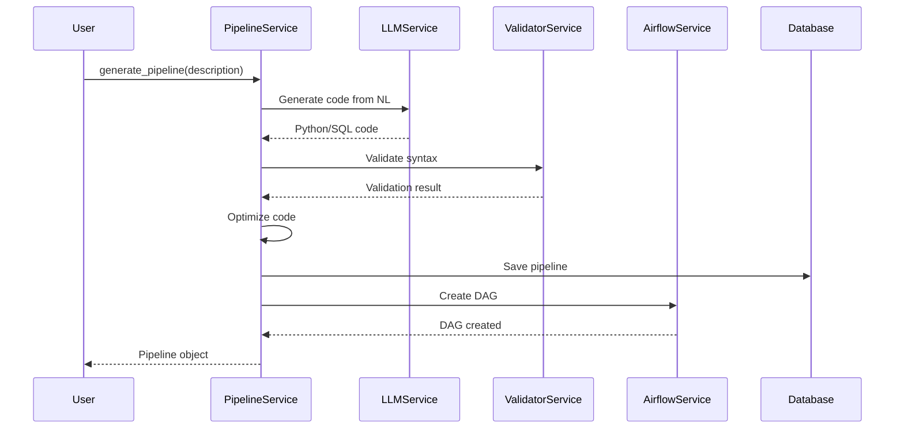

# Pipeline Service

## Overview

The Pipeline Service is the core service responsible for AI-powered pipeline generation, validation, and management. It orchestrates the entire pipeline lifecycle from natural language description to production deployment.

## Configuration

```bash
# Environment variables
PIPELINE_SERVICE_TIMEOUT=300
PIPELINE_SERVICE_MAX_RETRIES=3
PIPELINE_VALIDATION_ENABLED=true
PIPELINE_AUTO_OPTIMIZE=true
```

## API

### Main Methods

```python
class PipelineService:
    async def generate_pipeline(
        self,
        description: str,
        project_id: str,
        options: PipelineOptions = None
    ) -> Pipeline:
        """
        Generate pipeline from natural language description.

        Args:
            description: Natural language description
            project_id: Project identifier
            options: Generation options (optimization, validation, etc.)

        Returns:
            Generated Pipeline object with code and DAG
        """

    async def validate_pipeline(
        self,
        pipeline_id: str,
        validation_level: str = "full"
    ) -> ValidationResult:
        """
        Validate pipeline code and configuration.

        Args:
            pipeline_id: Pipeline to validate
            validation_level: "syntax" | "semantic" | "full"

        Returns:
            ValidationResult with status and warnings
        """

    async def deploy_pipeline(
        self,
        pipeline_id: str,
        environment: str = "production",
        schedule: str = None
    ) -> DeploymentResult:
        """
        Deploy pipeline to Airflow.

        Args:
            pipeline_id: Pipeline to deploy
            environment: Target environment
            schedule: Cron schedule expression

        Returns:
            DeploymentResult with DAG ID and status
        """

    async def run_pipeline(
        self,
        pipeline_id: str,
        params: Dict[str, Any] = None,
        async_mode: bool = True
    ) -> RunResult:
        """
        Execute pipeline immediately.

        Args:
            pipeline_id: Pipeline to run
            params: Runtime parameters
            async_mode: Run asynchronously

        Returns:
            RunResult with execution ID and status
        """

    async def get_pipeline_status(
        self,
        pipeline_id: str
    ) -> PipelineStatus:
        """
        Get current pipeline status.

        Args:
            pipeline_id: Pipeline identifier

        Returns:
            PipelineStatus with state, metrics, and history
        """
```

## Usage Examples

### Basic Pipeline Generation

```python
from backend.services.pipeline_service import PipelineService
from backend.schemas.pipeline import PipelineOptions

# Initialize service
pipeline_service = PipelineService()

# Generate simple pipeline
pipeline = await pipeline_service.generate_pipeline(
    description="Load customer data from PostgreSQL to ClickHouse daily at 2 AM",
    project_id="proj_123"
)

print(f"Generated pipeline: {pipeline.name}")
print(f"Code:\n{pipeline.code}")
```

### Advanced Pipeline with Options

```python
# Configure generation options
options = PipelineOptions(
    optimize=True,
    validate=True,
    include_monitoring=True,
    include_error_handling=True,
    target_framework="airflow",
    language="python"
)

# Generate optimized pipeline
pipeline = await pipeline_service.generate_pipeline(
    description="""
    Extract sales data from multiple PostgreSQL databases,
    join with product catalog from REST API,
    apply complex transformations including:
    - Currency conversion
    - Data quality checks
    - Anomaly detection
    Then load to data warehouse with partitioning by date
    """,
    project_id="proj_456",
    options=options
)

# Validate before deployment
validation = await pipeline_service.validate_pipeline(
    pipeline_id=pipeline.id,
    validation_level="full"
)

if validation.status == "passed":
    # Deploy to production
    deployment = await pipeline_service.deploy_pipeline(
        pipeline_id=pipeline.id,
        environment="production",
        schedule="0 2 * * *"  # Daily at 2 AM
    )
    print(f"Deployed to Airflow: {deployment.dag_id}")
```

### Pipeline Execution

```python
# Run pipeline with parameters
run_result = await pipeline_service.run_pipeline(
    pipeline_id="pipe_789",
    params={
        "start_date": "2024-01-01",
        "end_date": "2024-01-31",
        "batch_size": 1000
    },
    async_mode=True
)

# Monitor execution
while True:
    status = await pipeline_service.get_pipeline_status(run_result.pipeline_id)
    print(f"Status: {status.state}")

    if status.state in ["completed", "failed"]:
        break

    await asyncio.sleep(10)
```

## Pipeline Generation Process



## Error Handling

```python
from backend.core.exceptions import (
    PipelineGenerationError,
    ValidationError,
    DeploymentError
)

try:
    pipeline = await pipeline_service.generate_pipeline(description)
except PipelineGenerationError as e:
    # Handle generation failures
    logger.error(f"Generation failed: {e}")
    # Fallback to template-based generation
    pipeline = await pipeline_service.generate_from_template(
        template="basic_etl",
        params={"description": description}
    )
except ValidationError as e:
    # Handle validation failures
    logger.error(f"Validation failed: {e.errors}")
    # Return errors to user for correction
    return {"errors": e.errors}
except DeploymentError as e:
    # Handle deployment failures
    logger.error(f"Deployment failed: {e}")
    # Rollback deployment
    await pipeline_service.rollback_deployment(pipeline.id)
```

## Performance Considerations

### Caching Strategy

```python
# LLM response caching
@lru_cache(maxsize=1000)
async def get_cached_generation(description_hash: str):
    # Check semantic cache first
    cached = await redis_client.get(f"pipeline:{description_hash}")
    if cached:
        return json.loads(cached)
    return None

# Pipeline metadata caching
@cache_result(expiration=300)  # 5 minutes
async def get_pipeline_metadata(pipeline_id: str):
    return await db.query(Pipeline).filter_by(id=pipeline_id).first()
```

### Optimization Techniques

1. **Parallel Processing**: Generate multiple pipeline components concurrently
2. **Batch Validation**: Validate multiple pipelines in a single operation
3. **Lazy Loading**: Load pipeline code only when needed
4. **Connection Pooling**: Reuse database connections

## Monitoring

### Metrics

```python
# Prometheus metrics
pipeline_generation_counter = Counter(
    'pipeline_generations_total',
    'Total pipeline generations',
    ['status', 'project']
)

pipeline_generation_duration = Histogram(
    'pipeline_generation_duration_seconds',
    'Pipeline generation duration',
    buckets=[0.5, 1, 2, 5, 10, 30, 60]
)

pipeline_validation_errors = Counter(
    'pipeline_validation_errors_total',
    'Pipeline validation errors',
    ['error_type']
)
```

### Logging

```python
import structlog

logger = structlog.get_logger()

class PipelineService:
    async def generate_pipeline(self, description: str):
        logger.info(
            "Starting pipeline generation",
            description_length=len(description),
            user_id=self.current_user.id
        )

        try:
            pipeline = await self._generate(description)
            logger.info(
                "Pipeline generated successfully",
                pipeline_id=pipeline.id,
                code_lines=len(pipeline.code.splitlines())
            )
            return pipeline
        except Exception as e:
            logger.error(
                "Pipeline generation failed",
                error=str(e),
                description=description[:100]
            )
            raise
```

## Testing

### Unit Tests

```python
import pytest
from unittest.mock import Mock, AsyncMock

@pytest.fixture
def pipeline_service():
    mock_db = AsyncMock()
    mock_llm = AsyncMock()
    return PipelineService(mock_db, mock_llm)

@pytest.mark.asyncio
async def test_generate_pipeline_success(pipeline_service):
    # Arrange
    description = "Test pipeline"
    pipeline_service._llm_service.generate.return_value = "def process(): pass"

    # Act
    result = await pipeline_service.generate_pipeline(description, "proj_1")

    # Assert
    assert result.description == description
    assert "def process" in result.code
```

### Integration Tests

```python
@pytest.mark.integration
async def test_pipeline_lifecycle():
    """Test complete pipeline lifecycle"""
    # Generate
    pipeline = await pipeline_service.generate_pipeline(
        "ETL test pipeline",
        "test_project"
    )

    # Validate
    validation = await pipeline_service.validate_pipeline(pipeline.id)
    assert validation.status == "passed"

    # Deploy
    deployment = await pipeline_service.deploy_pipeline(pipeline.id)
    assert deployment.success

    # Run
    run = await pipeline_service.run_pipeline(pipeline.id)
    assert run.status == "running"
```

## Best Practices

1. **Always validate** before deployment
2. **Use options** to customize generation
3. **Handle errors gracefully** with fallbacks
4. **Monitor performance** metrics
5. **Cache expensive operations**
6. **Log important events** for debugging
7. **Test thoroughly** with various inputs

## Common Issues

### Issue: Generation takes too long

**Solution**:
- Enable caching
- Use simpler descriptions
- Break complex pipelines into components

### Issue: Validation failures

**Solution**:
- Check syntax errors in generated code
- Verify connector configurations
- Ensure required packages are available

### Issue: Deployment fails

**Solution**:
- Check Airflow connectivity
- Verify DAG syntax
- Ensure proper permissions

## Related Documentation

- [LLM Service](./llm-service.md)
- [Validation Service](./validation-service.md)
- [Orchestrator Service](./orchestrator-service.md)
- [API Reference](../api/pipelines.md)

---

[← Back to Services](./README.md) | [LLM Service →](./llm-service.md)