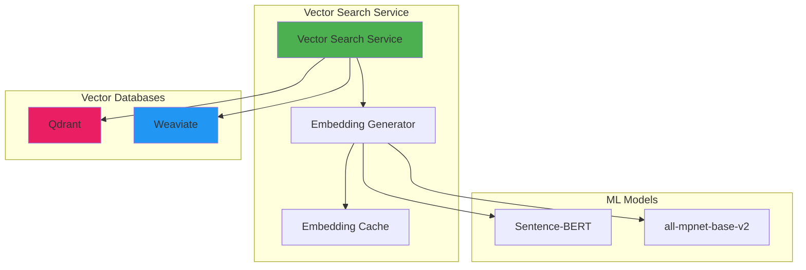

# 🔍 Vector Search Service

## Overview

The Vector Search Service provides semantic search and deduplication capabilities using vector embeddings with Qdrant and Weaviate vector databases.

## Architecture



## Location

```
backend/services/vector_search_service.py
```

## Dependencies

```python
from qdrant_client import QdrantClient
from qdrant_client.models import Distance, VectorParams, PointStruct
import weaviate
from sentence_transformers import SentenceTransformer
import numpy as np
```

## Class: VectorSearchService

### Initialization

```python
from backend.services.vector_search_service import VectorSearchService

service = VectorSearchService(
    provider="qdrant",  # or "weaviate"
    qdrant_url="http://localhost:6333",
    weaviate_url="http://localhost:8085",
    embedding_model="all-mpnet-base-v2"
)
```

### Methods

#### create_collection

Create a new vector collection.

```python
async def create_collection(
    collection_name: str,
    dimension: int = 768,
    distance_metric: str = "cosine"
) -> Dict[str, Any]
```

**Parameters:**
- `collection_name`: Name of the collection
- `dimension`: Vector dimension (default: 768 for all-mpnet-base-v2)
- `distance_metric`: "cosine", "euclidean", or "dot"

**Returns:**
```python
{
    "collection_name": "customers",
    "dimension": 768,
    "distance_metric": "cosine",
    "status": "ready"
}
```

**Example:**
```python
result = await service.create_collection(
    collection_name="customer_records",
    dimension=768,
    distance_metric="cosine"
)
```

---

#### index_record

Index a single record with automatic embedding generation.

```python
async def index_record(
    collection_name: str,
    record_id: str,
    text: str,
    metadata: Dict[str, Any] = None
) -> Dict[str, Any]
```

**Example:**
```python
result = await service.index_record(
    collection_name="customers",
    record_id="cust_12345",
    text="John Doe, john.doe@example.com, Premium customer",
    metadata={
        "customer_id": "cust_12345",
        "segment": "premium"
    }
)
```

---

#### batch_index

Index multiple records efficiently.

```python
async def batch_index(
    collection_name: str,
    records: List[Dict[str, Any]],
    batch_size: int = 100
) -> Dict[str, Any]
```

**Parameters:**
- `records`: List of records with `record_id`, `text`, `metadata`
- `batch_size`: Number of records to process in one batch

**Returns:**
```python
{
    "total_records": 1000,
    "indexed_count": 1000,
    "failed_count": 0,
    "processing_time_ms": 5432
}
```

**Example:**
```python
records = [
    {
        "record_id": "cust_001",
        "text": "Alice Smith, alice@example.com",
        "metadata": {"segment": "vip"}
    },
    # ... more records
]

result = await service.batch_index(
    collection_name="customers",
    records=records,
    batch_size=500
)
```

---

#### semantic_search

Find similar records based on semantic meaning.

```python
async def semantic_search(
    collection_name: str,
    query_text: str,
    limit: int = 10,
    score_threshold: float = 0.7,
    filters: Dict[str, Any] = None
) -> List[Dict[str, Any]]
```

**Parameters:**
- `query_text`: Search query in natural language
- `limit`: Maximum number of results
- `score_threshold`: Minimum similarity score (0.0-1.0)
- `filters`: Metadata filters

**Returns:**
```python
[
    {
        "record_id": "cust_12345",
        "score": 0.94,
        "text": "John Doe, Premium customer",
        "metadata": {"segment": "premium"}
    }
]
```

**Example:**
```python
results = await service.semantic_search(
    collection_name="customers",
    query_text="premium customer from New York",
    limit=10,
    score_threshold=0.8,
    filters={"segment": "premium"}
)
```

---

#### find_duplicates

Detect semantically similar records for deduplication.

```python
async def find_duplicates(
    collection_name: str,
    similarity_threshold: float = 0.90,
    batch_size: int = 1000
) -> List[Dict[str, Any]]
```

**Returns:**
```python
[
    {
        "group_id": 1,
        "similarity_score": 0.95,
        "records": [
            {"record_id": "cust_001", "text": "..."},
            {"record_id": "cust_002", "text": "..."}
        ]
    }
]
```

**Example:**
```python
duplicates = await service.find_duplicates(
    collection_name="customers",
    similarity_threshold=0.92
)

# Merge or remove duplicates
for group in duplicates:
    primary_id = group["records"][0]["record_id"]
    duplicate_ids = [r["record_id"] for r in group["records"][1:]]
    await merge_customer_records(primary_id, duplicate_ids)
```

---

#### get_collection_stats

Get collection statistics.

```python
async def get_collection_stats(
    collection_name: str
) -> Dict[str, Any]
```

**Returns:**
```python
{
    "collection_name": "customers",
    "vectors_count": 125430,
    "indexed_vectors_count": 125430,
    "segments_count": 4,
    "disk_size_bytes": 45678901
}
```

---

## Use Cases

### 1. Customer Deduplication

```python
async def deduplicate_customers(db: AsyncSession):
    """Find and merge duplicate customer records"""

    service = VectorSearchService(provider="qdrant")

    # Create collection
    await service.create_collection("customers", dimension=768)

    # Get all customers from database
    customers = await db.execute(
        select(Customer).where(Customer.is_active == True)
    )

    # Index customers
    records = [
        {
            "record_id": str(c.id),
            "text": f"{c.name}, {c.email}, {c.phone}",
            "metadata": {"customer_id": str(c.id)}
        }
        for c in customers.scalars()
    ]

    await service.batch_index("customers", records, batch_size=500)

    # Find duplicates
    duplicates = await service.find_duplicates(
        "customers",
        similarity_threshold=0.92
    )

    # Process duplicates
    for group in duplicates:
        logger.info(f"Found {len(group['records'])} duplicate records")
        # Implement merge logic
        await merge_duplicate_customers(group["records"])

    return {
        "total_checked": len(records),
        "duplicate_groups": len(duplicates),
        "duplicates_found": sum(len(g["records"]) for g in duplicates)
    }
```

### 2. Semantic Product Search

```python
async def search_similar_products(
    query: str,
    category: str = None,
    limit: int = 20
) -> List[Product]:
    """Search products using semantic similarity"""

    service = VectorSearchService(provider="qdrant")

    # Search with optional category filter
    filters = {"category": category} if category else None

    results = await service.semantic_search(
        collection_name="products",
        query_text=query,
        limit=limit,
        score_threshold=0.75,
        filters=filters
    )

    # Fetch full product details
    product_ids = [r["metadata"]["product_id"] for r in results]
    products = await db.execute(
        select(Product).where(Product.id.in_(product_ids))
    )

    return products.scalars().all()
```

### 3. Document Similarity for RAG

```python
async def find_relevant_documents(
    question: str,
    context_window: int = 5
) -> List[Dict]:
    """Find relevant documents for RAG (Retrieval-Augmented Generation)"""

    service = VectorSearchService(provider="qdrant")

    # Search knowledge base
    results = await service.semantic_search(
        collection_name="knowledge_base",
        query_text=question,
        limit=context_window,
        score_threshold=0.7
    )

    # Format for LLM context
    context_documents = [
        {
            "content": r["text"],
            "relevance_score": r["score"],
            "source": r["metadata"].get("source", "unknown")
        }
        for r in results
    ]

    return context_documents
```

### 4. Real-time Deduplication on Insert

```python
async def insert_customer_with_dedup_check(
    customer_data: Dict,
    threshold: float = 0.95
) -> Dict:
    """Check for duplicates before inserting new customer"""

    service = VectorSearchService(provider="qdrant")

    # Create search text
    search_text = f"{customer_data['name']}, {customer_data['email']}"

    # Search for similar existing records
    similar = await service.semantic_search(
        collection_name="customers",
        query_text=search_text,
        limit=5,
        score_threshold=threshold
    )

    if similar:
        # Potential duplicate found
        return {
            "status": "duplicate_detected",
            "potential_duplicates": similar,
            "recommendation": "review_before_insert"
        }

    # No duplicate, proceed with insert
    customer = Customer(**customer_data)
    db.add(customer)
    await db.commit()

    # Index new customer
    await service.index_record(
        collection_name="customers",
        record_id=str(customer.id),
        text=search_text,
        metadata={"customer_id": str(customer.id)}
    )

    return {
        "status": "inserted",
        "customer_id": customer.id
    }
```

---

## Performance Optimization

### Embedding Caching

```python
from functools import lru_cache
import hashlib

class VectorSearchService:
    def __init__(self):
        self.embedding_cache = {}

    async def get_embedding(self, text: str) -> np.ndarray:
        """Get embedding with caching"""
        # Create cache key
        cache_key = hashlib.md5(text.encode()).hexdigest()

        # Check cache
        if cache_key in self.embedding_cache:
            return self.embedding_cache[cache_key]

        # Generate embedding
        embedding = self.model.encode(text)

        # Cache for future use
        self.embedding_cache[cache_key] = embedding

        return embedding
```

### Batch Processing

```python
async def batch_index_optimized(
    self,
    collection_name: str,
    records: List[Dict],
    batch_size: int = 500
):
    """Optimized batch indexing with parallel processing"""

    # Process in batches
    for i in range(0, len(records), batch_size):
        batch = records[i:i + batch_size]

        # Generate embeddings in parallel
        texts = [r["text"] for r in batch]
        embeddings = await asyncio.gather(*[
            self.get_embedding(text) for text in texts
        ])

        # Prepare points
        points = [
            PointStruct(
                id=record["record_id"],
                vector=embedding.tolist(),
                payload=record.get("metadata", {})
            )
            for record, embedding in zip(batch, embeddings)
        ]

        # Batch upload
        await self.qdrant_client.upsert(
            collection_name=collection_name,
            points=points
        )
```

---

## Configuration

### Environment Variables

```bash
# Vector Database Provider
VECTOR_DB_PROVIDER=qdrant  # or weaviate

# Qdrant Configuration
QDRANT_URL=http://localhost:6333
QDRANT_API_KEY=your_api_key

# Weaviate Configuration
WEAVIATE_URL=http://localhost:8085
WEAVIATE_API_KEY=your_api_key

# Embedding Model
EMBEDDING_MODEL=sentence-transformers/all-mpnet-base-v2
EMBEDDING_DIMENSION=768
EMBEDDING_BATCH_SIZE=32

# Performance
VECTOR_SEARCH_CACHE_SIZE=10000
VECTOR_SEARCH_TIMEOUT=30
```

### Model Selection

| Model | Dimension | Speed | Accuracy | Use Case |
|-------|-----------|-------|----------|----------|
| all-MiniLM-L6-v2 | 384 | Fast | Good | Quick searches |
| all-mpnet-base-v2 | 768 | Balanced | Better | ⭐ Recommended |
| all-mpnet-base-v2-large | 1024 | Slow | Best | High accuracy needed |

---

## Error Handling

```python
from backend.core.exceptions import ServiceError

class VectorSearchService:
    async def index_record(self, ...):
        try:
            # Index operation
            pass
        except QdrantException as e:
            logger.error(f"Qdrant error: {e}")
            raise ServiceError(
                f"Failed to index record: {e}",
                error_code="VECTOR_INDEX_FAILED"
            )
        except Exception as e:
            logger.error(f"Unexpected error: {e}")
            raise ServiceError(
                f"Vector search service error: {e}",
                error_code="VECTOR_SEARCH_ERROR"
            )
```

---

## Testing

```python
import pytest
from unittest.mock import Mock, AsyncMock

@pytest.mark.asyncio
async def test_semantic_search():
    service = VectorSearchService(provider="qdrant")

    # Mock Qdrant client
    service.qdrant_client.search = AsyncMock(return_value=[
        Mock(id="cust_001", score=0.95, payload={"name": "John"})
    ])

    results = await service.semantic_search(
        collection_name="test",
        query_text="test query",
        limit=10
    )

    assert len(results) > 0
    assert results[0]["score"] >= 0.7

@pytest.mark.integration
async def test_duplicate_detection_integration():
    service = VectorSearchService(provider="qdrant")

    # Create test collection
    await service.create_collection("test_dup", dimension=768)

    # Index test data
    records = [
        {"record_id": "1", "text": "John Doe, john@example.com"},
        {"record_id": "2", "text": "John Doe, johndoe@example.com"}  # Duplicate
    ]
    await service.batch_index("test_dup", records)

    # Find duplicates
    duplicates = await service.find_duplicates("test_dup", threshold=0.9)

    assert len(duplicates) > 0
    assert len(duplicates[0]["records"]) == 2
```

---

## Monitoring

### Metrics

```python
from prometheus_client import Counter, Histogram

vector_searches = Counter(
    'vector_searches_total',
    'Total vector searches performed'
)

vector_search_duration = Histogram(
    'vector_search_duration_seconds',
    'Vector search duration'
)

duplicates_found = Counter(
    'duplicates_found_total',
    'Total duplicates detected'
)
```

### Health Check

```python
async def check_vector_db_health(self) -> Dict:
    """Check vector database health"""
    try:
        # Check connection
        collections = await self.qdrant_client.get_collections()

        return {
            "status": "healthy",
            "collections_count": len(collections.collections),
            "provider": self.provider
        }
    except Exception as e:
        return {
            "status": "unhealthy",
            "error": str(e)
        }
```

---

## Related Documentation

- [Vector Search API](../api/vector-search.md)
- [AI Enhancements Setup](../AI_ENHANCEMENTS_SETUP.md)
- [Semantic Deduplication Guide](../guides/semantic-deduplication.md)

---

[← Back to Services](./README.md)
